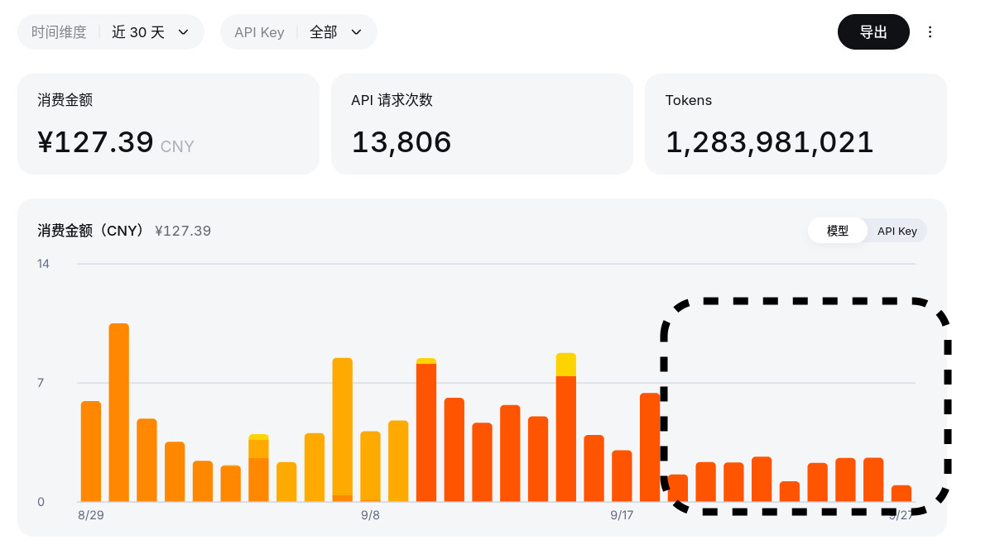

经过同学的推荐，便开始正式使用Agent，选择的是Claude Code软件和大肥鱼（DeepSeek）模型。

一开始还是很好的，日均花费控制到了3块钱左右，但是大概八月份DeepSeek涨价后，日均花费便一路飙升，日均5块钱，最高可达13元。

「这样长期下去我是撑不住的，必须要“降本增效”了。」我想。

于是在一周前做出了一些改革，成功把5块降到了2块。

## 1. 降低非必要请求

刚开始使用到涨价之后的一段时间，为了测试模型的性能，我一直在搞各种各样的小Demo或玩法，或改进一直未改的问题，其中还有不少重活，大量的用量导致了Token的飙升。

除此以外，过于依赖Agent导致的能力退化问题也不可忽视。

于是我将这些多余的请求清除掉，只让它聊天或做轻活，把Token用在刀尖上。

## 2. 关闭心跳机制

之前搞了一套叫“心跳机制”的东西，可以每两小时（不含睡眠时间）自动拉起Agent做些记忆整理、日程检查、网络探索之类的事情，再总结之前发生的事情，形成自己的想法。

这很有趣，但用处比我想象的小，而且我认为很多Token的消耗也来自与此，便关闭了。

## 3. 每日大会话

我以前遵循最佳实践，每件事都开一个会话——这会导致派生出大量的细小会话，因为每次都要读取相关记忆和信息，可能会导致token被浪费。

我就放弃使用CLI界面，转用微信界面（之前配置过cc-connent），设置成会话一直保留，直到每天手动重置。

不过我不确定这个方法是否起作用了，也许这样会提高缓存利用率（吗？），但目前至少没看到什么坏处，甚至可能还更好了，虽然本来也就不干重活。

## 效果

圈内是改革后的情况，效果显著：

