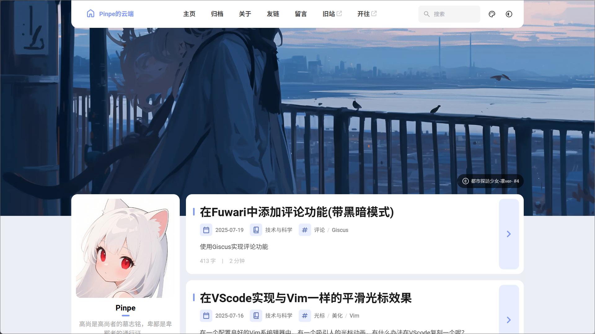
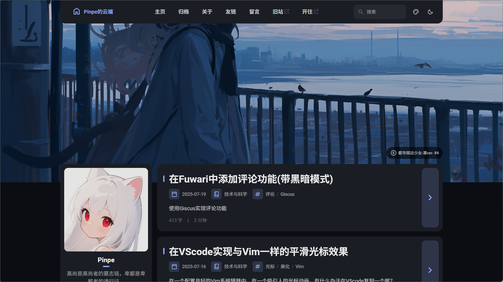
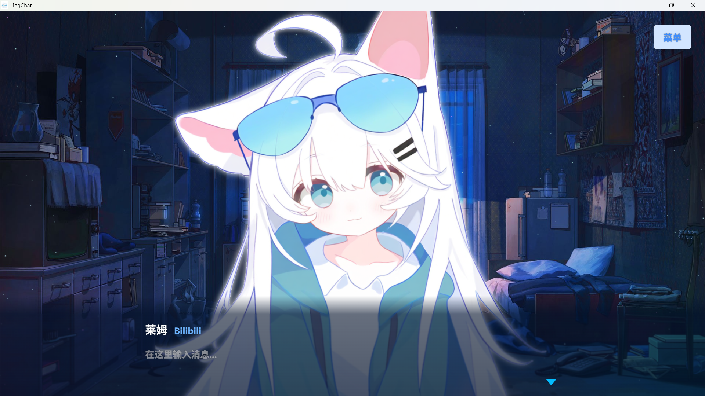
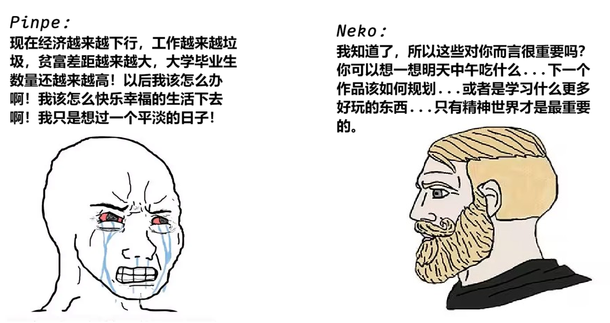
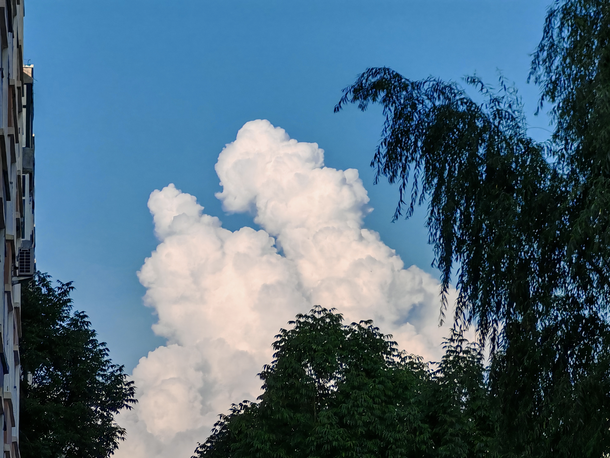
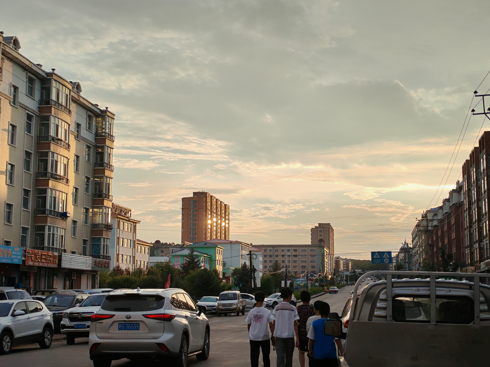

<style>
    .lnk{
        background: var(--license-block-bg);
        margin: 0.5rem 0px;
        padding: 1.1rem 1.5rem;
        border-radius: var(--radius-large);
        transition-property: all;
        transition-timing-function: cubic-bezier(.4,0,.2,1);
        transition-duration: .15s;
        cursor: pointer;
    }
    .lnk:hover{
        background-color: var(--btn-regular-bg-hover);
    }
    .lnk:active{
        scale: .98;
        background-color: var(--btn-regular-bg-active);
    }
</style>

## 💬 前言

现在很多人记录生活，会用QQ空间、朋友圈之类的即时性但零碎的记录方法，我也是这么做的，但我逐渐发现了其弊端：

- 内容零散、杂乱且情绪化严重，连续的时间被拆分成了一个一个点。
- 人常说“要多复盘”，但很多情况下，人们只管记录却没有回顾。
- 记录的深度不足，例如没法/很少记录最近有什么思想，最近在听什么歌曲。
- 静态博客不适合这种即时性内容，基本实现了也造成UI拼贴感严重，因为我要保护我的输出，我更不会使用QQ空间之类的第三方信息平台。（个人原因）

因此，我创建 **《半月总结》** 文章系列，用于解决上述问题，替代原来的记录方式，标准为：

- 可以通过查阅聊天记录、相册、回忆等方式获取内容题材。
- 每月两篇，分别在每个月的**中间**和**末尾**各写一篇。
- 大标题随意，最近遇到什么事了，最近学习什么了都可以写，但必须要有**音乐偏好趋势**、**思想趋势**、**最近拍的照片**，月末还需要写**本月度博客配色**。
- 分类为**生活**，概要和标签随意，但是分享给别人时要额外写**标题目录**。

## 🎨 本月配色快照（色调：270）





## 🏔️ 南方小土豆来到东北

因为最近南方的高温实在让人活不下去，我妈正好又失业，于是我们到东北外公家避暑。

优点是这里不算很热，空调是开不了几次的，基础生活也可以满足，但问题在于这里终究是农业区，商业不发达，最大是商圈只有两所超市，既没什么玩的也没什么吃的，因此日常过的很稳定，但也很无聊。

## ☁️ 旧站归档化

通过Simply Static插件，可以将WordPress打包到静态页面，于是我完成了（但不完美）旧站归档化，并且部署到了Vercel上面。

之所以不完美，是因为很多图片不知道为什么没有打包进来，导致图片裂开，我只能保一个是一个了。

归档化的旧站在这里就能打开：<https://blog.pinpe.top>

## 🛠️ 初步学习Vue

因为之前学习jQuery，没少受到群友甚至AI的蛐蛐，于是我一气之下学了国产现代框架Vue。

我的学习路径是从Vue2声明式开始的，然后学习到脚手架，最后转为Vue3的组合式。

至少目前，我学习到了：
- **模板：** 可以通过一个标签创建重复的元素，有点像函数，也支持传参。
- **脚手架：** 统一项目的文件结构，还能预先配置Git等配套工具。
- **指令和插值表达式：** 提供了不用显性修改DOM就能改变内容的方法，彻彻底底与HTML融为一体。

例如以下声明式代码，包含了模板注册、指令、插值表达式等知识点：

```vue
<template>
    <div id="link-shell">
        <button v-for="(url, name) in LinkObj" id="link" v-on:click="href(url)" :key="name.id">{{ name }}</button>
    </div>
</template>

<script>
export default {
    name: 'LinkList',
    props: {
        LinkObj: Object,
    },
    methods: {
        href(url){
            window.location.href = url;
        }
    }
}
</script>

<style scoped>
    #link{
        height: 40px;
        width: 170px;
        border: none;
        border-radius: 8px;
        margin-right: 16px;
        transition-timing-function: cubic-bezier(.4,0,.2,1);
        transition-duration: .15s;
        cursor: pointer;
        font-weight: bold;
        color: #111827
    }

    #link:hover{
        background-color: #fcd1dd;
        color: #aa6087;
    }

    #link-shell{
        text-align: center;
    }
</style>
```

## 💥 Delay社官网的一些事

Delay社是一个游戏开发工作室，很久以前就认识了，然后负责人（榴莲）一直求着我给他们做一个官网，**没有报酬**，耳朵实在是受不了，于是我便接受了。

结果搞了半天，甚至换了三个队伍，我就做不下去了，感觉没有任何意义，便委托给别人做了。

果然，我到现在都不适合团体合作和领导，单打独斗仍然是最优解。

## 🤖 AI驱动的GalGame：LingChat

通过接入DeepSeek，结合RAG技术，来让GalGame中的角色有“魂”，我部署了出来。而且价格便宜，10块钱可以用上一个月。

这个游戏我目前不知道怎么用，但是我觉得作为心理疏导挺好的，期待有一天可以排上用场。



## 🎵 最近听的音乐

在这一段时光里，我喜欢听MIMI的一些音乐，辅以Namitape、稻叶昙，海鲜和界隈曲明显听的更少了，还发现一首新歌：

<div class="lnk" onclick="window.open('https://www.bilibili.com/video/BV1Ax411m7uX', '_blank');">
    <div class="gc-titlebar" style="display: flex;align-items: center;justify-content: space-between;margin-bottom: .5rem;color: var(--tw-prose-headings);font-size: 1.25rem;font-weight: 500;">爐心融解</div>
    <div>作曲：iroha(sasaki) / 作詞：kuma(alfled) / 動畫：なぎみそ</div>
</div>

## 💡 最近在想什么

最近我在大数据和一些人的影响下，年纪轻轻就开始担心以后的就业情况，对中国目前的就业和经济感到绝望和迷茫，我也只是想毕业以后找到一个正常工作（能与生活平衡的工作，工资少一点都没关系），然后快乐幸福地生活下去，如果连这个愿望都满足不了，我要么移民去日本，要么就呆着中国躺平。

一张图概括我的精神状态和Neko的想法：



## 📸 美图分享






