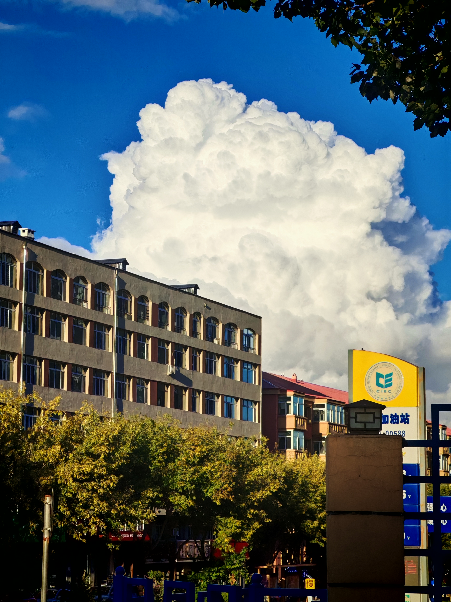

## 🌇 异国四日行

我们一起去了中国最东极**抚远**和远东第一大城市**哈巴洛夫斯克市**，详情请看此文章：

    
【多图预警】人生第一次出国！抚远和俄罗斯的加倍快乐

    
中国最东极抚远，和俄罗斯的哈巴洛夫斯克市。

## 🐧 系统大换血：从Windows到Linux

因为把Windows搞崩了，又讨厌Windows11的史山代码和乱拉史的特性，我直接在D盘分了几乎全部空闲空间，用于安装Arch（现在是EndeavourOS，但还是Arch系）

    
试试Linux吧：Arch Linux日用记录

    
Arch Linux 的日常使用体验与心得。

## 🧠 Brainfuck解释器实现

我实现了著名Esolang——Brainfuck的解释器，还附带交互环境和调试功能，命名为Pinfuck，具体细节，请看文章：

    
实现Brainfuck解释器

    
文章明确Brainfuck规则，做触发器、流程器处理符号与循环，整合成解释器。

## 💕 新作品：《来自地狱的患者》

通过心理咨询师Anna的视角，在安然和安乐一对双子之间，揭开所谓“姐妹情”的残酷真相：

    
来自地狱的患者

    
当共生被撕裂，地狱便在人间的缝隙中滋生。她失去的不仅是姐姐，更是赖以生存的“另一半灵魂”。

## 📔 自学考试出成绩了

我之前考的自考项目《网页设计与网站建设》出成绩了，考了70分！

## 🎵 最近听的音乐

>好消息：海茶一年连出两首歌 坏消息：质量没有以前惊艳了

我最喜欢的年更P主海茶，今年破天荒地连续出了两首歌（都是AB两面的姊妹歌），可以说让人很惊喜了，但是质量下降了不少，既没有抓耳的旋律，也没有海茶的特色感觉，希望下一首作品可以更好。

    
弦楽少女は諦めを知らずに

    
甜中带苦的香气那一边，你依然在那里。

    
サワーチェリーが輝いたから

    
像醇香糖果一样的梦，怎么样？

在此之前，就听一些治愈纯音乐和动漫OP，例如《鸟之诗》。

## 💡 最近在想什么

我发现我越来越勇敢，做事越来越激进了，有一种天不怕地不怕的感觉，我感觉刚刚经历了一场大换血，从Wordpress到Astro，又从Windows到Linux，让我感到臃肿乱拉屎的软件都换成轻量但折腾的了。~~然后时间全花在这上面~~

## 📸 美图分享

.jpg)

%20-2.jpg)

.jpg)

%20-3.jpg)