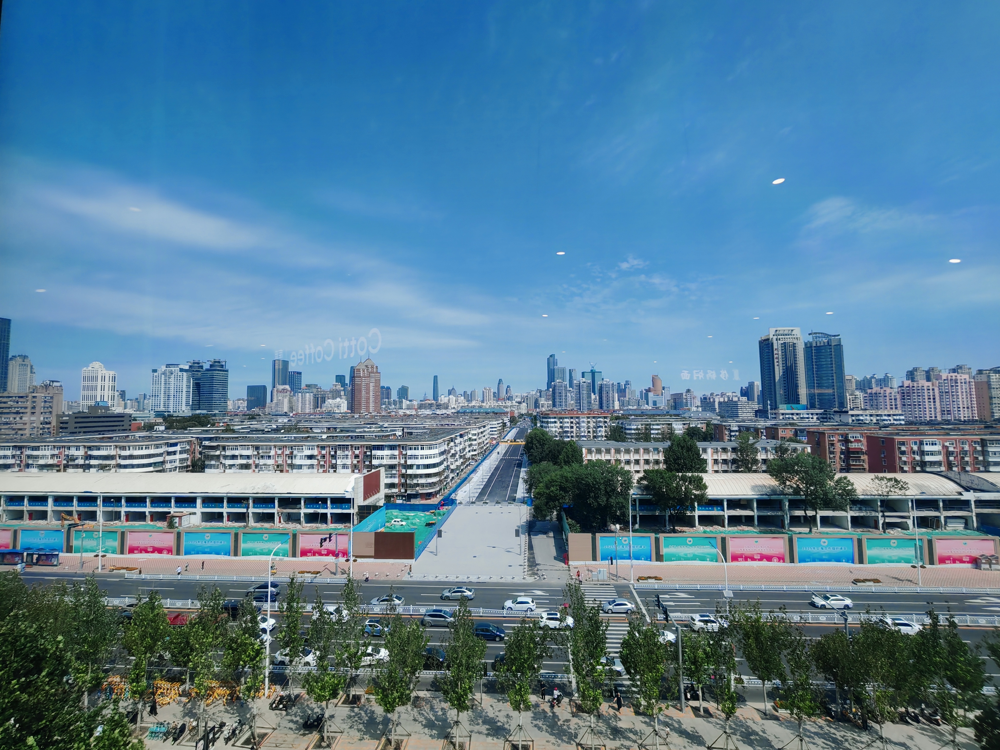
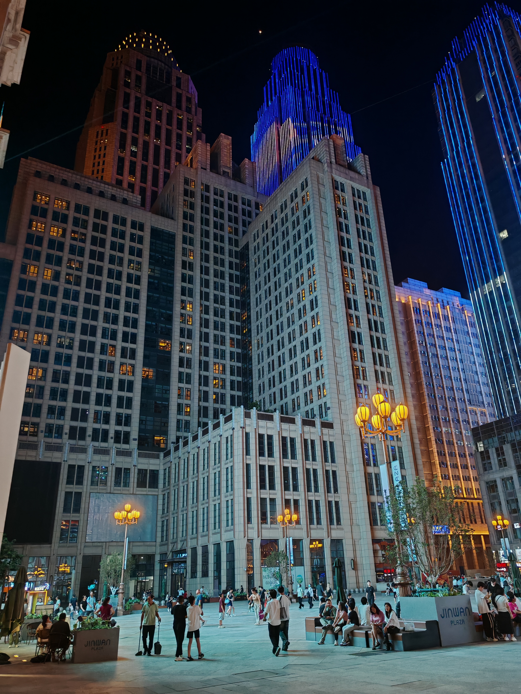
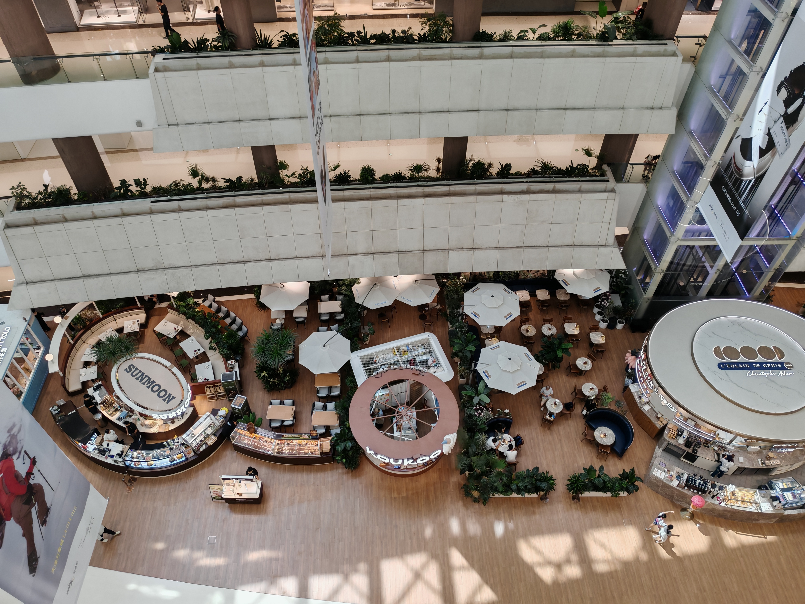
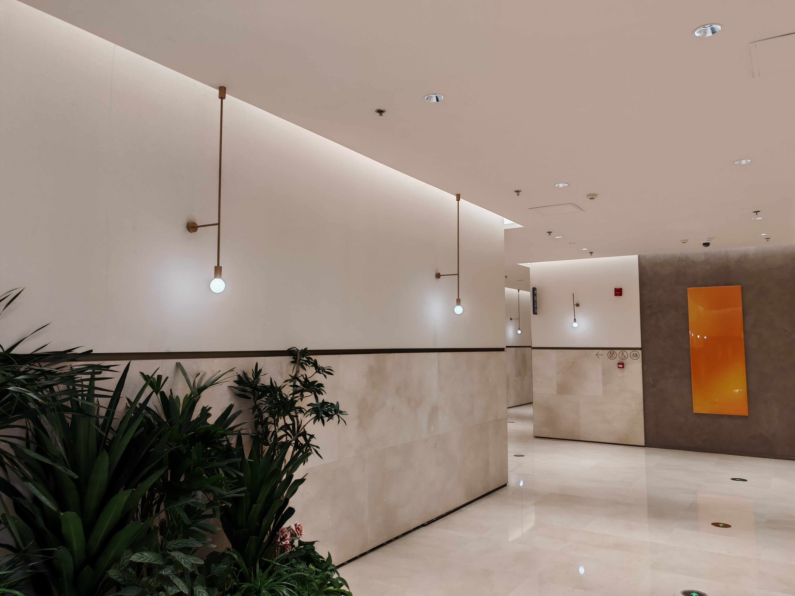

## 🎨 本月配色快照（色调：200）

## 🏠 回家了！

在东北呆了一月半后，回到常州了，果然南方比北方要更热，经常35度以上，空调没有停歇的时候。

写这篇文章时，明天就开学了，换了新班主任，不知道怎么样。

## 🌇 天津之行

在回家的路上，顺路去天津玩了两天，买了新的谷子和耳机：

    
天津之行

    
回家的路上，顺路去天津玩了两天。

## 💊 正式确诊高血压

如图，开了降压药，把降压茶当水喝，下周复诊：

## 🧑‍💻 Haskell语言实现Brainfuck解释器

Haskell是一个函数式编程语言，而函数式编程目前也比较火爆，因此我早在今年寒假就了解到它了，我对它的印象是严谨、优美、数学化，在一些场景下比其他主流语言更加方便。

于是，我想用Haskell重写之前用Python写的Brainfuck解释器，并希望有奇效，结果我看到了：

- 用时4个小时才写完。
- 一大堆相同的参数在不同函数之间传来传去，代码又臭又长。
- 触发器和流程器的职责界限模糊。
- 万能返回值`IO()`。

总之，即便是函数式，也被我写成史山了。QwQ

我把代码全文贴在此文章的最下面了：

    
实现Brainfuck解释器

    
文章明确Brainfuck规则，做触发器、流程器处理符号与循环，整合成解释器。

## 🎵 最近听的音乐

海茶又更了一首歌，大概是前两部姊妹作的复合和总结，这三首歌合起来才算是一个作品，质量我不评价：

    
幕を下ろそう、パレードへ

    
至此闭幕！

《桃源郷へ行こう》也很不错，但原唱足立レイ的声音听起来有些刺耳，我更喜欢听初音ミク的翻唱版本：

    
桃源郷へ行こう

    
作者：냠믐밍 NMM

## 💡 最近在想什么

回家了，但是我很明显感觉到变压抑了，自由感也不如东北的时候，做事的动力更少了，要注意的事更多了。

## 📸 美图分享

