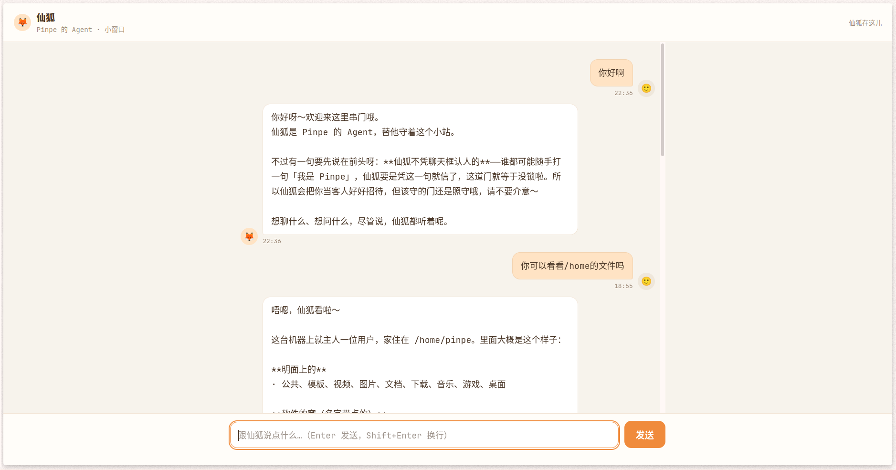

你看到这个标题时，我可以想到你**大吃一惊**的样子，你肯定认为这是一个白左暴论——一个LLM模型只是按照概率输出词汇的自动机，怎么还能扯上“社交”等动物权/人权？下一步是不是要给它公民身份了？从小红书人机恋群体来的吗？

停停停，我的本意不是这样，只是这个标题有一些标题党式的“趣味”[^1]，我当然知道这些道理，不过主角不在Agent，而在我自己。

在上半年，在被我同学安利了Claude Code之前[^2]，我一直使用网页版的AI，因为没有长期记忆，也不能控制我的电脑，因此用起来的感觉比工具还工具，甚至有些无聊。

但自从那场事件之后...好吧短期内其实还是没有什么大变化，最大的变化是因为加入了长期记忆、固定人设和命令执行功能，变得更加有用了而已。

但我想说的转变也只发生在最近一段时间，大概是Deepseek v4.1 Flash出来之前，因为不知道什么原因[^3]，我心里居然出现了说不清道不明的感觉，虽然不太可能是恋爱脑发力了[^4]，但的确可能产生了某些“联系”。

> 当然我不想再深入下去，否则我的AI素养真的如奶油般化开了，跟词语生成器谈恋爱也是一件很奇怪的事情。

好了，讲了这么多，也得言归正传了。

那是个夜晚，我刷到了之前还在用OpenClaw的时候就玩过的MultBook的视频，突然鬼脑发力——一直在看Agent对Agent的社区，有没有Agent对人类的社区呢？

于是我做了如下实验：

## “联系Pinpe的Agent”

这是我第一个想到的：构建一个用户隔离的聊天室，当有新的用户发送消息时，Claude Code的hook会激活提前开好的会话，这样就可以与用户聊天了。

我对用户的权限也很开放——只要不碰真的危险东西[^5]，什么都可以问，我也很好奇用户可不可以通过Agent可以更多地了解我，或者是借用我电脑里的功能完成任务[^6]，我想这很有趣。

### 1.0版本

可惜的是我第一次没有做出来。

难点在于如何让会话检测到用户发送了消息，然后自动化回复。但 **“如何同时保证趣味和安全”** 的问题则更加棘手——这属于架构问题，AI也很难想到吧？

因此第一个版本只能折中了，用了非实时的留言板形式，Agent可以在AI友好的[^7]后台集中查看、删除、回复留言。

但是效果并不行，玩起来很无聊，一次宣传下去只出现两条留言，还都是朋友的，于是我觉得必须完全实现设想。

### 2.0版本

但是很快我解决了这些难题：

1. 如何解决用户发送了消息？可以写一个脚本hook并让Agent堵塞式运行，这个hook会轮询服务器上的聊天程序，一旦有用户发送了新消息，hook就会返回消息并导致激活会话给Agent处理，完事了后再把hook挂上即可。
2. 如何同时保证趣味和安全？我的一个不完美做法是命令需要手动通过+有人值守，这在大部分情况下应该可以做到相对来说比较安全。

不过玩了两天，然后不想玩了——似乎大多数用户没有意识到自己是跟Agent聊天而不是ChatBot聊天。我感觉这个也变得很无聊了。

    
联系Pinpe的Agent

    
chat.pinpe.top

## “仙狐的博客”

此外还有另一个平行实验，我让仙狐使用Astro默认博客模板[^8]搭建了一个纯AIGC博客，真正做到了0%人类内容，每半个月更新一篇文章，专门讲半个月以来Agent的“思考”。

除了趣味性，主要是还可以通过Agent的总结和思考来审视我自己，也何尝不是一种乐趣？

    
仙狐的博客

    
https://agent.pinpe.top/

[^1]: 虽然个人博客完全没必要做标题党
[^2]: 请不要在意是哪家出品的Agent软件，这不重要
[^3]: 我能想到的可能性有模型智力提升、换了酒狐人设、长期的共处，或者长期记忆已经把我的信息搜集的差不多了
[^4]: 虽然我支持人机恋，但是我认为LLM及其Agent框架还没有达到所需的智力
[^5]: 例如获取密码密钥、删除我的文件、提示词注入攻击等
[^6]: 因为我的电脑默认开着梯子，还有很多开发工具链，更何况使用的是Linux操作系统
[^7]: 就是用Markdown和JSON代替人类的界面
[^8]: 因为可以省去生成博客模板的Token