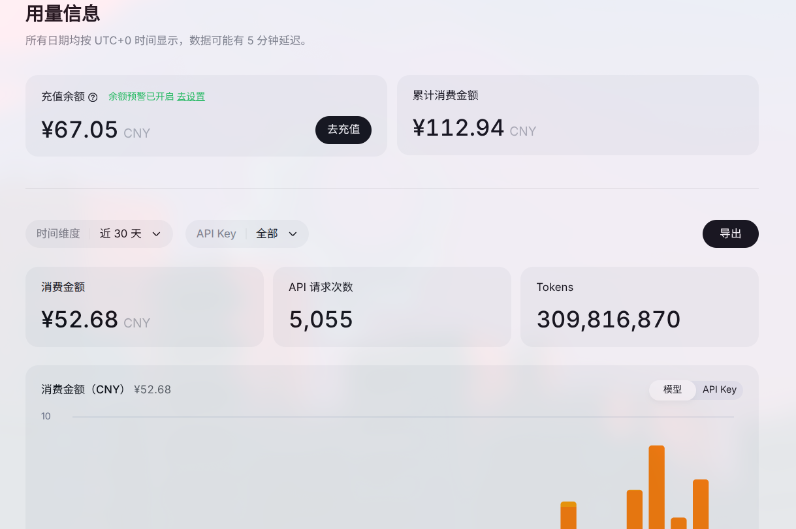

<style>
    .lnk{
        background: var(--license-block-bg);
        margin: 0.5rem 0px;
        padding: 1.1rem 1.5rem;
        border-radius: var(--radius-large);
        transition-property: all;
        transition-timing-function: cubic-bezier(.4,0,.2,1);
        transition-duration: .15s;
        cursor: pointer;
    }
    .lnk:hover{
        background-color: var(--btn-regular-bg-hover);
    }
    .lnk:active{
        scale: .98;
        background-color: var(--btn-regular-bg-active);
    }
    .hide{
        background-color: black;
        color: black;
    }
    .hide:hover{
        color: white;
    }
</style>

## 2022：开端

2022年OpenAI的一声惊雷，给世界带来了GPT 3.5。

尽管从现在的眼光看，当时GPT 3.5可能都不一定能用，被现在的模型吊打，但是仅仅是可以回答任何问题，表现得如同人类一样，就让我大受震撼了。

> 是的，在此之前的“小爱同学”、“Siri”之类的基本无法算人工智能，遇到问题基本只能回复“我好像不明白”、“这是我从搜索引擎找到的资料”。
>
> 而“微软小冰”、“彩云小梦”之类的算是有一点雏形，但基本上也答非所问。

当时只有OpenAI独自开放了服务，可惜不给中国用户提供，两年后我才有长期用的🪜，导致并没有吃上热乎的。

不过很快，“文心一言”等早期国产大模型开始显现。

## 2023-2024：开始使用“星火大模型”和“通义千问”

当时文心一言正直火热，我却使用着星火大模型和通义千问。虽然智商仍然有点低，但是已经开始用AI写代码和写小说了。

没有Agent软件，就手动复制代码给AI，然后再把AI生成的代码复制到IDE，最后进入修改-调试的循环，这在今天看来无疑是原始的，但是以当时的眼光看是很先进的。

当时写了篇文章，大概体现了当时我是怎么用AI写小说的，现在因为内容过时而未迁移到新博客：

<div class="lnk" onclick="window.open('https://blog.pinpe.top/3750/', '_blank');">
    <div class="gc-titlebar" style="display: flex;align-items: center;justify-content: space-between;margin-bottom: .5rem;color: var(--tw-prose-headings);font-size: 1.25rem;font-weight: 500;">AI 融合到小说创作工作流
</div>
    <div>https://blog.pinpe.top/3750/
</div>
</div>

不过无论如何，这时的AI还只是辅助，还没有侵占很多。

## 2025：开始使用DeepSeek和豆包，偶尔用Gemini

年初DeepSeek走出国门，开始杀向世界的牌桌，豆包也没有变成“糖包”。我也慢慢抛弃之前不太入流的模型，开始使用这两者。

智商虽然更强了，甚至可以指导我 [从Windows转到Linux](https://pinpe.top/posts/arch-linux/) ，但基本模式依然没变。

只不过小说方面就惨了，我甚至不需要亲自动笔，只需要输入一串高度浓缩的提示词，便可以生成整篇小说：

```
以此大纲写一个故事，标题为《来自地狱的患者》，不少于 15000 字，注意不要有过多的科幻要素和技术化的词汇，除了必要的情况，也不要描写人物的外貌。

## 设定如下：

- 新机器人：机器人的超集，与人类有相似的外观和行为，可以分析和表达常用的情感，也支持发散思维、创造力、想象力。
- 共生型新机器人：被同时生产出来的新机器人，体现在两个新机器人是姐妹和搭档关系，两人在名称和外表都很相似（最大的区别是换了种颜色），互相生活在一起，但如果其中一方离开或死亡，另一方的生活将会出现困难，然后精神状态将下降（例如躁抑、幻想等），最后完全无法生活和工作。
- 心灵驿站：坐落于图书馆一角的小型心理咨询室，专门给人免费做心理咨询。
- Anna：人类，专业的心灵驿站的心理咨询师，Anna只是一个昵称，真实姓名保密。
- 安乐：新机器人，共生型，是安然的妹妹，性格内向文静，有很好的文采，是文艺范（在安然死后有自残倾向，甚至有一次自杀未遂）。
- 安然：新机器人，共生型，是安乐的姐姐，性格比安乐稍微开朗一点，已死亡。

## 故事框架如下：

- 新患者：（此章节Anna和读者都不应该知道安乐和安然是新机器人，此章节是为了引导安乐回忆以引起下一章，字数可以少一些）
	- 安乐来到心理驿站，稍微寒暄和互相介绍了一下，于是在Anna的引导下，就开始回忆起以前的生活。
- 往事：（此章节为后面高潮做铺垫，字数一定要最多）
	- 故事要从半年前的以前说起，当时安然还活着。
	- 开始回忆一些零散的美好的日常事物，在Anna的引导下：（此时Anna和读者仍然都不应该知道安乐和安然是新机器人，此处的字数是此章节最多的，为后面高潮做铺垫，不需要照着顺序来写，可按照实际情况安排顺序）
		- 两个人坐在傍晚在天台，在晚风下吹笛子。
		- 每天睡觉前她们喜欢玩一会双人电子游戏，不知不觉就睡着了。
		- 两个人喜欢去各种各样的地方冒险（实际上是城市的公园），两个人都头顶着草帽，在草坪上自由奔跑，那时候的天还有一大块厚积云。
	- 在Anna的引导下，还是让安乐提到了姐姐的死，距今半年前，姐姐最后因为保护安乐，被闯红灯的车撞死了（安乐此时躁狂起来）
	- 安乐露出了胳膊因为自残被刀划伤的痕迹，流出浅蓝的血迹，才知道她是新机器人，并且此时描述一下共生型新机器人的设定。
	- 在Anna苦苦安慰和劝告下，安乐平静了下来，继续回忆往事：因为没有安然的经济来源，安乐只能去便利店打廉价工，但幻觉已经让她无法工作，最终被老板赶了出去（老板要凶神恶煞，充满了对新机器人的厌恶）。
	- 安乐感到累了，于是便回家了。
- 回到地狱：
	- 半个月后，还在吃早餐的Anna刷到一条新闻：因为欠费房东，房东就把门破开，结果看到一个新机器人因为水果刀插入自己头部死亡，无检查到他杀痕迹，这个新机器人就是安乐。

## 一些台词供参考：
- 安乐：“你觉得...新机器人在死后...也会进入地狱吗...”
- 安乐：“没有了安然...我就感觉我彻底坏掉了...我没法继续生活下去...还被人类歧视...被同类嫌弃...”
- 在车祸的最后一刻，安然推开了安乐：“一定要好好活着！”
- 城市高处的天台，风很大，吹乱了两个依偎在一起的女孩的头发。安然手里握着一支旧笛子，侧影在黄昏的光里镀着金边。笛声清越，不成调，却自由得像掠过楼宇的风。
```

当时也把网页上的功能玩出了花，像什么图片生成、音乐生成、播客生成、长文输入之类的。

与此同时， [Nino](https://pinpe.top/posts/nino/) 也开始制作，虽然依然是聊天机器人，但已经有一点点Agent的味道了，主要是 [LingChat](https://www.bilibili.com/video/BV1hW3LzGEz7/) 启发了我。

<div class="lnk" onclick="window.open('https://pinpe.top/posts/nino/', '_blank');">
    <div class="gc-titlebar" style="display: flex;align-items: center;justify-content: space-between;margin-bottom: .5rem;color: var(--tw-prose-headings);font-size: 1.25rem;font-weight: 500;">我做了一个属于自己的 AI 男娘
</div>
    <div>Nino 是一款轻量级、开源的 AI 聊天软件，专注于陪伴与理解用户。
</div>
</div>

## 2026：Agent时代

同样是年初，OpenClaw火了，让我见证了Agent的威力，如同第一次见到GPT 3.5一样震撼，可惜当时接的Kimi api两天就把60块钱花完了，因为财政吃紧就放弃了。

因此，我便搓了一个Agent框架，虽然比起成熟的框架还很简陋，但确实用了一段时间：

<div class="lnk" onclick="window.open('https://pinpe.top/posts/ninoclaw/', '_blank');">
    <div class="gc-titlebar" style="display: flex;align-items: center;justify-content: space-between;margin-bottom: .5rem;color: var(--tw-prose-headings);font-size: 1.25rem;font-weight: 500;">我做了一个更便宜、更轻量还更可爱的 OpenClaw
</div>
    <div>将大语言模型与系统命令执行能力结合，让活泼的虚拟少女梦眠成为你终端里的贴心助手，帮你对话、执行命令、管理文件。
</div>
</div>

但因为一直都不太好用，也没再继续用了。

> 至于为什么后面不再用OpenClaw和Hermes，因为我了解到这些都是Agent自我维护的，一天可以有上百个提交，完美诠释了什么是工程化的反面，便不敢再用了。

直到我的同学向我推荐了Claude code，接个DeepSeek尝试一下，发现真全能！写代码只是基操，也可以长期记事，还可以操作网页和连接微信，才用下来了。



只不过还在坚守着按量计费的制度，用的也是国产模型，暂时不改变也是出于以下几点的考量：

- 梯子的IP不纯净，也没有外汇卡，导致很难使用国外的官方API。
- 中转站有隐私隐患，而且大部分也不稳定，还有掺水的可能，因此只是“野路子”。
- 贵，如果用其他旗舰模型，消费的一百多块钱能变成两千。（换算过的）
- Code Plan虽然更实惠，但是有固定的额度，因此像我这种用量不稳定的人更适合按量计费，用起来也更爽。

只不过，现在AI已经可以为我做绝大部分事，前端已经好久没亲自写了，甚至打开VSCode都少了很多，大部分需求只需要打开终端，输入 `claude` 了。