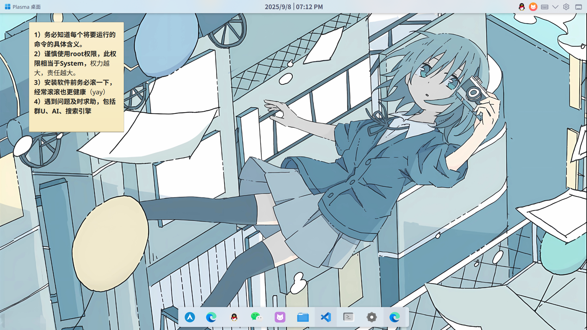
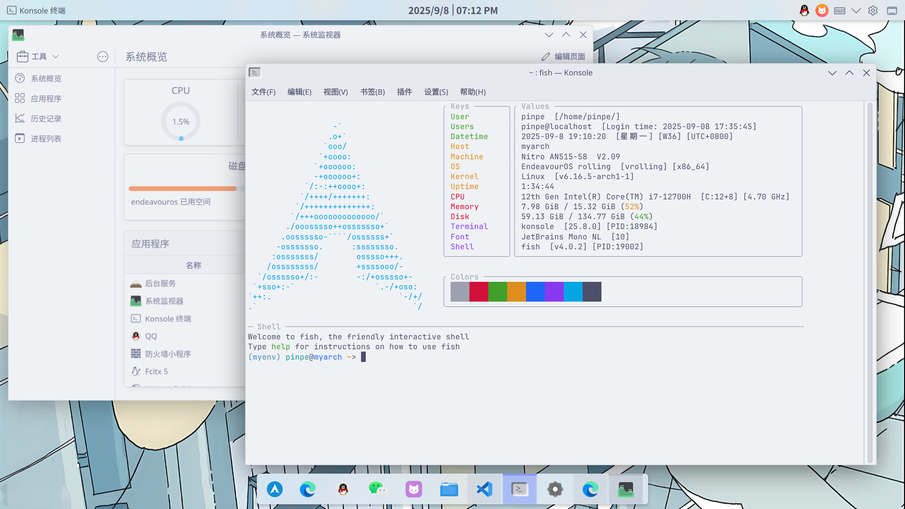
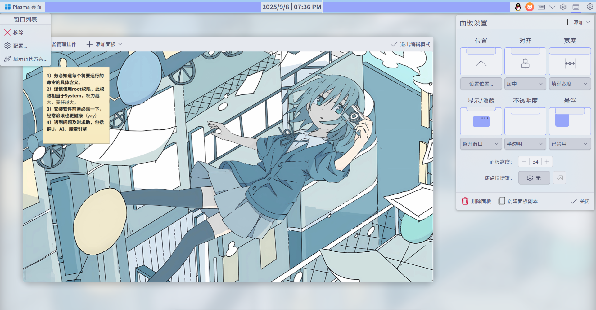
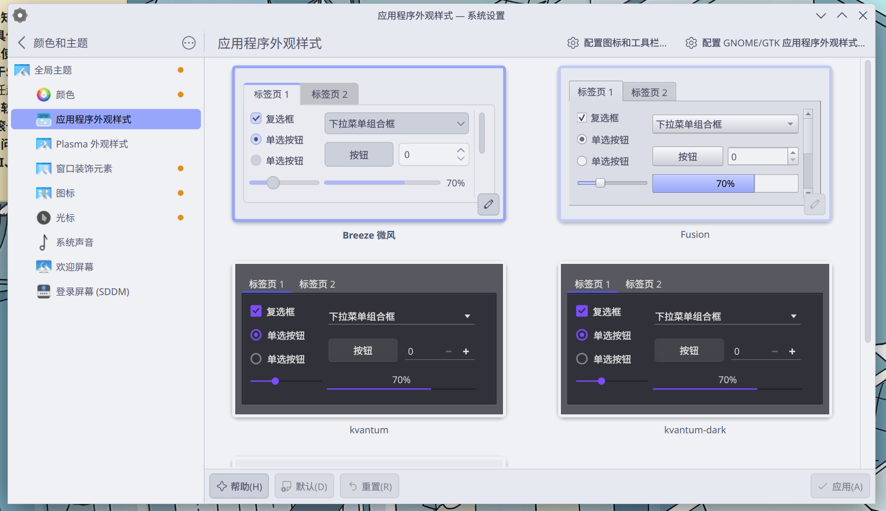
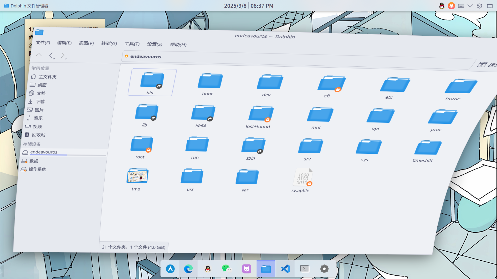
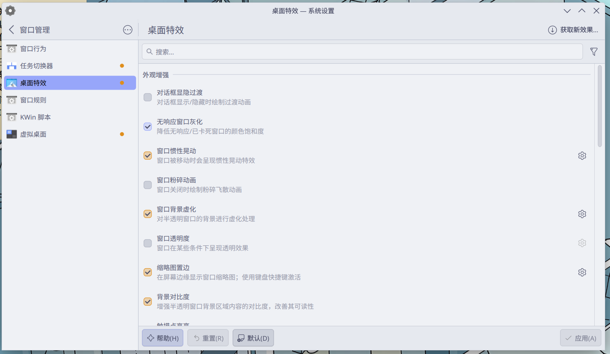
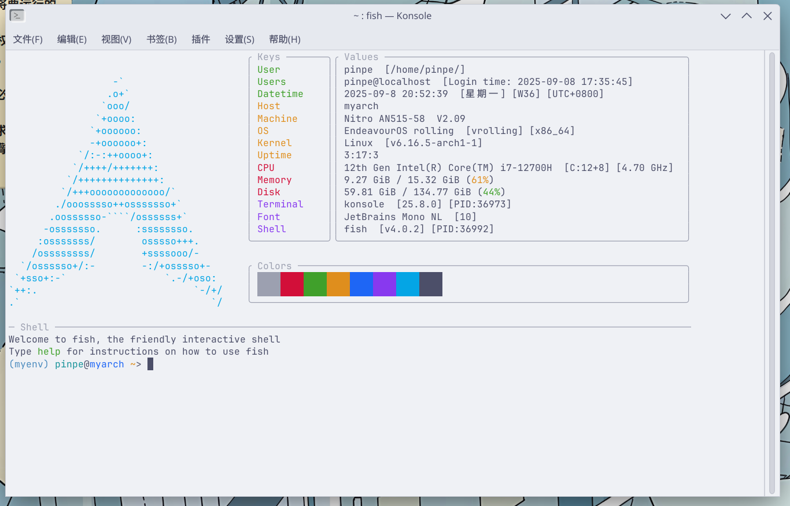

<style>
    .lnk{
        background: var(--license-block-bg);
        margin: 0.5rem 0px;
        padding: 1.1rem 1.5rem;
        border-radius: var(--radius-large);
        transition-property: all;
        transition-timing-function: cubic-bezier(.4,0,.2,1);
        transition-duration: .15s;
        cursor: pointer;
    }
    .lnk:hover{
        background-color: var(--btn-regular-bg-hover);
    }
    .lnk:active{
        scale: .98;
        background-color: var(--btn-regular-bg-active);
    }
    .hide{
        background-color: black;
        color: black;
    }
    .hide:hover{
        color: white;
    }
</style>

## \[🎐 千里之行，始于足下\] # 转Linux的契机

那是一个暑假，我当时正在搞Windows的美化，然后不小心把某些文件删除了，导致不仅再也不见毛玻璃的材质，一些系统应用（例如设置）也没法打开。

我便进入启动项补救，结果安全模式是一片漆黑的，sfc和还原点是没用的，唯一剩下的，只有重置系统。

我别无选择，便重置了系统，最后我发现系统修好了，软件还在，但是设置什么的也一起重置了，一切都回到了2023年的状态，一切都要从头再来。

这时，一个念头出现了：

**“与其继续使用Windows，难道不能有其他的选择吗？”**

是啊，Windows特别是Windows11，又慢又笨重，喜欢到处拉屎，甚至还有成千上万的Bug和技术债，一个专业版就要收费一千多，结果卖成这价格也都植入了广告，除了生态是全球最大的以外，与其他系统根本不能比，这就是垄断的力量，已经连做产品的觉悟都没有了。

于是，我将目光投向其他操作系统：

- Mac OS虽然有品味，但是绝对封闭，把用户当白鼠养，生态也不咋地，普通电脑也很难安装。
- 而Linux则刚刚好，开源不拉屎，虽然生态不如Windows，但是也有一些人作为日用系统，似乎只要不玩3A大作和工业软件，也能够用。

于是，在这个契机下，我的Linux旅程，便开始了。

## \[🌸 知己知彼，百战不殆\] # 选择一个发行版

我已经确定要使用Linux了，但是Linux只是一个内核，还有成千上万个衍生出来的发行版，且各有不同。

我选择了Arch，但是与转Linux不同的是，我甚至无法拿出任何像样的理由，也许是与Windows完全相反的极致轻量化，也许是自定义程度高，也许可以让我学到点东西，也许比较热门，<span class=hide>也许MTF很喜欢用</span>，但无论如何，我就是选择了它。

这个发行版门槛和难度都比较高，对用户不太友好，但是我有信心可以驾驭它，成为优秀的Windows的平替。

当然，纯Arch我玩不来，我选择了基于Arch衍生而来的**EndeavourOS**，它支持图形化的安装方式，也预装了一些软件，其他都没怎么动，相比起来更加方便一些。

## \[🌺 爱美之心，人皆有之\] # 桌面环境与终端

我换Linux的一个动机就是可以随心所欲美化，这样看的会更加舒服。

经过了适当的美化和磨合后，截至目前，我的桌面是这样的：





我使用的是此发行版预装的KDE桌面环境，与其他桌面环境有一个优点就是自定义程度高，例如上图的“Dock”和“Finder”，实际为两个面板，每个面板都可以单独自定义属性和内容：



支持全局主题，与Windows只能换个壁纸不同，这里的主题甚至可以替换控件样式、窗口装饰、图标、配色等，大部分软件的主题一致性也能保证，而Windows11已经成为究极缝合怪了：



:::tip
可以透露一些主题信息：
|项目|值|注释|
|-|-|-|
|配色|Catppuccin Latte Lavender|这是一个配色方案标准，色彩柔和，支持数百种接口，其中也包括了KDE。|
|应用程序外观样式|Breeze微风|默认的已经很好看了。|
|Plasma外观样式|Breeze微风||
|窗口装饰元素|Breeze微风|以前用的是其他的，但因为[这个](https://pinpe.top/posts/kde-gtk3-shadow/)原因，导致换回默认的了。|
|图标|Fluent|设计的比较清爽，但是也有风格不一致的问题。|
:::

不过我认为最好的是动效，几乎每处地方都有一个过渡动画，且质量和性能都不错，最让人感到惊艳的动效是窗口拖动时的惯性效果，一张图足以说明一切：



这是我将文件管理器从左边快速拖到右边的截图，只需要进入`设置->动效->桌面特效`，打开`窗口惯性晃动`，就可以开启了，自带的：



说了这么多桌面环境，来看看Linux的精华：终端如何吧。

我使用的是KDE自带的Konsole终端，Shell默认为Fish，主题为Catppuccin Latte，以下是进入终端时的样子：



我写了一个小脚本，在进入终端时会自动加载Python虚拟环境（至于为什么后面要提到），Haskell语言工具链Path，以及使用fastfetch显示的系统信息，以充足的准备来执行命令：

```fish
set -gx PATH $HOME/.ghcup/bin $PATH
if test "$TERM_PROGRAM" != "vscode" && test -z "$VSCODE_INJECTION" && test -z "$NVIM"
  if status is-interactive
    source myenv/bin/activate.fish
    fastfetch
    printf "\n\u001b[90m─ Shell ──────────────────────────────────────────────────────────────────────────────────────────────────────────────\u001b[0m\n"
  end
end
```

:::tip
neofetch、fastfetch等软件可以在终端里显示系统信息，因为一些原因被称为“耍酷”的代名词，很多配置展示的视频下第一个命令就是调用这些软件。
:::

## \[🌼 采菊东篱下，悠然见南山\] # 包的管理与生态

首先要说明一下，Arch使用滚动更新的更新策略，这意味着系统组件可以使用包管理器单独的升级和安装：

>滚动更新（rolling update）是指软件开发中经常性将更新发送到软件的概念。相较于滚动发行，有标准版本和小数点版本的版本号开发模式，必需通过重新安装以取代先前的发行版。archlinux 是没有版本概念的，它始终保持最新的状态，通俗地理解就相当于把发行版比喻为一部车，ubuntu 更新就是换一部新的，而 archlinux 就是把车里面旧的配件换成新的。
>
><span style="color: #666">_——来自[archlinux 简明指南](https://arch.icekylin.online/guide/prepare/understand)_</span>

