最近一款叫[**Wigglypaint**](https://internet-janitor.itch.io/wigglypaint)的麦金塔风格的画图软件在互联网上很火，使用它可以画出线条抖动的图画，深受画师喜爱。

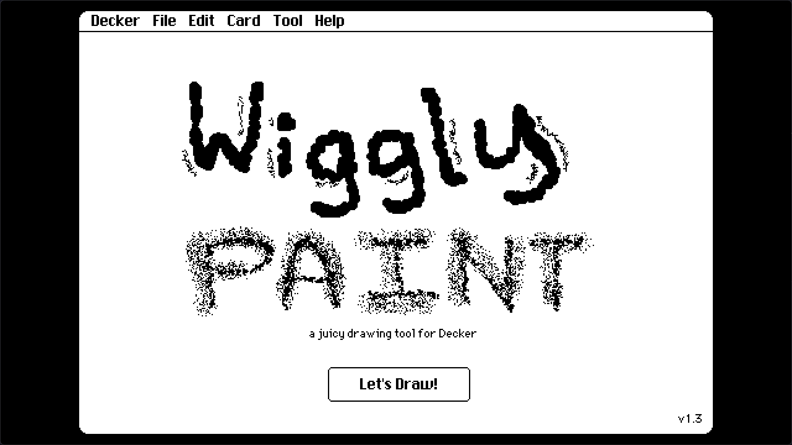
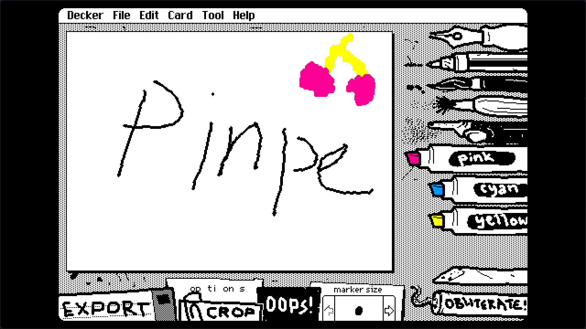

比如这些作品就是用这款软件画的，线条确实是抖动的，很灵动：

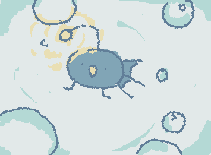

但是随着我的深入研究，发现事情并没有这么简单，因为它支持一整套开发环境。

## Decker

实际上，这款软件建立在[Decker](https://internet-janitor.itch.io/decker)之上，这是一款模拟麦金塔风格的软件引擎，可以轻松地创建麦金塔风格的软件，这就是Wigglypaint如此复古的原因。

它还有一个自创的脚本语言[Lil](https://beyondloom.com/decker/lil.html)，地位和JavaScript或VB，但文章篇幅限制就不展开了。

接下来我会教你做个Demo。

## Deck（项目）的创建与保存

在上面的导航栏，依次点击`File->New Deck`：

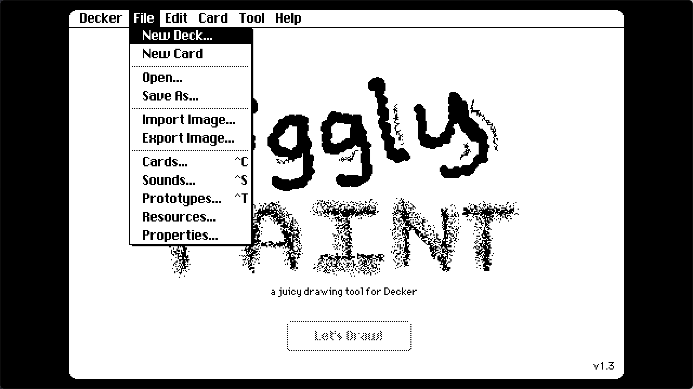

弹出对话框，点击`Discard`：

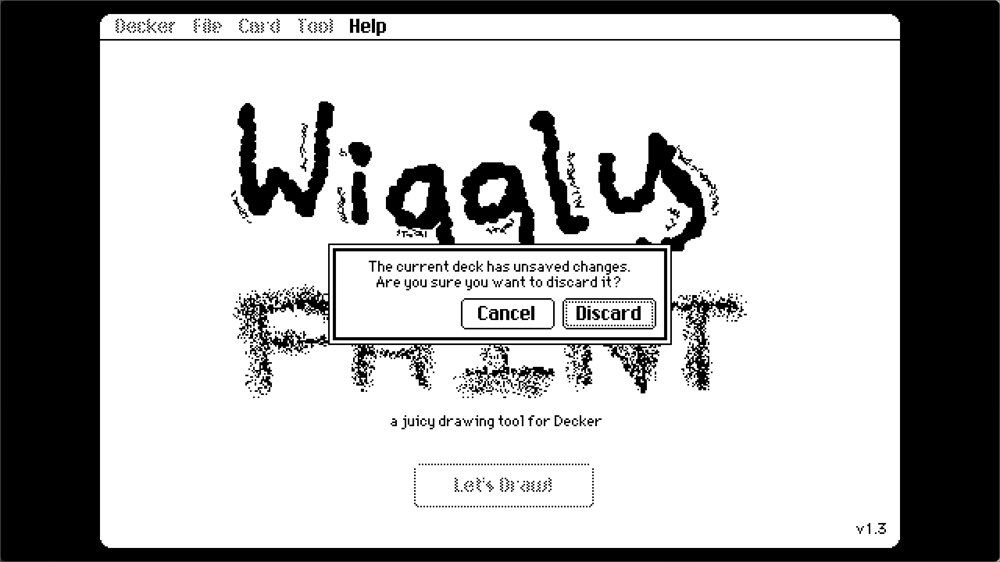

此时就能创建一个空白Deck，如果以后想要保存你的Deck，只需依次点击`File->Save As`：

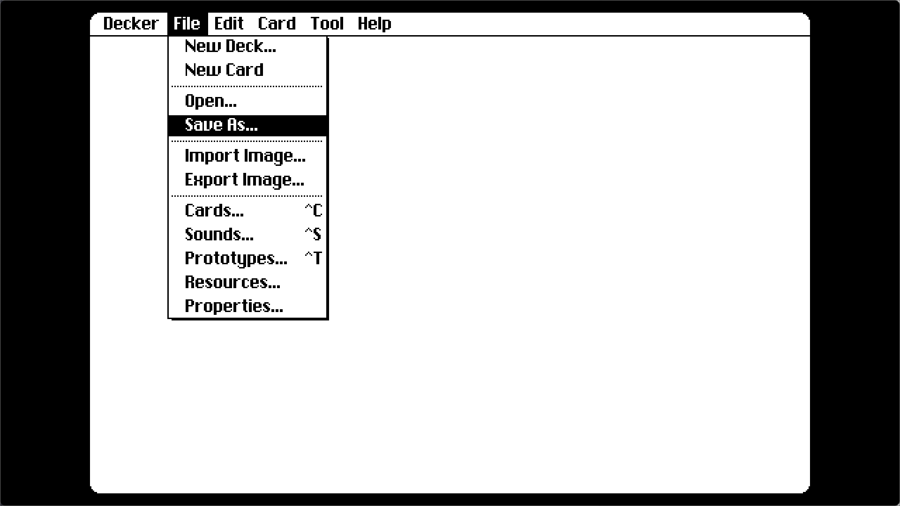

输入你想保存的文件名，然后点击`Save`：

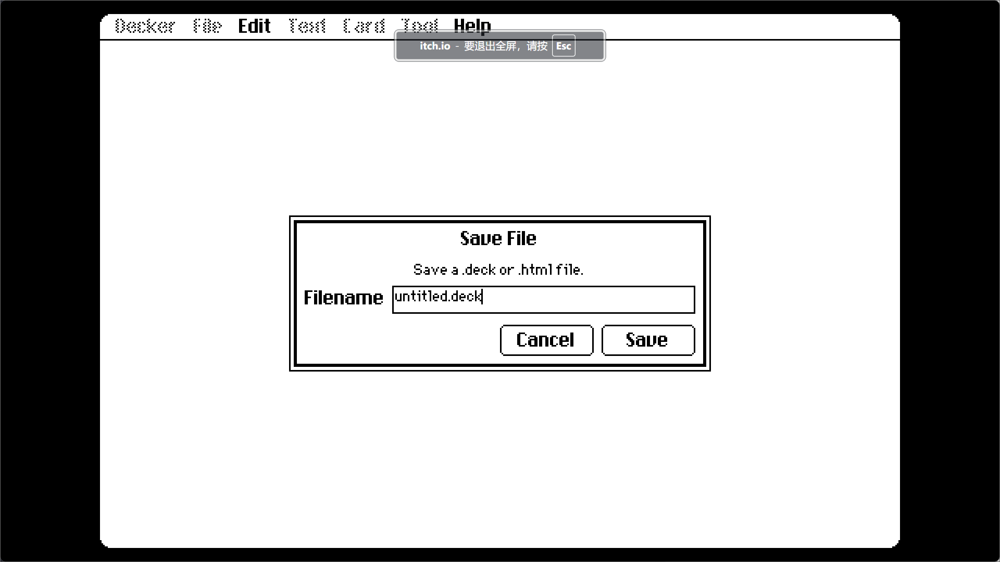

如果你想打开保存的文件，只需要`File->Open`，然后选择文件即可。

## Card（页面）的管理

创建Deck后，依次点击`File->Cards`，即可查看和添加所有的Card：

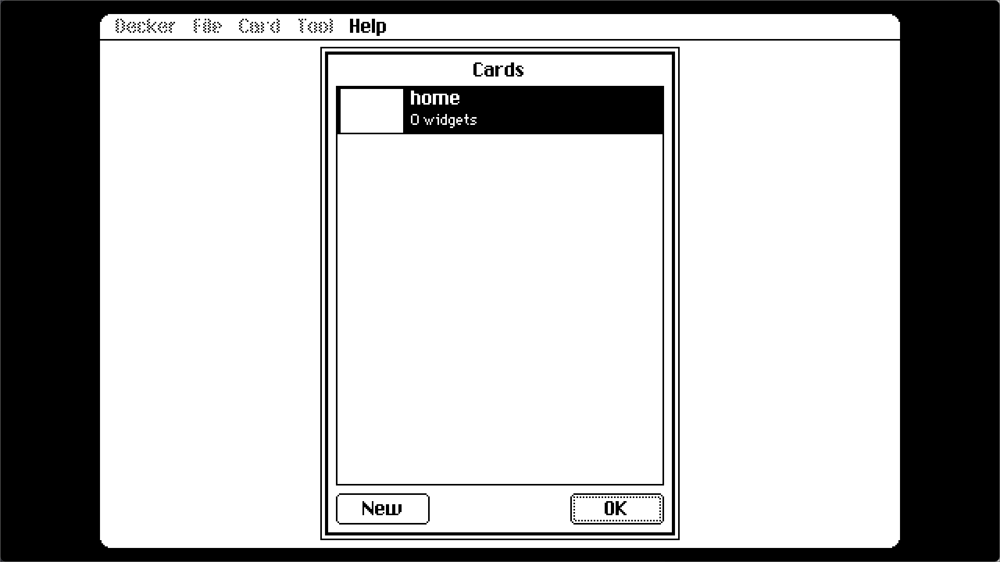

`New`可以新建一个Card，双击其中一个Card可以改名字和写脚本（`Script...`）：

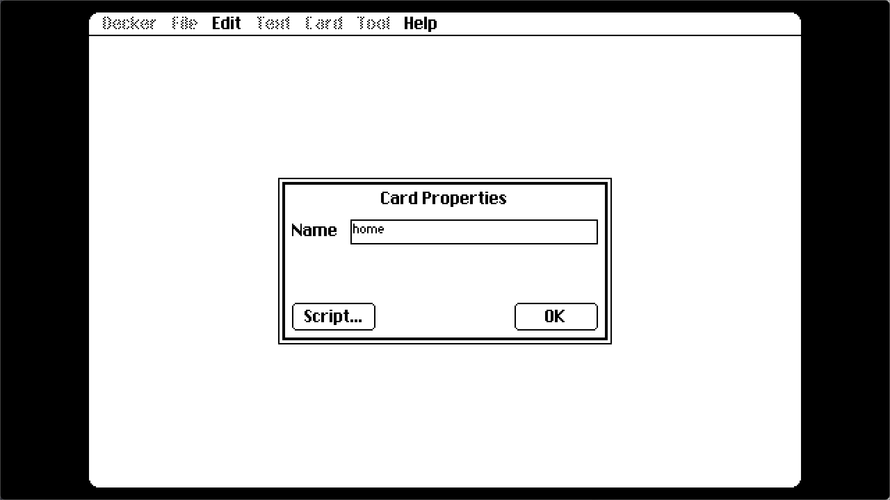

## 使用Tool（工具）来构建页面

点击`Tool`菜单，可以看到有好几种选项：

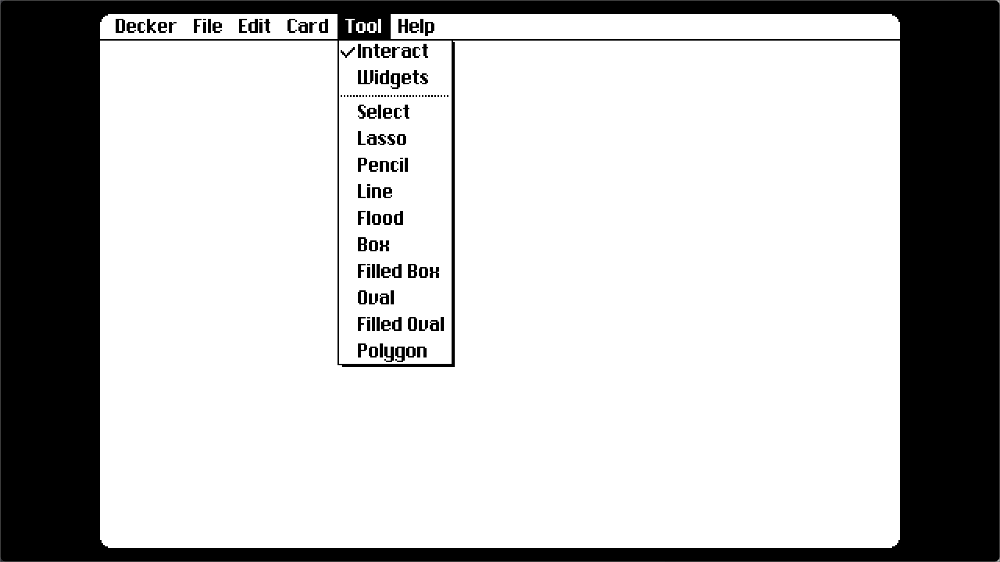

- `Interact`：类似于预览，可以以用户的身份与Windget（控件）交互。
- `Widgets`：Windget模式，用于管理和添加此Card上的Windget。
- `Select`：矩形框选背景。（不包括Windget）
- `Lasso`：不规则框选背景。
- `Pencil`：画笔工具，可以在背景上画画。
- `Line`：在背景上画线段。
- `Flood`：油漆桶工具。
- `Box`：画出空心矩形。
- `Filled Box`：画出实心矩形。
- `Oval`：空心圆。
- `Filled Oval`：实心圆。
- `Polygon`：不规则实心形状。

例如，我们要给Card设置背景纹理，请选择`Flood`，然后在`Style->Stroke`选择纹理，再点击空白的Card即可：

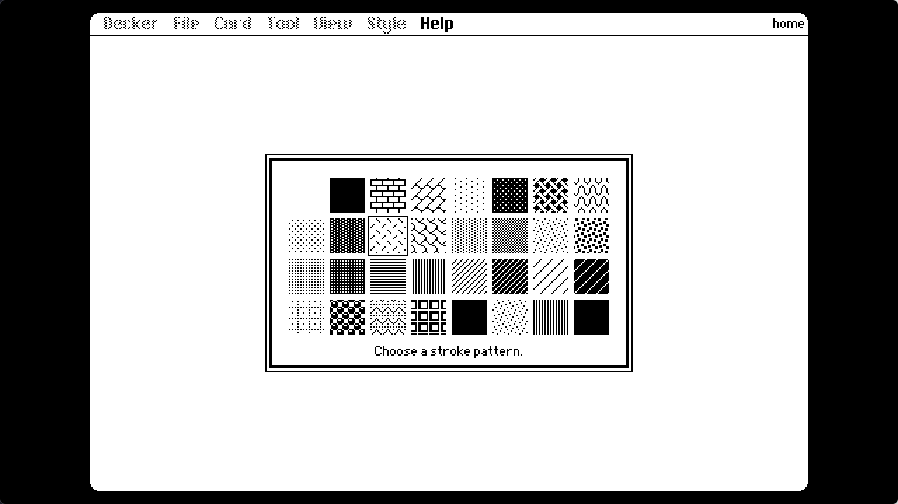
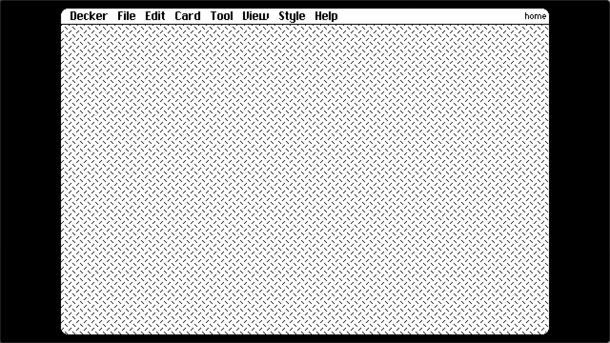

当然，你可以画一个爱心之类的装饰品：

## 创建和修改Windget

Windget就是可以交互的控件，如果不是纯手绘的展示型页面，还是需要Windget的。

切换到Windget模式，在`Windgets`菜单，可以创建好多种Windget：

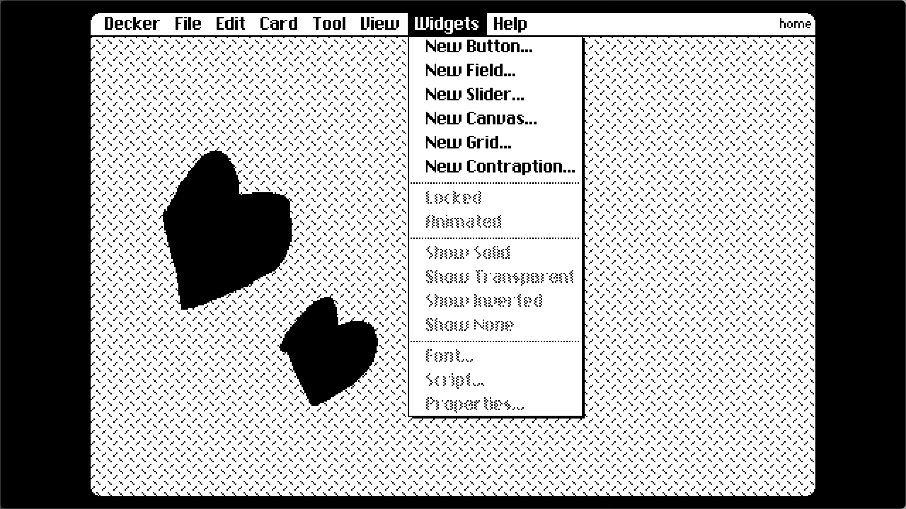

- `Button`：按钮或复选框。
- `Field`：文本或输入框。
- `Silder`：滑动条。
- `Canvas`：画布，可以让用户在画布上作画。
- `Grid`：表格。
- `Contraption`：自定义控件。

作为一个demo，当然要写一个Hello world啦，而显示文字需要`Field`Windget，因此请点击`New Field`，然后拖动和双击新创建的Field：

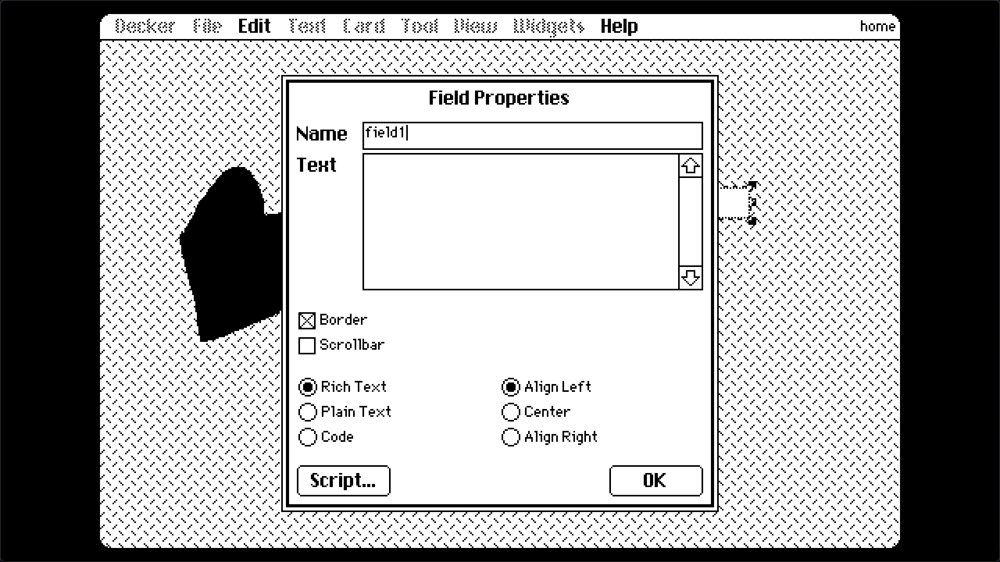

在`Text`输入框里输入`Hello world`，取消勾选`Border`，然后就`OK`：

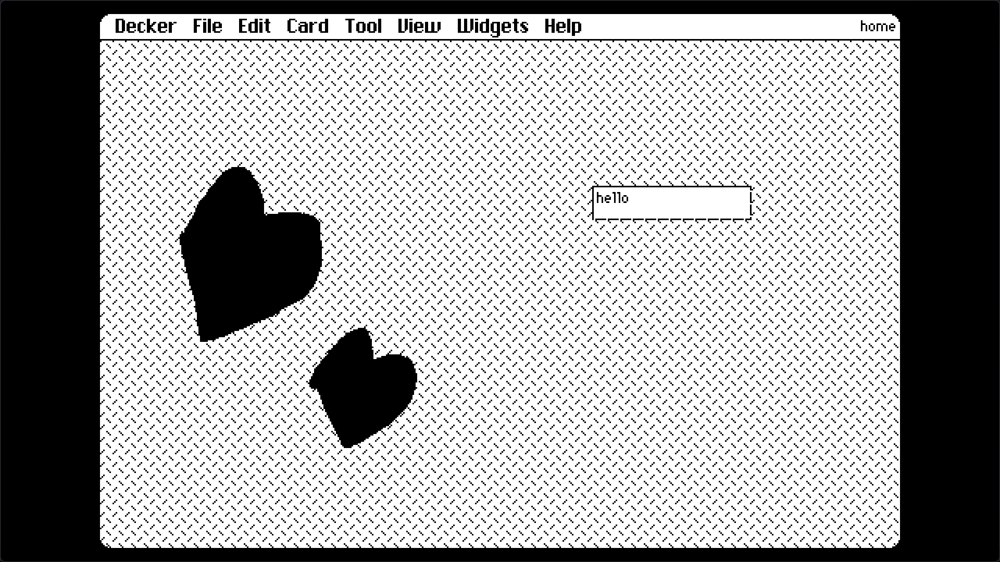

但现在还不够，因为这实际上是个输入框，用户也能更改文本，因此还是需要选择此框，然后`Windgets->Locked`：

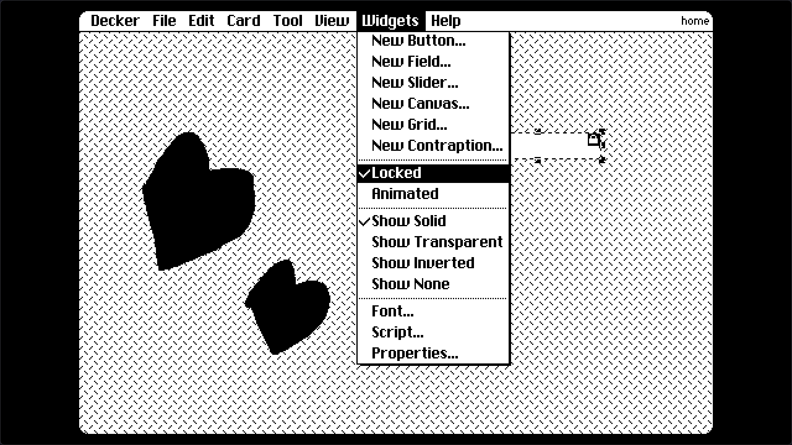

这样就可以了，你成功创建了一个无边框且无法更改的Field。

接下来，需要创建一个按钮，用来实现Card跳转的功能，点击`Windgets->New Button`，双击新创建的Button：

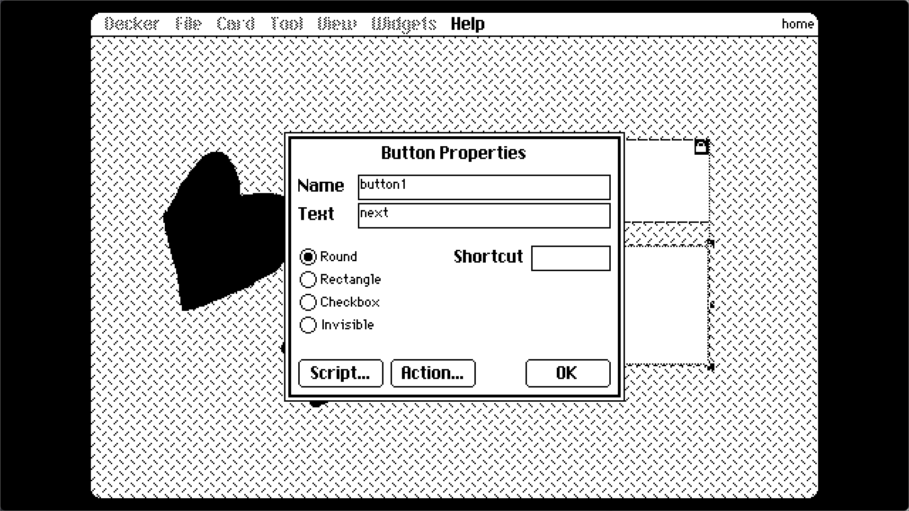

在`Text`输入框里输入`next`，`OK`。

## 给Button添加Action（行为）

现在已经成功创建了一个Button，但是现在点击Button并没有什么用，因此我们需要设置一个Action，用于跳转到别的Card。

注意，在设置Action之前，先`File->Cards`，创建一个新的Card，中间再创建一个`back`Button，就像这样：

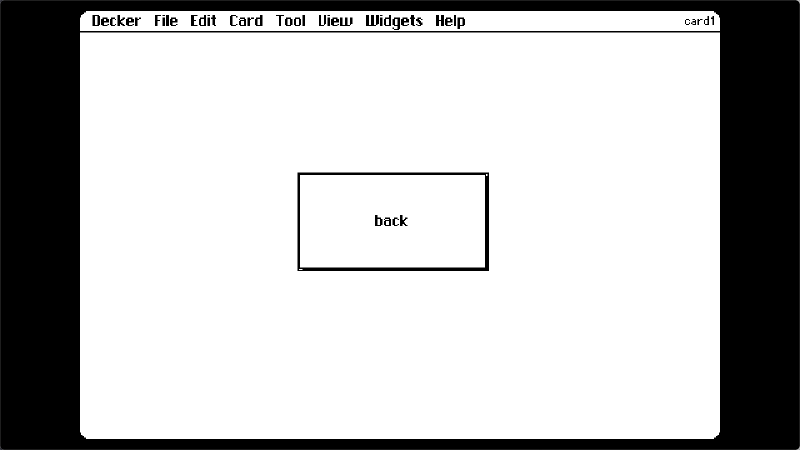

然后双击按钮，点击`Action...`，会看到以下选项：

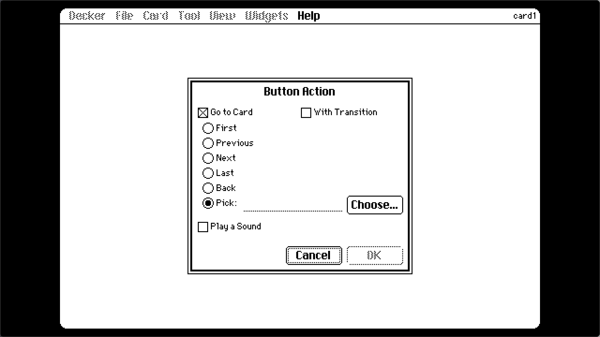

选择`First`，`OK`，然后回到上一个页面，同样是之前创建的按钮，在`Action...`里设置`Next`。

于是一个简单的Demo就完成了，其中的技术包括绘制背景、设置不可变文本、按钮跳转。