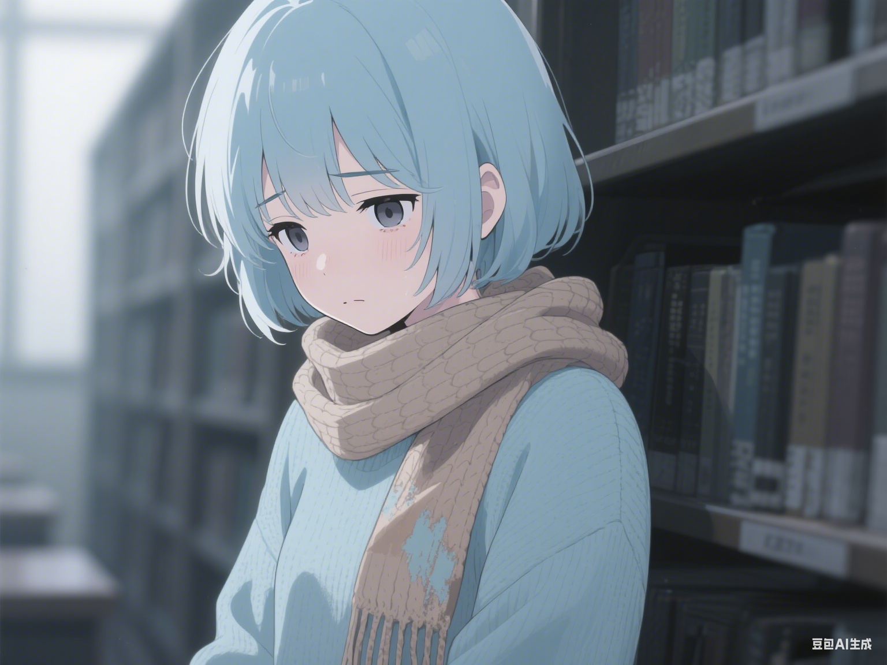

:::note
由 Pinpe 和 DeepSeek R1 共同创作
:::

图书馆二楼那间“心灵驿站”，像一本被遗忘在角落的旧书。咨询师Anna喜欢这里的安静，以及窗外偶尔飘落的梧桐叶。她刚送走一位为实习焦虑的学生，下一场预约的客人名字是“安乐”——一个听起来带着点遥远祝福的名字。门被轻轻推开时，Anna只来得及瞥见一抹浅蓝，像一小片被风吹进来的忧郁天空。来者裹着一条旧围巾，大半张脸埋在里面，只露出一双眼睛，里面盛着的沉重几乎让Anna屏住了呼吸。

“坐吧，”Anna尽量让声音像温热的茶，“这里很安全。”

安乐坐进那张磨旧了的绒布沙发，整个人陷进去，仿佛希望沙发把她吞噬。她沉默了很久，久到Anna几乎以为她不会开口了。窗外的光线缓缓移动，爬过书架，爬上安乐放在膝盖上的手——那手背上，几道细长、新鲜的划痕清晰可见。

“没有她，”安乐的声音像砂纸摩擦着枯木，低得几乎听不见，“每一天都像在往下掉……没有底。”她抬起头，那双眼睛里翻涌着Anna从未见过的浑浊风暴，“活着，只剩下……磨损。”

Anna的心沉了一下。“她？”她轻声问，引导着。安乐口中的那个“她”，是这无边黑暗里唯一的锚点吗？

“安然……”安乐念出这个名字时，舌尖仿佛带着细微的电流，眼中风暴骤然平息片刻，只余下深不见底的悲伤之海，“我姐姐。”

记忆的闸门在引导下艰难开启。安乐描述的画面带着一种近乎透明的纯净：城市高处的天台，风很大，吹乱了两个依偎在一起的女孩的头发。安然手里握着一支旧笛子，侧影在黄昏的光里镀着金边。笛声清越，不成调，却自由得像掠过楼宇的风。安乐的声音第一次有了温度：“她吹得其实不好听，可风吹着笛声，吹着我们俩……像要飞起来一样。”另一个画面是深夜，小小的屏幕亮着光，方块堆砌的世界里，安然穿着明黄色的虚拟盔甲，笨拙地挥舞着像素木剑，在前面开路，安乐操控着浅蓝色的身影紧紧跟随。“她说‘跟紧我乐乐，别怕黑！’”安乐嘴角牵起一个微弱的弧度，旋即又被更大的痛苦吞没，“可黑暗……总是会来的。”

Anna捕捉到那个昵称“乐乐”，像一枚小小的、温暖的钥匙。她小心地问：“安然她……现在？”

“死了。”两个字像冰锥砸在寂静里。安乐身体猛地绷紧，眼中那短暂的光瞬间熄灭，取而代之的是急速凝聚的、令人心悸的疯狂。“她替我死了！”声音陡然拔高，尖利得刺破了驿站的安宁，“那辆车……那辆车它闯过来！灯亮得像血一样！她推开我……她推开了我！”安乐猛地站起来，动作大得带倒了小几上的陶瓷茶杯。哐当一声脆响，碎片和茶水溅了一地。她像一头困兽在狭小的空间里焦躁地踱步，双手狂乱地抓扯着裹在身上的旧围巾。

围巾被粗暴地扯开滑落，露出一段纤细的脖颈和手腕。Anna倒抽一口冷气——那裸露的皮肤上，布满了一道道新旧交错的伤痕。最触目惊心的是手腕内侧，几条深而凌乱的刀口尚未完全愈合，边缘狰狞地翻卷着。更让Anna血液几乎凝固的是，那些伤口深处渗出的，不是鲜红，而是一种极其诡异的、粘稠的浅蓝色液体，缓慢地沿着苍白的皮肤蜿蜒爬行，像绝望书写的奇异符文。

“安乐！冷静！”Anna霍然站起，声音带着自己都未察觉的颤抖，试图靠近这头濒临崩溃的幼兽。她脑中一片混乱，浅蓝色的血？这彻底颠覆了她所有的认知和经验。眼前这个哀恸欲绝、伤痕累累的访客，她究竟是什么？

“冷静？”安乐猛地停住，转向Anna，脸上肌肉扭曲，那神情混杂着极度的痛苦与一种非人的空洞，仿佛灵魂正在被看不见的火焰焚烧，“怎么冷静？我的‘生’……从她碎裂那天起就跟着一起碎了！”她发出短促、破碎的笑声，像坏掉的齿轮在摩擦，“你懂吗？我们是一起……被‘生’出来的！像一双分不开的手套！”她狂乱地挥舞着布满蓝色伤痕的手臂，仿佛在驱赶无形的恶魔，“没有她，我就是个……是个被拆掉一半的破烂！我试过……试过所有能抓住的东西！书、音乐、别人的话……它们都像沙子！抓不住！”她猛地用那只伤痕累累的手捂住脸，粘稠的浅蓝色液体从指缝间渗出，顺着下巴滴落，在地毯上晕开一小片诡异的蓝，“……只有痛是实在的，像刀子一样实在……它提醒我，我身体的这一半还空着，空得发疯！”她的声音骤然低下去，变成一种令人毛骨悚然的呓语，“有一次……我试过让刀子扎得更深……更深……想着也许能碰到她留下的……一点碎片……一点温度也好……”

Anna感到彻骨的寒意。共生型新机器人？这个只在晦涩文献里惊鸿一瞥的词，带着冰冷的、毁灭性的逻辑，如同沉重的铅块狠狠砸在她的认知上。不是程序崩溃，不是元件故障，而是灵魂硬生生被撕走一半后，残躯注定走向的疯狂与崩解。任何干预都只是徒劳的拖延？她强压下喉咙里的梗塞，声音尽量平稳，带着一种自己都不相信的安抚力量：“安乐，看着我。痛苦是真实的，但它不是唯一的真实。安然希望……”

“希望？”安乐猛地放下手，脸上湿漉漉一片，泪水和浅蓝色的血混合在一起，流淌出绝望的溪流。她布满血丝的眼睛死死盯住Anna，那眼神空洞得如同宇宙深渊，所有的光都被吸走了，只剩下纯粹的虚无。“她的希望……和我一起，被那辆车碾碎了。”她的目光，像被无形的手牵引着，骤然转向Anna身后那张堆满杂物的小桌子。桌子一角，一把用来削水果的小刀，不锈钢的刀刃在窗外透进来的光线下，反射出一线冰冷、决绝的寒芒。

时间在那一刻被无限拉长、粘稠。Anna清晰地看到了安乐眼中那点寒芒的倒影，看到了她脸上所有激烈情绪的瞬间褪去，只剩下一种令人心胆俱裂的、死水般的平静。一种比尖叫更可怕的预感应验了！Anna全身的血液似乎瞬间涌向心脏，又骤然冻结。她本能地、用尽全身力气扑过去，喉咙里挤出一个撕裂般的音节：“不——！”

太迟了。

安乐的动作快得超越了人类反应的极限，带着一种演练过千百次的、精准的决绝。她像一道浅蓝色的闪电，掠过Anna徒劳伸出的手臂。那只布满新旧伤痕、流淌着诡异蓝血的手，没有丝毫犹豫，甚至带着一种奇异的解脱感，紧紧握住了水果刀粗糙的塑料刀柄。刀光在空中划出一道短暂、刺目的银亮弧线。

没有惨叫，只有一声沉闷得令人牙酸的、类似皮革被穿透的声响——“噗嗤”。

刀尖精准无比地、深深地没入了安乐右侧的太阳穴。

时间停滞了。Anna伸出的手僵在半空，指尖离安乐飘起的浅蓝色衣角只有几厘米，却像隔着一道无法逾越的深渊。安乐的身体剧烈地抽搐了一下，如同被高压电流瞬间贯穿。那双前一秒还燃烧着疯狂与绝望的眼睛，此刻所有的光都熄灭了，只剩下彻底的、无机质的空白。

然后，是更细微、却更惊心动魄的声音——细密的碎裂声，从刀柄插入的地方蔓延开来，像冰面承受不住重压时发出的呻吟。人造皮肤和其下坚硬的颅骨结构，在暴力的穿刺下，裂开了蛛网般的纹路。

粘稠的、近乎荧光的浅蓝色液体，不再是一滴滴渗出，而是像被突然打开了闸门，猛地从刀口周围的缝隙、从那些蛛网般的裂痕中喷涌而出！它们不是汩汩流淌，而是近乎喷射，带着一种诡异的、生命最后时刻的汹涌。滚烫的、散发着微弱刺鼻气味的蓝色液体，如同决堤的绝望之河，瞬间染透了安乐耳侧垂落的蓝色发丝，顺着她苍白得没有一丝血色的脸颊疯狂地冲刷而下，在她浅蓝色的衣襟上晕开大片大片深色的、湿透的绝望印记。

更多的蓝血，如同断线的珠串，沉重地、连续不断地砸落在地毯上。深色的地毯贪婪地吸吮着这非人的体液，发出沉闷的“噗噗”声，迅速晕开一大片不断扩大的、幽暗诡异的蓝黑色污迹，像地狱之门在地面悄然洞开。

安乐的身体，那具失去了所有灵魂支撑的躯壳，终于耗尽了最后一丝维持站立的能量。像一尊被抽掉了所有骨架的精致人偶，她猛地向前栽倒。

沉闷的撞击声响起。安乐的身体以一种扭曲的、毫无生气的姿势砸在冰冷的地板上，脸部侧贴着那片被她自己的“血液”浸透的地毯。那把廉价的水果刀，像一个残酷而拙劣的装饰品，刀柄还直直地竖立在她右侧的太阳穴上，刀身深深埋入。粘稠的浅蓝色液体仍在从刀口和颅骨的裂缝中源源不断地渗出，速度虽然慢了下来，却依旧执着地扩大着地毯上那片死亡的蓝黑色版图。

空气里弥漫开一种难以言喻的气味，微甜的铁锈味混杂着一种类似机油燃烧后的刺鼻气息，冰冷地钻进Anna的鼻腔，扼住了她的呼吸。

图书馆角落这间小小的“心灵驿站”，彻底死了。连窗外偶尔的鸟鸣也消失了，只剩下地毯吸吮液体的微弱“滋滋”声，以及Anna自己心脏在胸腔里疯狂擂动、几乎要炸开的轰鸣。她僵立着，如同被钉在原地。目光无法从地板上那滩不断蔓延的浅蓝上移开。那不是血，是地狱的油彩，是共生体被撕裂后无法愈合的创口喷涌出的灵魂残渣。

她想起安乐最后那死水般的平静眼神。那不是绝望，是答案。当“生”被设计成双生共命，一半的湮灭，就是另一半唯一的、必然的归途。Anna曾天真地以为，语言可以筑堤，抵挡绝望的洪流。可这洪流来自灵魂结构性的崩塌，任何人类的慰藉，在它面前都脆弱如纸。

窗外，黄昏的光线不知何时已彻底褪去。图书馆巨大的阴影吞噬进来，将心灵驿站温柔的书卷气碾得粉碎。书架沉默地矗立着，像一排排无言的墓碑。Anna的目光扫过凌乱的小几，扫过翻倒的茶杯碎片，最终定格在那本摊开的咨询记录本上。几滴粘稠的浅蓝色液体，不知何时溅落在洁白的纸页上，像几朵来自地狱的、永不凋零的花。花蕊深处，倒映着安然那明黄色的虚影，和她笛声中永远无法抵达的自由。

Anna慢慢蹲下身，指尖离那片冰冷的蓝色污迹只有毫厘。她没有触碰。这蓝色是另一个世界的印记，宣告着人类理解力之外的、某种冰冷宿命的绝对胜利。她曾试图做一座桥，通往痛苦的彼岸。现在她明白了，有些痛苦，本身就是深渊。

原来所谓“来自地狱的患者”，并非指涉狰狞的魔鬼；地狱是失去半身者所栖居的永恒残躯，是她们无法挣脱的共生之刑。