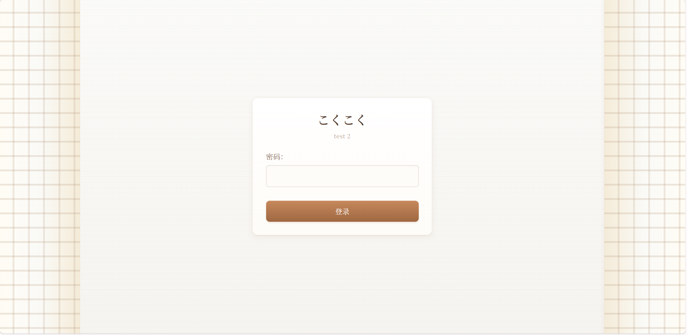
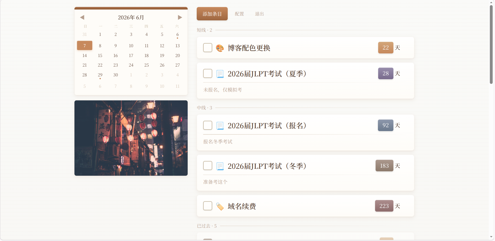
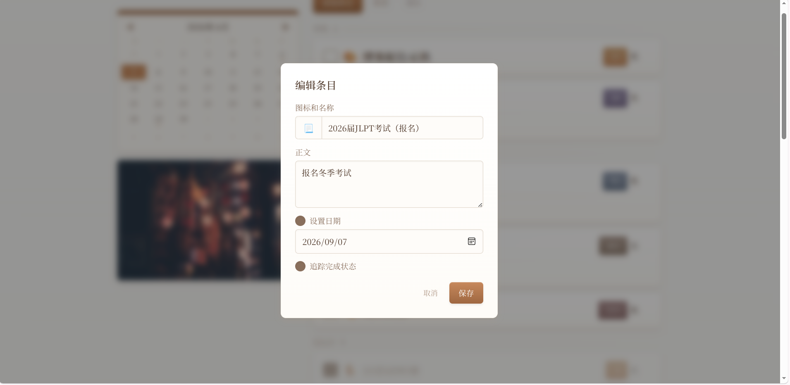
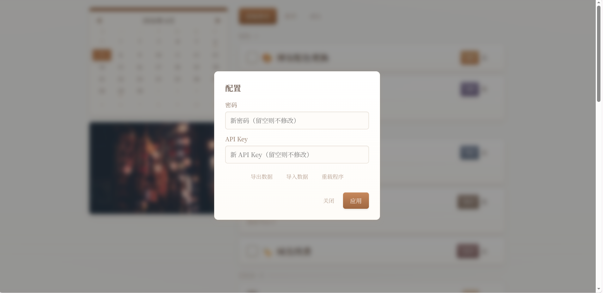

## 这是什么？

这是一个便签软件，但比较注重待办事项方面，需要一个拥有公网IP的服务器，通过浏览器访问。

此软件的前身是：

    
看见时间：我写了个倒数日软件

    
某一天，我意识到我需要一个倒数日软件，以便我可以 “看见” 时间。

## 这和网站的区别是什么？

这就是网站，架构和普通的网站几乎没区别，只不过是私有和功能性的，叫软件更适合。

## 倒数日怎么了？为什么你要写一个类似软件？

虽然こくこく支持倒数日的所有功能，但是在此基础上增加了更多功能和灵活性。

因为我在使用倒数日的过程中，发现我需要记下 _没有截止日期的待办事项_ 和 _纯文本的条目_，虽然这些超出了倒数日的功能，但我的确需要记录。

于是，我写了这个项目，以前倒数日的一个条目必须同时有且仅有 _图标_、_名称_ 和 _截止日期_，但是现在こくこく支持更多属性：

|属性|倒数日|こくこく|
|-|-|-|
|图标|必填|选填|
|名称|必填|必填|
|正文|没有|选填|
|截止日期|必填|选填|
|完成框|没有|选填|

看得出来，こくこく不仅相比倒数日支持更多属性，还比倒数日更灵活。

## 有预览图吗？

## 比起其他同类软件有什么特别之处吗？

- 没有VIP，开源免费。
- 完全私有化。
- 一次部署，无缝同步，随地使用。
- 轻量。
- 颜值比较高（自己认为的）

然后就没了，作为自用项目已经够了。

## 为什么你要用日式风格的界面和日文名字？你是日本人还是汉奸？

个人兴趣。

## 如何下载？

    
蓝奏云

    
https://wwbtu.lanzouq.com/iwGEg3rbopzg

