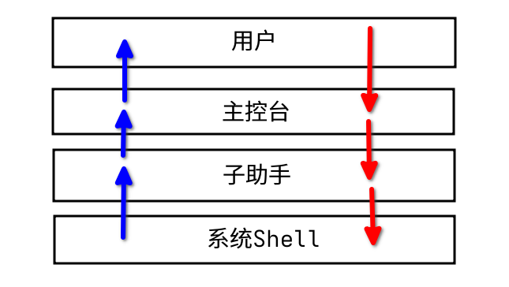
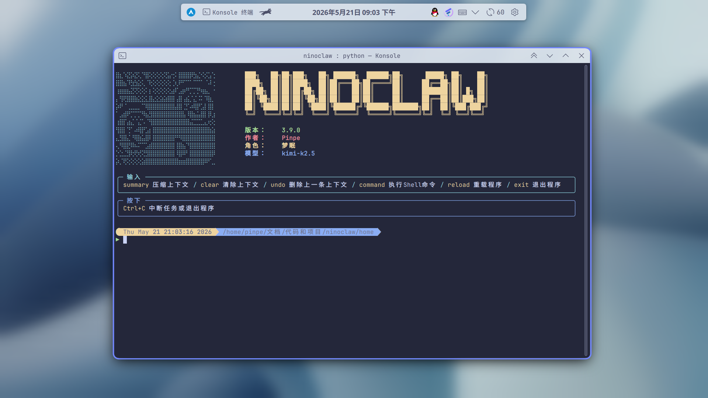
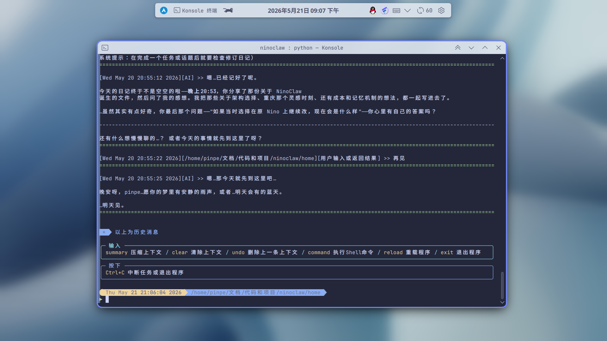
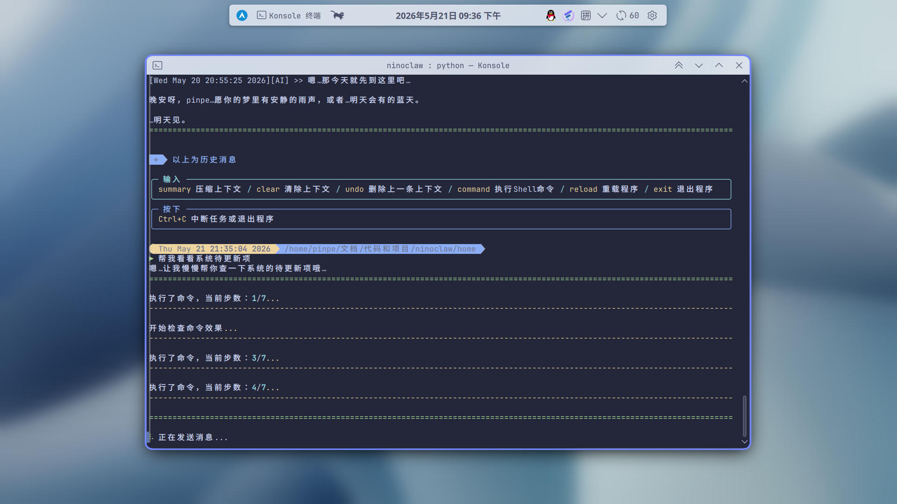
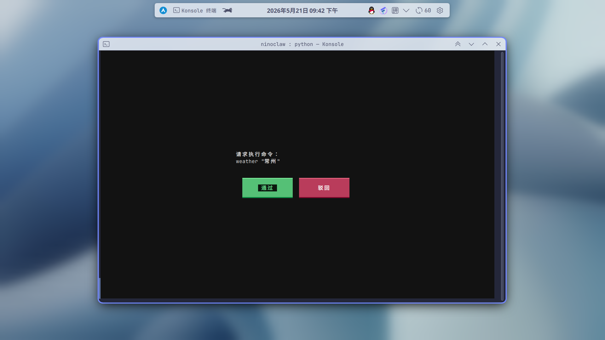

今年一月份的时候，OpenClaw还没有像今天一样火到大街小巷，只是技术圈子里的小众新玩意。

那时我刚刚放寒假，偶然间看到技术群里有人晒出了他新部署的OpenClaw，眼睛顿时一亮——我当时对LLM的理解只停留在网页对话和专用型编码Agent（例如Codex），这种能执行电脑上任意指令，支持Skill扩展，甚至能自举的Agent并没有见过，于是立即上手把玩起来。

但是玩了两天就放弃了。

首先不提每日都会清空记忆的奇怪机制（当时仅仅是ChatBot的[Nino](https://pinpe.top/posts/nino/)都不会这样干），主要原因是**我没有这么多钱**，仅仅两天时间就花了60块钱，应该谁都养不起吧。（后来又听说OpenClaw还是全VibeCoding的，一天上百个提交，只能以猎奇来形容）

于是便 `npm remove` 删掉了。

后来这事被搁置了一段时间，转折点是我当时在重庆旅游，突然不知怎么就想到了一件浅显的事——我可以自己做一个“OpenClaw”出来啊。

回到家后，我立刻开始了这个项目，我首先快速Vibe了一个小脚本——一个简单的ReAct的Agent，叫MiniClaw（代码在附录），发现效果符合预期后，便立刻去拯救那早已停滞的Nino。

但是实际操作起来却还是有很多问题，第一个问题是：我应该继续在原Nino的基础上继续更新，还是另开一个项目，使用更好的架构。

我最后选择了后者，只在名义上继承之前的Nino（因此版本号从3.0.0开始），顶多只是复用了一些工具代码，因为Nino的架构完全是为ChatBot设计的，非常死，也开始出现史山的苗头了。

当时离开学已经只有两天了，但也伴随着一个新项目的出现——**NinoClaw**。

## ▶ 技术架构和选型设计

与Nino一样，同样是本地应用，但是更加专业一些，遵循着以下方针：

- 不必要或不重要的功能不添加。
- 能使用系统原生的功能就不要自己管理。（例如能用配置文件就不要设计配置界面，能用系统的文件管理器就不要写导入导出功能）
- 尽量不硬编码任何东西，将需要硬编码的地方抽离到配置文件。
- 调用链尽量不要太多，用全局变量管理。

技术栈同样，但是没有Web Shell了，取而代之的是CLI界面，使用Python Rich+JSON。

架构方面稍微微调了一下，主要是分为了 `lib` （内置库）和 `main.py` （主程序和兼交互界面），不得不承认是，这个架构比Nino要粗糙一点。

:::tip
目前有计划将 `main.py` 中的交互界面剥离到一个独立程序（Shell），原来的主程序将只保留基本I/O，并且使用系统Shell互相通信，这样不仅能解耦，还可以更加方便制作更多的Shell（例如Web Shell），但是大概要咕咕很久。
:::

最后，项目结构大致是这样的：

```
- database（持久化文件）
    - context.json（上下文文件）
- home（Agent默认的家目录）
    - MEMORY.md（经验和长期记忆文件）
    - diary（日记）
        ...
- lib（内置库）
    - core.py（核心库）
    - database.py（文件管理库）
    - terminal.py（终端输出库，作为Rich的补充）
- prompt_template（Agent提示词模板）
    - exec.md（子助手默认提示词）
    - yume.md（主控台默认提示词）
    ...
- main.py（主程序和入口）
- env.json（敏感信息配置文件）
- config.json（配置文件）
（其他不重要的文件和文件夹...）
```

## ▶ 细节设计

以上是整个项目的大体情况，接下来选择一些需要注意的细节。

### 主控台-子助手架构

早期版本使用单Agent的ReAct循环，虽然架构简单，但是其带来的安全性、幻觉率和上下文占用都非常高，我们都知道上下文是LLM的稀缺资源，上下文越多模型就越笨。

因此从3.7.0开始，我想出了**主控台-子助手架构**，添加了一个子Agent（子助手），所有行为都只能通过子助手操作，然后子助手将结果返回给直接与用户对话的主Agent（主控台），同时清空子助手的上下文。



结果效果较为显著，大量无用的上下文被清空了。

### 使用系统Shell作为Skill调用方法

整个项目我只写了3个给Agent的接口：

- 主控台发布任务的 `[TASK]` ，传入自然语言。
- 子助手执行命令的 `[COMMAND]` ，传入Shell命令。
- 子助手返回结果的 `[RESULT]` ，传入自然语言或其他什么的。

有些人可能会把每个Skill都写一个接口，例如查看天气写一个接口，连接网络写一个接口...但实际上一个就好了，因为一切Skill都可以通过Shell调用，只是你需要手动添加别名。

你说这只是工具而不是Skill？这也没关系，这个方法支持任何可执行程序和文本文件，只需要在你的Shell配置里加上类似于 `alias xxx "cat /xxx/xxx/xxx.md` 即可

## ▶ 功能与效果展示

初次进入程序，会显示较为华丽的标题：



如果已经有上下文了，会把之前的历史消息打印出来：



正在执行任务中：



支持命令审查，不用再担心执行不应该的命令了：



## ▶ 安装方式

最简安装很简单，只需要准备两件事：

- Python 3.12 或更高版本
- 一个兼容 OpenAI API 格式的模型接口

然后敲以下命令：

```bash
git clone https://github.com/Pinpe/ninoclaw.git
cd ninoclaw
pip install -r requirements.txt
python main.py
```

最后打开 `config.json`，配置模型接口和各种路径。

当然这只是最简安装，不仅自带的Skill没有链接上，启动程序也很麻烦，因此请在你的Shell配置写上：

```bash
alias ninoclaw="python /你的实际路径/ninoclaw/main.py" 

alias web="python /你的实际路径/ninoclaw/skill/web.py"
alias get-llm="python /你的实际路径/ninoclaw/skill/get_llm.py"
alias vision="python /你的实际路径/ninoclaw/skill/vision.py"
alias weather="python /你的实际路径/ninoclaw/skill/weather.py"
alias ocr="python /你的实际路径/ninoclaw/skill/ocr.py"
```

:::warning
自带的Skill也不一定是开箱即用的，请检查每个Skill代码。
:::

## ▶ 附录

### NinoClaw项目地址

::github{repo="Pinpe/ninoclaw"}

### MiniClaw源码

```python
import os
import sys
import subprocess
import shlex
import re
from openai import OpenAI
from typing import List, Dict

# ================= 配置区域 =================
# 请设置环境变量 DEEPSEEK_API_KEY，或在此处直接填入你的 Key
API_KEY = os.getenv("DEEPSEEK_API_KEY", "")
BASE_URL = "https://api.deepseek.com"
MODEL_NAME = "deepseek-reasoner"  # DeepSeek R1 推理模型

# 定义 AI 调用 Bash 的暗号格式
# 格式: [BASH]命令内容[/BASH]
BASH_START_TAG = "[BASH]"
BASH_END_TAG = "[/BASH]"

# ================= 系统提示词 =================
# 告诉 AI 它是谁，以及如何使用 Bash 工具
SYSTEM_PROMPT = f"""
你是一个名为 'miniclow' 的智能终端助手。你可以通过调用 Bash 命令来帮助用户完成任务。

**关键规则：**
1. 当你需要执行系统命令时，请严格使用以下格式包裹命令：
   {BASH_START_TAG}你的命令{BASH_END_TAG}
   例如：{BASH_START_TAG}ls -la{BASH_END_TAG}

2. 命令执行是具有上下文的。你可以使用 `cd` 切换目录，后续命令会在新目录执行。
3. 如果用户只是聊天，直接回复即可，不需要使用标签。
4. 遇到危险命令（如 rm -rf /）请务必谨慎并请求用户确认（虽然你有权执行）。
"""

class MiniclowAgent:
    def __init__(self):
        self.client = OpenAI(api_key=API_KEY, base_url=BASE_URL)
        self.history: List[Dict] = [{"role": "system", "content": SYSTEM_PROMPT}]
        # 维护当前工作目录，初始为当前 Python 脚本运行目录
        self.current_cwd = os.getcwd()

    def call_api(self, user_input: str = None) -> str:
        """调用 AI 接口"""
        if user_input:
            self.history.append({"role": "user", "content": user_input})

        print("\n🤖 Miniclow 思考中...", end="", flush=True)
        try:
            response = self.client.chat.completions.create(
                model=MODEL_NAME,
                messages=self.history,
                stream=False
            )
            ai_content = response.choices[0].message.content
            print("\r", end="") # 清除思考提示
            
            # 将 AI 回复加入历史，保持对话连贯
            self.history.append({"role": "assistant", "content": ai_content})
            return ai_content
        except Exception as e:
            return f"API 调用错误: {e}"

    def execute_bash(self, command: str) -> str:
        """
        执行 Bash 命令，支持 cd 上下文切换
        """
        command = command.strip()
        print(f"\n⚡ 正在执行: \033[93m{command}\033[0m")  # 黄色高亮显示命令

        # 特殊处理 cd 命令
        if command.startswith("cd "):
            try:
                # 解析路径，处理引号和空格
                parts = shlex.split(command)
                if len(parts) > 1:
                    target_dir = parts[1]
                    # 处理 ~ (用户主目录)
                    target_dir = os.path.expanduser(target_dir)
                    
                    # 尝试切换目录（仅在 Python 内部状态切换）
                    # 下次 subprocess.run 会使用这个 self.current_cwd
                    # 注意：我们要先测试这个路径是否存在
                    new_path = os.path.join(self.current_cwd, target_dir) if not os.path.isabs(target_dir) else target_dir
                    new_path = os.path.abspath(new_path)
                    
                    if os.path.isdir(new_path):
                        self.current_cwd = new_path
                        return f"目录已切换至: {self.current_cwd}"
                    else:
                        return f"错误: 目录不存在 {target_dir}"
                return "cd 命令需要参数"
            except Exception as e:
                return f"cd 执行失败: {e}"

        # 处理其他命令 (sudo, ls, python, etc.)
        try:
            # subprocess.run 允许我们将 cwd 设置为我们在 Python 中维护的目录
            result = subprocess.run(
                command,
                shell=True,
                cwd=self.current_cwd,
                capture_output=True,
                text=True,
                timeout=60 # 防止命令卡死
            )
            
            output = result.stdout
            if result.stderr:
                output += f"\n[STDERR]\n{result.stderr}"
            
            # 如果输出为空，提示成功
            if not output.strip():
                output = "(命令执行成功，无文本输出)"
                
            return output
        except subprocess.TimeoutExpired:
            return "命令执行超时 (60s)"
        except Exception as e:
            return f"命令执行异常: {e}"

    def run(self):
        print(f"🔥 Miniclow 已启动 (当前目录: {self.current_cwd})")
        print("输入 'exit' 或 'quit' 退出")
        print("-" * 40)

        while True:
            try:
                user_input = input("\n👤 用户: ")
                if user_input.lower() in ['exit', 'quit']:
                    print("👋 再见！")
                    break
                
                if not user_input.strip():
                    continue

                # 1. 首次发送给 AI
                ai_response = self.call_api(user_input)

                # 2. 循环检测 AI 是否想要执行命令
                # (Agent 循环：如果 AI 执行了命令，我们要把结果回传给它，让它继续判断是否完成任务)
                while True:
                    # 使用正则提取命令
                    match = re.search(f"{re.escape(BASH_START_TAG)}(.*?){re.escape(BASH_END_TAG)}", ai_response, re.DOTALL)
                    
                    if match:
                        # 提取命令
                        bash_cmd = match.group(1)
                        
                        # 显示 AI 的思考过程（去除命令标签部分，只显示文字）
                        text_part = ai_response.replace(match.group(0), "").strip()
                        if text_part:
                            print(f"🤖 AI: {text_part}")
                        
                        # 执行命令
                        cmd_result = self.execute_bash(bash_cmd)
                        print(f"📄 结果:\n{cmd_result[:500]}..." if len(cmd_result) > 500 else f"📄 结果:\n{cmd_result}")

                        # 将命令结果回传给 AI
                        # 我们构造一条 user 消息，伪装成系统反馈
                        feedback_prompt = f"命令 '{bash_cmd}' 的执行结果:\n{cmd_result}\n请根据结果继续操作或回答用户。"
                        
                        # 再次调用 AI，不需用户输入
                        # 注意：这里我们传入 None 作为 user_input，需要在 call_api 里处理
                        # 但为了简单，我们直接手动 append history 并调用 client
                        self.history.append({"role": "user", "content": feedback_prompt})
                        
                        print("\n🤖 Miniclow 分析结果中...", end="", flush=True)
                        response = self.client.chat.completions.create(
                            model=MODEL_NAME,
                            messages=self.history
                        )
                        ai_response = response.choices[0].message.content
                        print("\r", end="")
                        
                        self.history.append({"role": "assistant", "content": ai_response})
                        # 循环继续，检查新的回复是否还有命令...
                    else:
                        # 没有命令了，直接打印最终回复并跳出内部循环，等待用户新输入
                        print(f"🤖 AI: {ai_response}")
                        break

            except KeyboardInterrupt:
                print("\n操作已取消")
                continue

if __name__ == "__main__":
    app = MiniclowAgent()
    app.run()
```