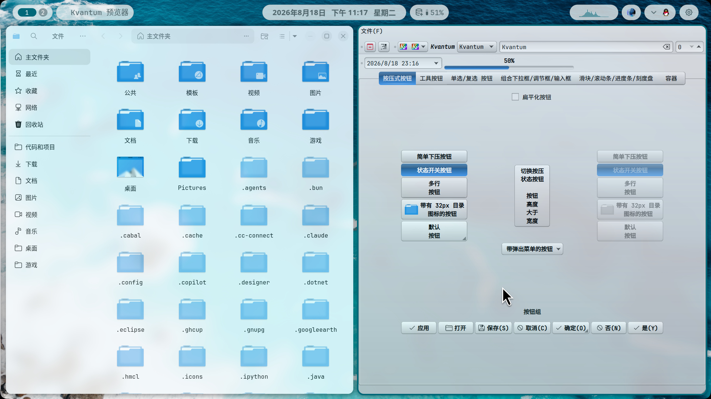
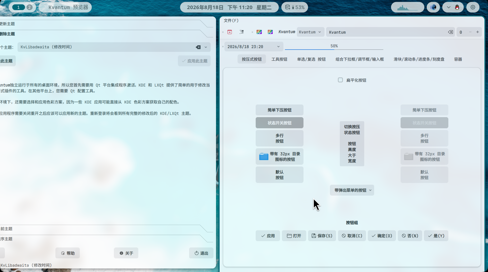
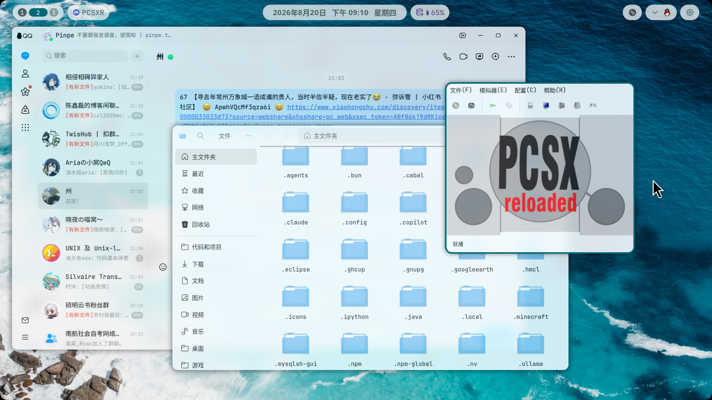
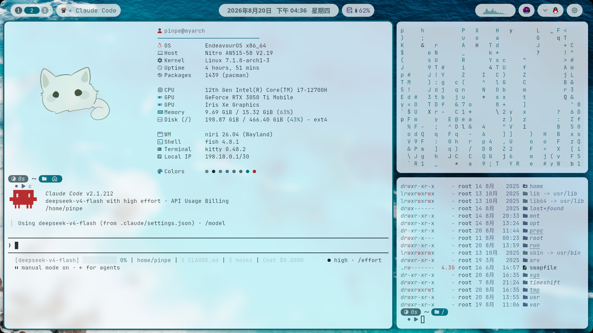
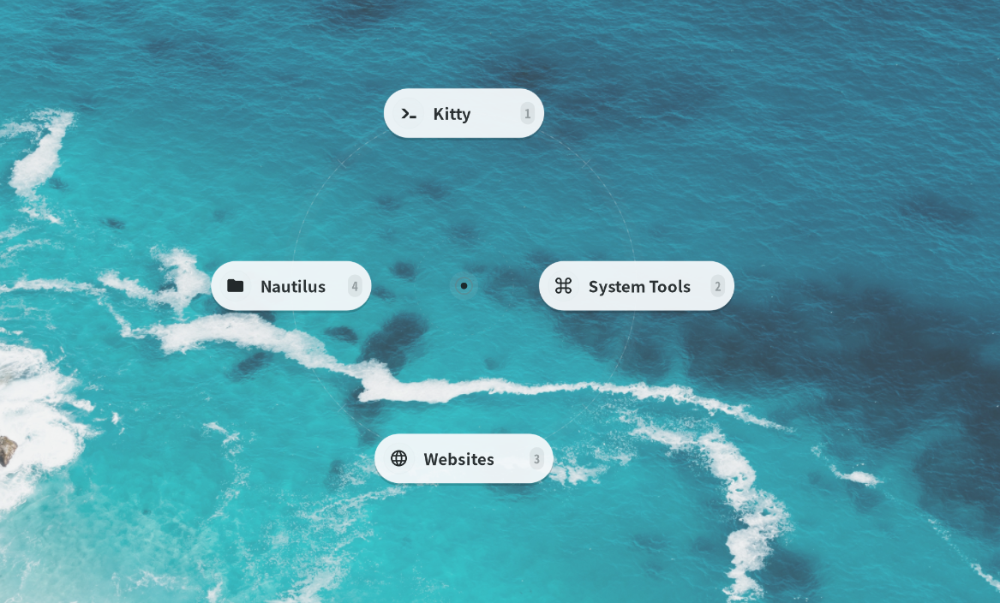
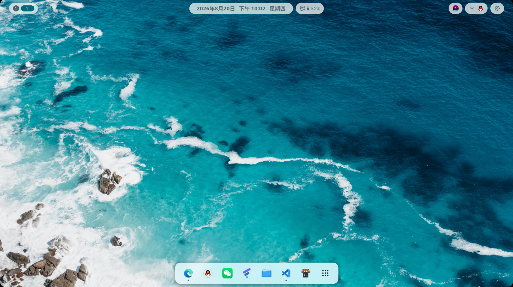
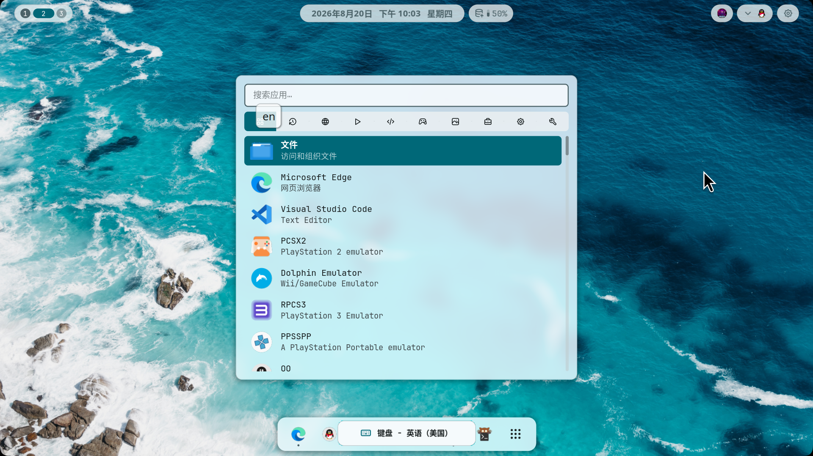
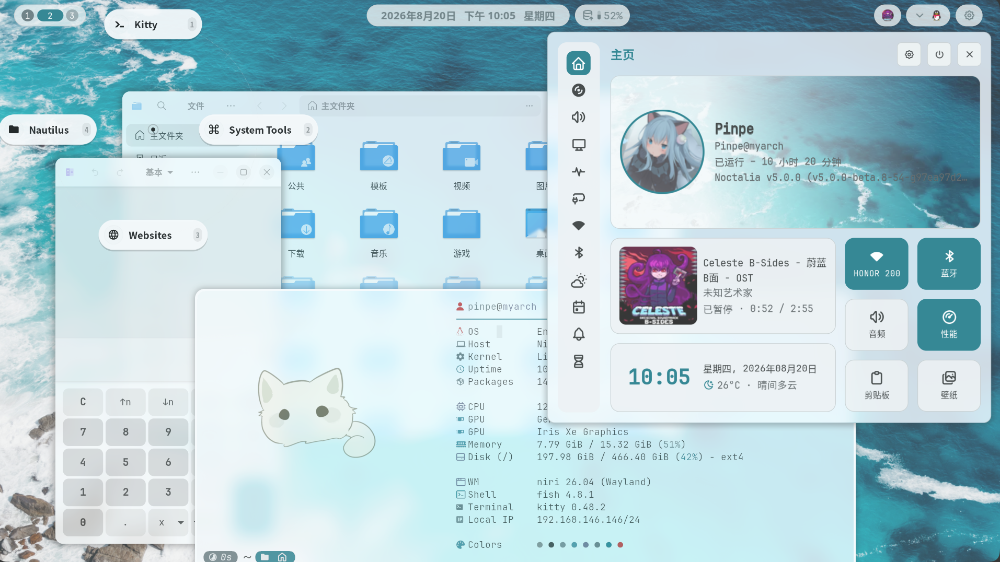
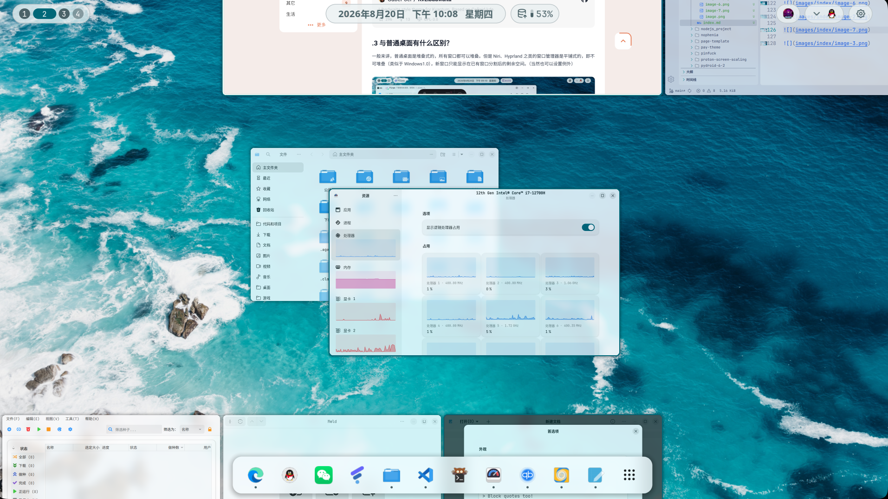
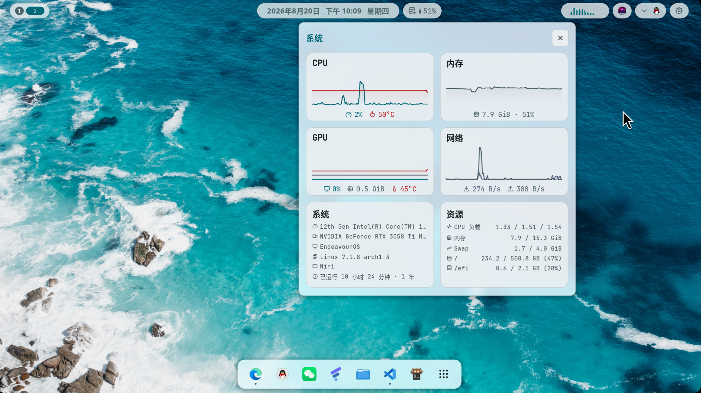

## .1 为什么想要用Niri呢？

虽然从Windows迁移到Linux时，连KDE都感觉很新鲜，但是用久了后，居然萌生出了换桌面的想法。

我馋到什么程度呢？甚至想要让KDE模仿平铺式窗口管理器，因为非常新颖和美观，而KDE就差点意思：

    
将 KDE 打扮成 Hyprland 一样！

    
不妨试试在 KDE 中亲手复刻一套类似的视觉风格，兼顾美观与生产力！

在今年暑假的某一天，我刷到了一个Niri配置分享，于是我头脑一热，如同当时迁移操作系统一样，我开始迁移桌面。

    
NyxNiri v2.3.0 | 星环更新 | 一键脚本 | 基于「CachyOS+Niri+Noctalia5」的Linux桌面美化

    
BV1nxby6NEhc

仅需要很简单的TUI操作（安装依赖和覆盖配置），就可以应用上了。（非Arch系需要手动覆盖配置）

## .2 迁移时有什么坑？

坑其实没有特别多。

但是随着深入使用，发现GTK与QT软件根本不是一个画风，QT明显简陋很多，差不多是这种样子：

于是我开始换软件，将KDE遗留下来的QT软件全部 `-Rns` 了，转头安装了Gnome的GTK软件，才发现Gnome才是颜值巅峰。

不过不久后就找到解决办法了，Kvantum的 `KvLibadwaita` 主题可以提供相近的外观（但不是完美的，比如部分对比度和主题色固定），至少解决了少数无法替换的QT应用太碍眼的问题：

::github{repo=GabePoel/KvLibadwaita}

## .3 与普通桌面有什么区别？

一般来讲，普通桌面是堆叠式的，所有窗口都可以堆叠。但是Niri、Hyprland之类的窗口管理器是平铺式的，即不可堆叠（类似于Windows1.0），新窗口只能显示在已有窗口分割后的剩余空间。（当然也可以设置例外）

但是平铺式有一个很明显的问题：屏幕太小了，没有足够的空间放下所有窗口，因此现代的平铺式管理器都支持“工作区”功能，可以通过切换工作区来切换屏幕，约等于有了无限的空间。

不久之后，人们发现了新的问题：如果有大量窗口，因为一个屏幕的容量依然太小，就需要频繁切换工作区，这样做还是有点累人的。

正因如此，Niri对平铺式做出了微创新，扩展了屏幕的x轴，让宽度变成了无限，这样就可以在一个工作区里放下无限个窗口了。

## .4 接下来该如何使用和维护？

大部分操作都需要使用键盘，但是幸好我的笔记本有触控板，于是左手用触控板，右手拿鼠标成为了最舒服的操作方式。

这里写几个我常用的功能，不全面：

|键盘|触控板|操作|
|-|-|-|
|-|三指左右滑动|屏幕左右滑动|
|-|三指上下滑动|切换工作区|
|`Meta` + `Tab`|四指上下滑动|开关概览|
|`Meta` + `q`|-|关闭窗口/软件|
|`Meta` + `f`|-|让窗口最大化|
|`Meta` + `Shift` + `f`|-|让窗口全屏|
|`Meta` + `t`|-|让窗口浮动（转换为堆叠式）|
|`Meta` + `r`|-|打开软件列表|
|`Meta` + `Enter`|-|打开终端|
|`Meta` + `a`|-|打开星环菜单（Nyxniri配置专属）|

星环菜单则是独家集成的快捷功能，通过 `Meta` + `a` 呼出，通过方向来打开软件或执行命令，看起来很酷。

至于维护，虽然Niri的配置文件比KDE的图形化设置要难得多，但感谢同学让我开始使用Claude Code，以及DeepSeek提供了比较便宜的API，无论是新版本合并还是个性化修改，我自始至终从未动过配置文件。

> 否则我可能还窝在KDE里。

## .5 截图一览

