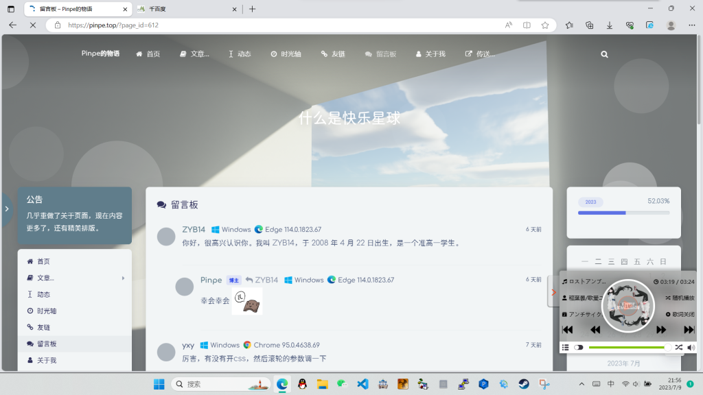
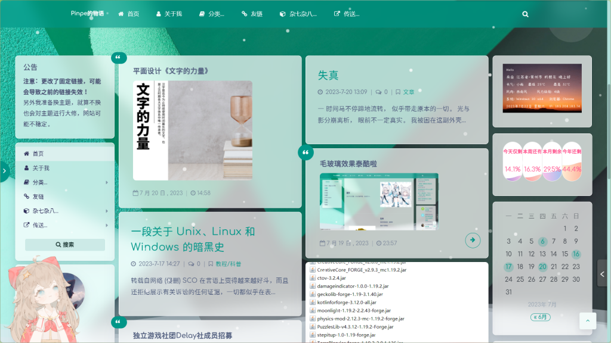

这是我网站以前的样子：

这是我网站现在的样子：

最大的变化是卡片变得透明，且有毛玻璃效果——所有的卡片都是这样。

是的，这样的设计很像Windows11的**Fluent**，当然缺点还是有的，最大的缺点帧数不高，因为大面积的模糊效果很影响性能。而且因为未知原因，表情卡片有Bug，无法使用。

那么，这种效果如何实现呢？

### 第一步：基础效果

打开WordPress后台>外观>自定义>额外CSS，添加以下代码：

.card{
  background-color:rgba(255, 255, 255, 0.7) !important;
  backdrop-filter:blur(16px) !important ; 
}

可以看到，所有卡片都透明了，其中可以更改的值有：

background-color:rgba(R, G, B, A) !important;

* R：卡片的红色度

* G：卡片的黄色度

* B：卡片的蓝色度

* A：卡片的透明度

backdrop-filter:blur(X px) !important ; 

* X：卡片的模糊强度

### 第二步：质感边框

添加边框可以增强卡片的质感，在下面添加以下代码：

.card{
        border-style:solid !important;
	border-width:1px !important;
	border-color:rgba(255, 255, 255, 0.9) !important;
}

效果可能不明显，但是卡片周围有白色边框了，其中可以更改的值有：

border-style:X !important;

* X：边框的样式，不懂的人不要改

border-width:X px !important;

* X：边框的粗细

border-color:rgba(R, G, B, A) !important;

* 同上，但更改的是边框的颜色

### 其它修改

这个时候基本完成了，但是一些特殊的卡片（公告、页脚等）还是老样子，由于篇幅关系，只能留给大家探索了。