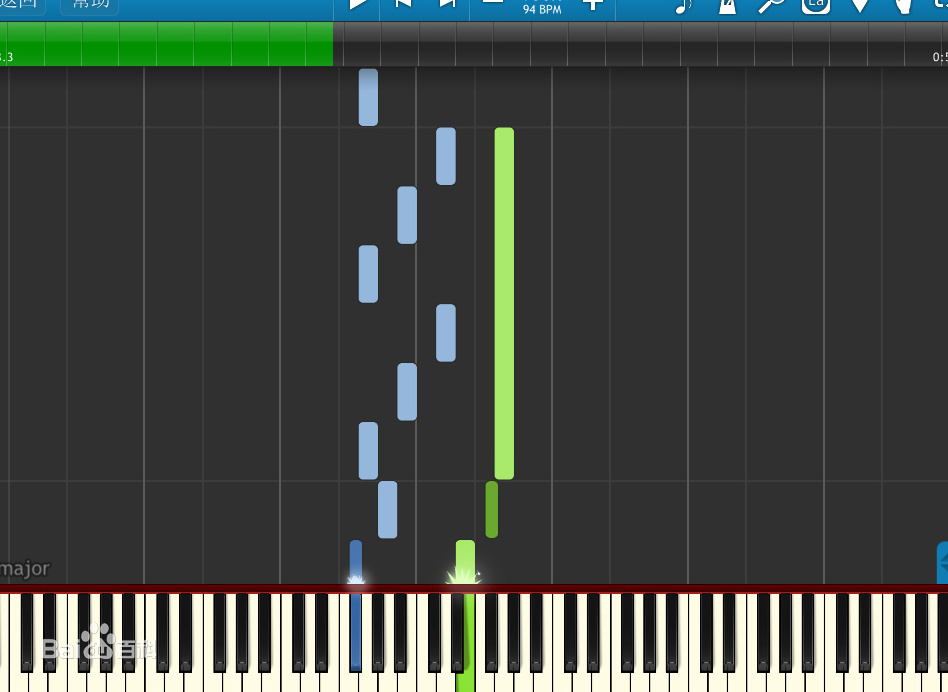

Synthesia是一个有趣的虚拟钢琴软件，能在屏幕上显示虚拟键盘按键的软件。可以给不懂五线谱或简谱的人知道怎么弹钢琴，支持任何MIDI文件(即后缀为.mid的文件)的导入和弹奏。如果你有MIDI键盘或者MIDI输出口的电子琴，就能与之连接进行弹奏练习。软件自带了上百首MID曲子，可供练习钢琴技术。

[collapse title="下载"]

电脑版：

[Synthesia-10.9.5890](http://blog.pinpe.top/wp-content/uploads/2023/04/Synthesia-10.9.5890.zip)[下载](http://blog.pinpe.top/wp-content/uploads/2023/04/Synthesia-10.9.5890.zip)

安卓版：

[Synthesia10.9.5906](http://blog.pinpe.top/wp-content/uploads/2023/04/Synthesia10.9.5906.zip)[下载](http://blog.pinpe.top/wp-content/uploads/2023/04/Synthesia10.9.5906.zip)

[/collapse]