本次测试使用光影Photon和光追SEUS PTGI作为对比，游戏版本1.19.2，视距10区块。

上图为Photon，下图为SEUS PTGI。

### 室内场景

[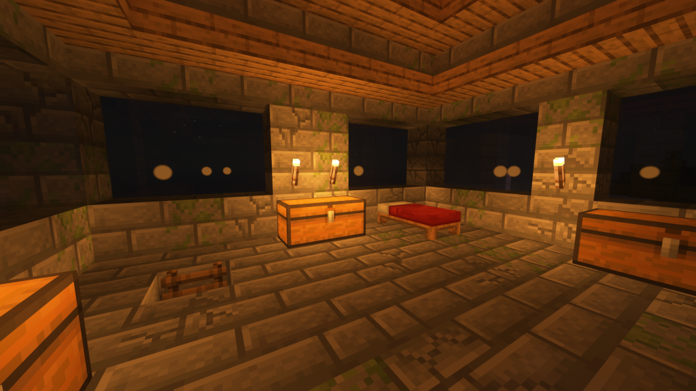](http://blog.pinpe.top/wp-content/uploads/2023/12/屏幕截图-2023-12-16-121348.png)

看起来光追的光感更好，火把颜色更暖。

### 彩色光源

[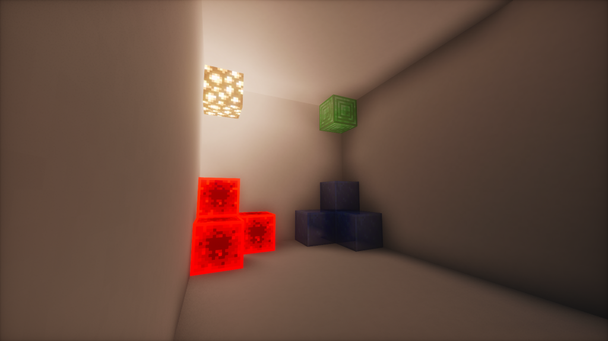](http://blog.pinpe.top/wp-content/uploads/2023/12/屏幕截图-2023-12-16-115558.png)

[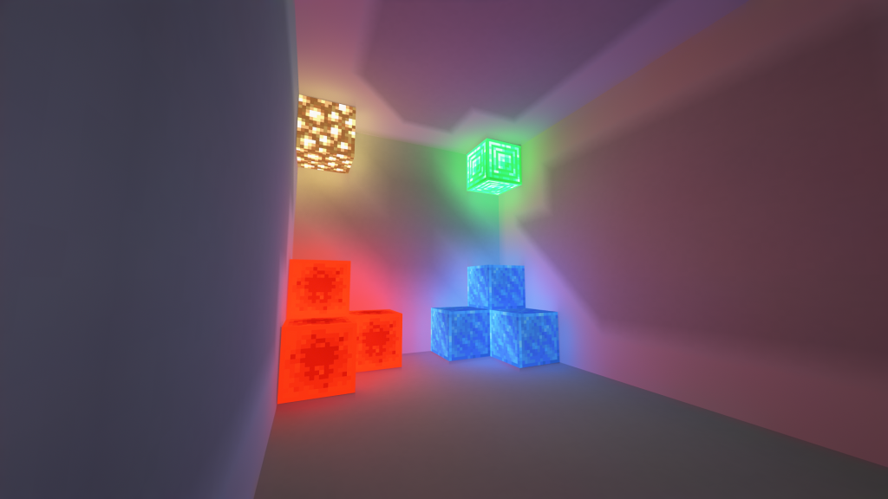](http://blog.pinpe.top/wp-content/uploads/2023/12/屏幕截图-2023-12-16-115534.png)

光追支持红石块、青金石等方块发光，还是彩色的光源，颜色也可以混合。光影不能。

### 反光

[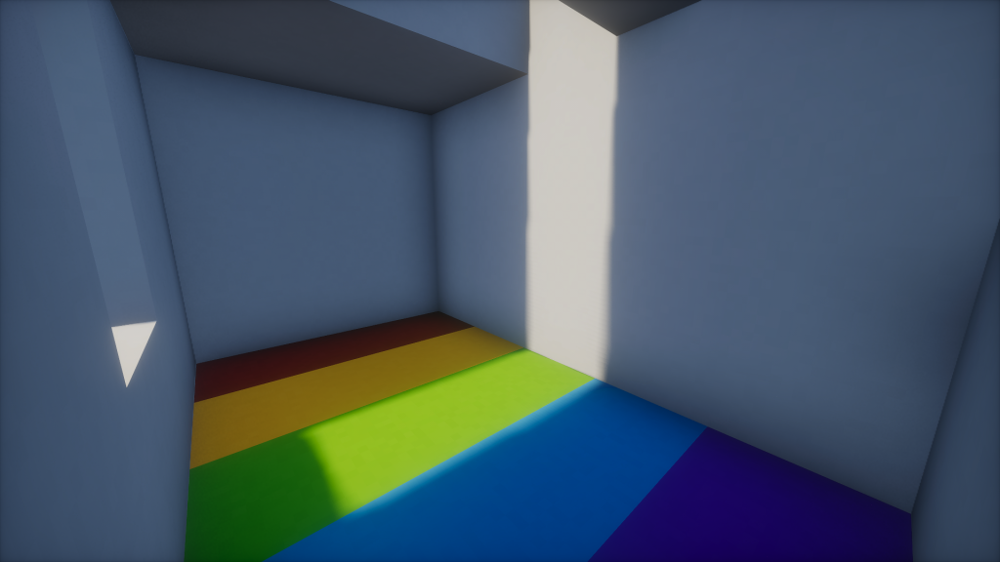](http://blog.pinpe.top/wp-content/uploads/2023/12/屏幕截图-2023-12-16-120953.png)

[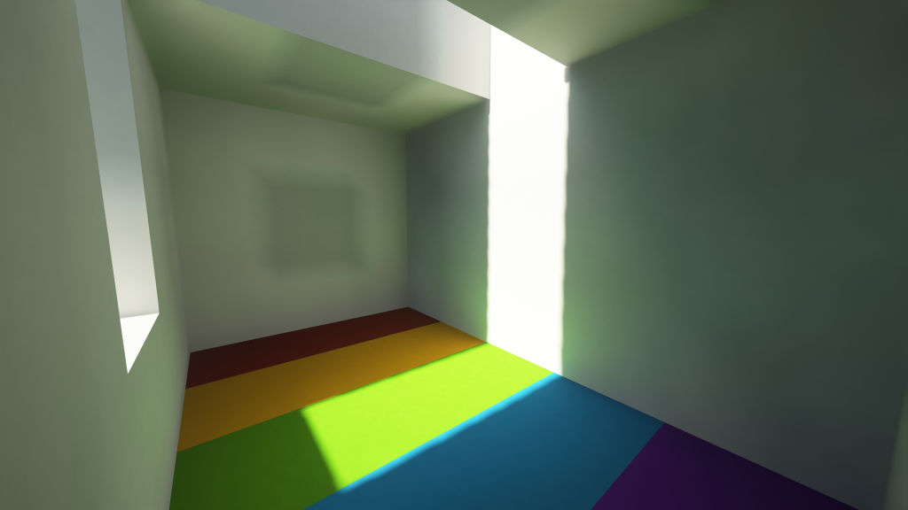](http://blog.pinpe.top/wp-content/uploads/2023/12/屏幕截图-2023-12-16-120247.png)

[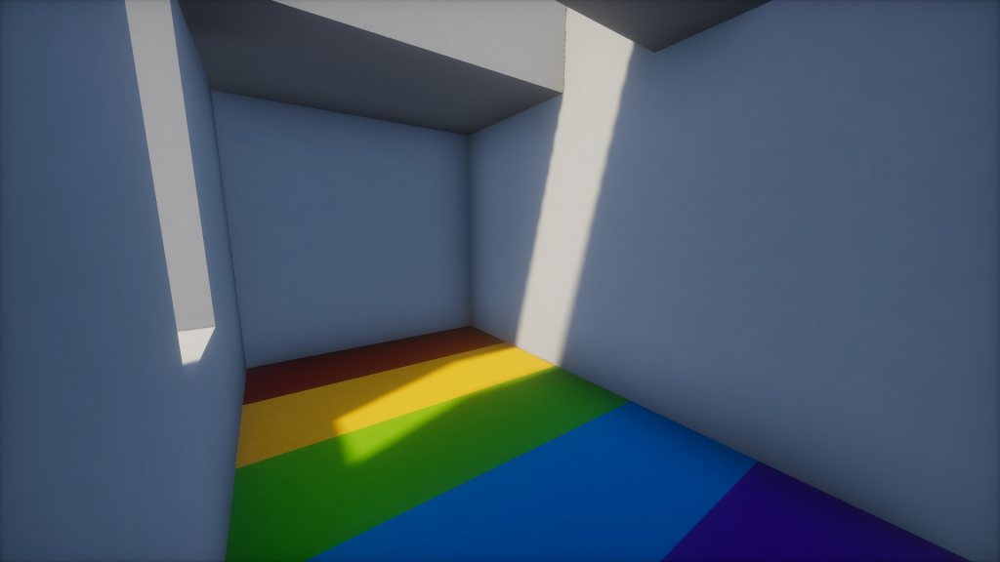](http://blog.pinpe.top/wp-content/uploads/2023/12/屏幕截图-2023-12-16-120942.png)

[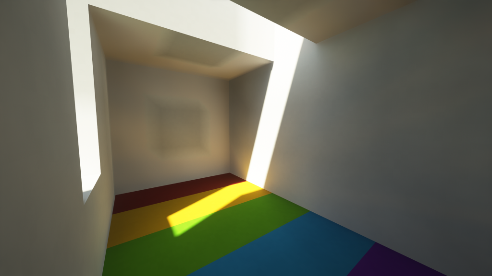](http://blog.pinpe.top/wp-content/uploads/2023/12/屏幕截图-2023-12-16-120222.png)

[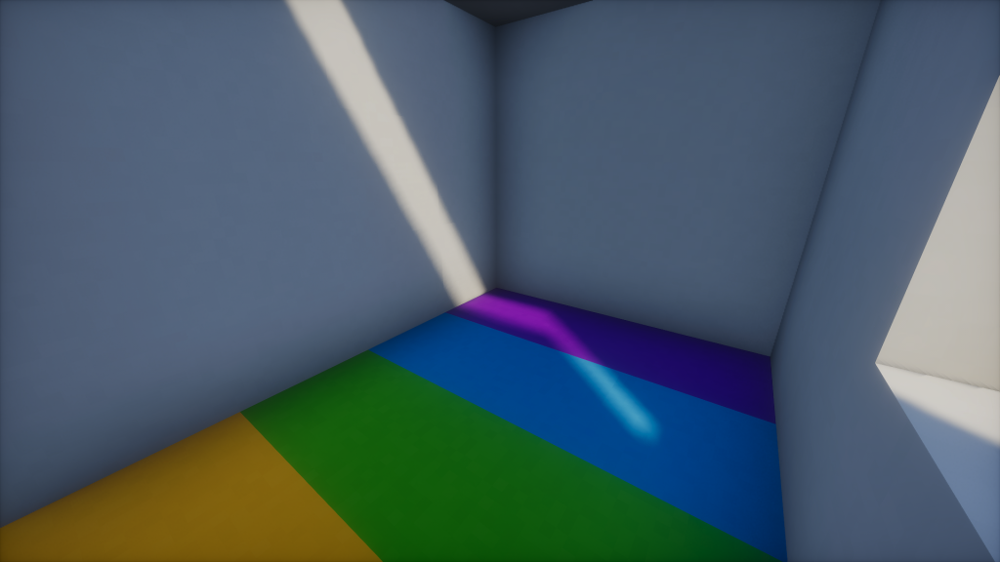](http://blog.pinpe.top/wp-content/uploads/2023/12/屏幕截图-2023-12-16-121011.png)

[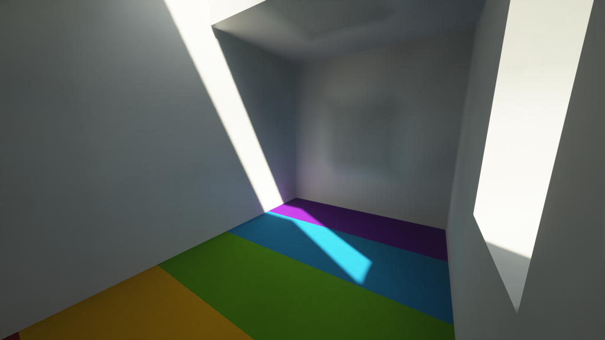](http://blog.pinpe.top/wp-content/uploads/2023/12/屏幕截图-2023-12-16-120759.png)

光追可以反光，太阳光遇到不同颜色时可以把对应的颜色反射在墙上。光影不能。

### 光线传播

光追的光线在遇到障碍的时候能准确模拟光路。光影是黑漆漆的一片。

### 夕阳景色

[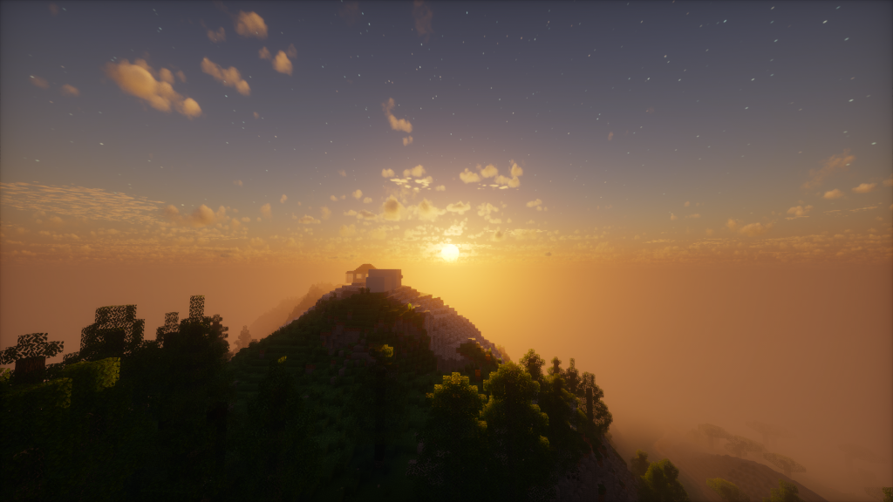](http://blog.pinpe.top/wp-content/uploads/2023/12/屏幕截图-2023-12-16-121047.png)

[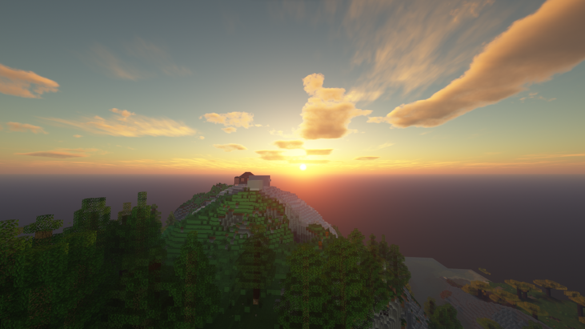](http://blog.pinpe.top/wp-content/uploads/2023/12/屏幕截图-2023-12-16-121113.png)

光追的夕阳更加写实，光影的夕阳更加梦幻。个人喜欢光影的夕阳。

### 雨天效果

[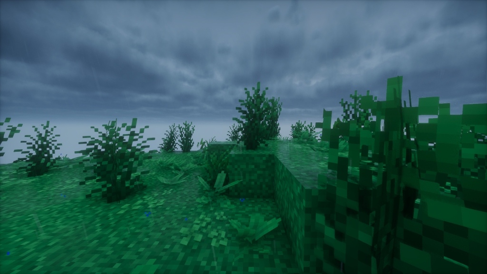](http://blog.pinpe.top/wp-content/uploads/2023/12/屏幕截图-2023-12-16-121233.png)

[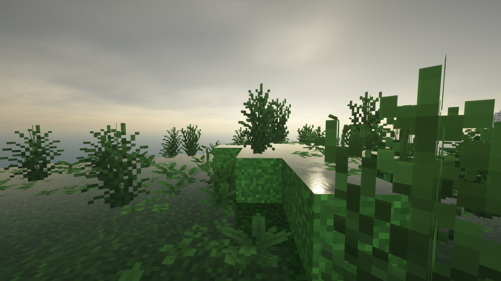](http://blog.pinpe.top/wp-content/uploads/2023/12/屏幕截图-2023-12-16-121245.png)

光追的雨天同样是写实的，地面的反射强度很高。光影偏昏暗，各有各的特点。