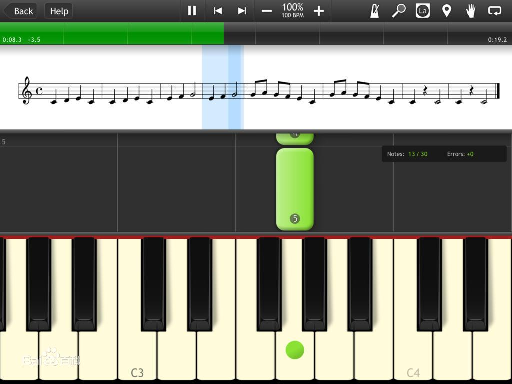

在VS Code或其它IDE中，可以查看某个函数在源文件是如何实现的，例如outputs库中debug()方法的实现：

但是在很多时候，特别是内置函数，你可以看到一大堆函数定义，但函数体全都是空的，例如exec()函数：

这些空的函数是怎么执行的？为什么会出现这种情况呢？

### .py和.pyi之分

如果我们仔细看看前面两张图，注意到两个文件名分别是__init__.py和builtins.pyi，是两个不一样的文件类型。

.py就不用说了，代码源文件，所有的实现都会在这里。而.pyi最后的i代表着interface，只会有函数的定义，不包含函数体。

### .pyi的作用是什么？

因为.pyi里提到的函数都是别的语言来实现的（例如C语言），且已经编译过了，自然找不到代码实现。

但是没有代码实现意味着就不知道怎么调用，甚至连多少个内置函数都不知道，你的IDE该怎么自动补全和悬停提示呢？

因此.pyi应运而生，它不需要告诉你**这个是怎么实现的**，而是**有什么、怎么用**。