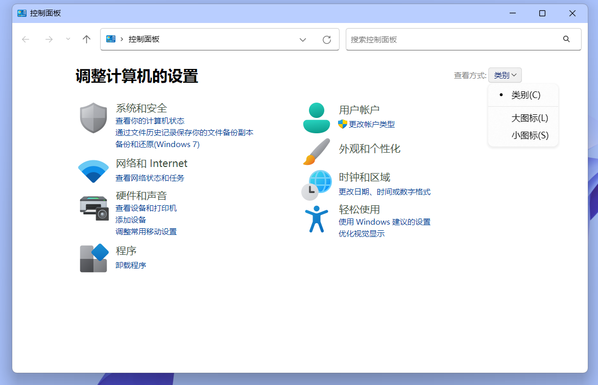

转载自[为博客添加热力图（仿Github贡献图） - Mimosa的小站](https://loneapex.cn/archives/2997)，其中的代码可能需要一定的修改——Pinpe

注：由于 Mimosa 对 PHP 一窍不通，本文几乎所有的代码都是 chatgpt 帮我写的，我只是给了它一个思路，然后帮它调调试、debug 一下罢了。

## 效果

鼠标悬浮时会显示细节

实时渲染预览：

[loneapex.cn/heatmap/](https://loneapex.cn/heatmap/)（通过 php 实现）

[loneapex.cn/heatmap/index_.html](https://loneapex.cn/heatmap/index_.html)（通过 html 实现）

## 原理

上一次逛 GitHub 时，心血来潮想给博客整一个热力图，用来记录博客的更新频率。奈何在网上找了一圈后，有关博客热力图的案例寥寥无几，而且为数不多的案例全部失效。这其中很大原因就是 wordpress 博客引擎无法精确统计字数的问题（因为 wordpress 无法统计中文）

所以，我们不妨换个思路，抛开 wordpress，把目光投向几乎所有的博客系统都能使用的方案 —— 通过 rss 统计字数和时间。

正是因为要保证兼容性，几乎所有博客的 rss 订阅文件样式都是统一的（xml 格式），因此这个程序理论上**可以统计任意具有 rss 功能的博客网站**，而且不必担心随着时间而失效。

如图，这是本站的 rss 文件开头部分。不难发现，每篇文章开头部分总有一个&nbsp;item&nbsp;标识，并且都标明了发布日期，所以我们可以通过 item 查找每篇文章并统计文章字数。

由于通过 rss 统计，所以博客 rss 必须保证**显示在统计范围内 (一年) 的全部文章**，并且 rss 要**显示全文**，否则会统计不准确。

* 注意 / ATTENTION*1. 必须打开 rss 功能2.rss 能显示**近一年**的文章，且**全文显示**

最后的最后，当然要知道自己网站的 rss 订阅链接啦～后面会用到。（比如我的是&nbsp;[https://loneapex.cn/feed](https://loneapex.cn/feed)）

## 实现

由于遇了到博客不支持 php 的现象，我又让 chatgpt 重构了一个纯 html+JavaScript 的版本，但它俩实现的效果都是一模一样的。

### php 实现

注：php 获取 rss 文件时可能会报错（好像是域名 dns 解析错误），这种情况下把域名改成 ip 即可

在注释&nbsp;// 在此处填写你的 RSS 地址填上 rss 地址，剩下的按照注释去做即可。

&lt;!--博客热力图 start-->
 
&lt;?php 
date_default_timezone_set('Asia/Shanghai');
 
// 获取RSS内容（使用cURL）
function getRssContent($url) {
    $ch = curl_init();
    curl_setopt($ch, CURLOPT_URL, $url);
    curl_setopt($ch, CURLOPT_RETURNTRANSFER, true);
    curl_setopt($ch, CURLOPT_FOLLOWLOCATION, true);
    curl_setopt($ch, CURLOPT_SSL_VERIFYPEER, false);
    curl_setopt($ch, CURLOPT_SSL_VERIFYHOST, false);
    curl_setopt($ch, CURLOPT_TIMEOUT, 10);
    $content = curl_exec($ch);
    
    if (curl_errno($ch)) {
        die("无法获取RSS内容: " . curl_error($ch));
    }
    
    $httpCode = curl_getinfo($ch, CURLINFO_HTTP_CODE);
    if ($httpCode !== 200) {
        die("RSS请求失败，HTTP状态码: $httpCode");
    }
    
    curl_close($ch);
    return $content;
}
 
// 解析RSS并统计字数
function parseRss($rssContent) {
    libxml_use_internal_errors(true);
    $xml = simplexml_load_string($rssContent);
    
    if ($xml === false) {
        die("RSS解析失败");
    }
    
    $stats = &#91;];
    $namespaces = $xml->getNamespaces(true);
    
    foreach ($xml->channel->item as $item) {
        $pubDate = (string)$item->pubDate;
        $date = date('Y-m-d', strtotime($pubDate));
        
        $contentNS = $item->children($namespaces&#91;'content']);
        $contentEncoded = (string)$contentNS->encoded;
        
        $content = html_entity_decode(strip_tags($contentEncoded));
        $content = preg_replace('/\s+/', ' ', $content);
        $content = trim($content);
        
        $wordCount = mb_strlen($content);
        
        if (!isset($stats&#91;$date])) {
            $stats&#91;$date] = 0;
        }
        $stats&#91;$date] += $wordCount;
    }
    
    return $stats;
}
 
// 生成完整日期范围
function generateDateRange($startDate, $endDate) {
    $interval = new DateInterval('P1D');
    $period = new DatePeriod($startDate, $interval, $endDate);
    
    $fullStats = &#91;];
    foreach ($period as $date) {
        $dateStr = $date->format('Y-m-d');
        $fullStats&#91;$dateStr] = 0;
    }
    
    return $fullStats;
}
 
// 颜色等级计算
function getColorLevel($count) {
    if ($count === 0) return 0;
    elseif ($count &lt;= 100) return 1;
    elseif ($count &lt;= 300) return 2;
    elseif ($count &lt;= 500) return 3;
    else return 4;
}
 
// 主程序
try {
    $rssUrl = 'https://123.60.42.216/feed'; // 请在此处填写你的 RSS 地址
    $rssContent = getRssContent($rssUrl);
    $stats = parseRss($rssContent);
    
    // 调整日期范围，使其从最近一年前的周一开始，到最近的周日结束
    $startDate = new DateTime('-1 year');
    if ($startDate->format('N') != 1) {  // N: 1 (周一) ... 7 (周日)
        $startDate->modify('last monday');
    }
    $endDate = new DateTime();
    if ($endDate->format('N') != 7) {
        $endDate->modify('next sunday');
    }
    $endDate->modify('+1 day'); // 包含最后一天
    
    $fullStats = generateDateRange($startDate, $endDate);
    
    // 合并统计数据
    foreach ($stats as $date => $count) {
        if (isset($fullStats&#91;$date])) {
            $fullStats&#91;$date] = $count;
        }
    }
    
    // 计算总字数
    $totalCount = array_sum($fullStats);
    
    // 将统计数据按天顺序存入数组，并按每7天一组分成每周的数据
    $days = &#91;];
    foreach ($fullStats as $date => $count) {
        $days&#91;] = &#91;
            'date' => $date,
            'count' => $count,
            'level' => getColorLevel($count)
        ];
    }
    $weeks = array_chunk($days, 7);
    
    // 生成每列（月）的标签：当本周第一天的月份与上一周不同则显示
    $monthLabels = &#91;];
    $prevMonth = '';
    foreach ($weeks as $i => $week) {
        $weekStart = new DateTime($week&#91;0]&#91;'date']);
        $month = $weekStart->format('n'); // 月份（无前导零）
        $year = $weekStart->format('Y');
        $label = "$year.$month";
        if ($month !== $prevMonth) {
            $monthLabels&#91;$i] = $label;
            $prevMonth = $month;
        } else {
            $monthLabels&#91;$i] = '';
        }
    }
    
} catch (Exception $e) {
    die("发生错误: " . $e->getMessage());
}
?>
 
&lt;!--主HTML-->
&lt;style>
    .heatmap-table {
        border-collapse: collapse;
        margin: 0 auto;
    }
    .heatmap-table th, .heatmap-table td {
        padding: 2px;
    }
    .month-label {
        text-align: center;
        font-size: 12px;
        color: #666;
    }
    .day-label {
        font-size: 12px;
        color: #666;
        text-align: right;
        padding-right: 4px;
    }
    .day-cell {
        width: 12px;
        height: 12px;
        background-color: #ebedf0;
        border-radius: 2px;
        position: relative;
    }
    .day-cell:hover::after {
        content: attr(data-date) ": " attr(data-count) "字";
        position: absolute;
        top: -30px;
        left: 50%;
        transform: translateX(-50%);
        background: #333;
        color: #fff;
        padding: 4px 8px;
        border-radius: 4px;
        white-space: nowrap;
        font-size: 12px;
        z-index: 10;
    }
    .level-0 { background-color: #ebedf0; }
    .level-1 { background-color: #c6e48b; }
    .level-2 { background-color: #7bc96f; }
    .level-3 { background-color: #239a3b; }
    .level-4 { background-color: #196127; }
    
    .scroll-container {
      overflow-x: auto;            /* 允许水平滚动 */
      -webkit-overflow-scrolling: touch; /* iOS上更顺滑的滚动 */
    }
&lt;/style>
&lt;div class="scroll-container">
&lt;!-- 上部月份标签 -->
&lt;table class="heatmap-table">
    &lt;tr>
        &lt;th>&lt;/th>
        &lt;?php foreach ($weeks as $index => $week): ?>
            &lt;th class="month-label">&lt;?= $monthLabels&#91;$index] ?>&lt;/th>
        &lt;?php endforeach; ?>
    &lt;/tr>
&lt;/table>
 
&lt;!-- 主体热力图 -->
&lt;table class="heatmap-table">
    &lt;?php 
        // 定义一周内7天的名称（从周一到周日）
        $dayNames = &#91;"周一", "周二", "周三", "周四", "周五", "周六", "周日"];
        // 需要显示标签的行索引：0（周一）、2（周三）、4（周五）、6（周日）
        $labelRows = &#91;0, 2, 4, 6];
    ?>
    &lt;?php for ($i = 0; $i &lt; 7; $i++): ?>
        &lt;tr>
            &lt;td class="day-label">
                &lt;?php if (in_array($i, $labelRows)): ?>
                    &lt;?= $dayNames&#91;$i] ?>
                &lt;?php endif; ?>
            &lt;/td>
            &lt;?php foreach ($weeks as $week): ?>
                &lt;?php $day = $week&#91;$i]; ?>
                &lt;td>
                    &lt;div class="day-cell level-&lt;?= $day&#91;'level'] ?>" 
                         data-date="&lt;?= $day&#91;'date'] ?>" 
                         data-count="&lt;?= $day&#91;'count'] ?>">
                    &lt;/div>
                &lt;/td>
            &lt;?php endforeach; ?>
        &lt;/tr>
    &lt;?php endfor; ?>
&lt;/table>
 
&lt;!-- 底部统计总字数 -->
&lt;div >
    本站近365天的废话总产量(含代码、「说说」短文章)：&lt;?= $totalCount ?>
&lt;/div>
&lt;/div>
&lt;!--博客热力图 end-->

### HTML+js 实现

注：如果通过 ip 访问 rss 的话，可能会遇到跨域错误。具体去配置一下 nginx 就行了。当然，用域名的话当我没说

ps. 通过前端加载的方式相较于 php 而言，有概率加载失败，而且加载速度很慢。建议优先使用 PHP 的那个版本

&lt;!--博客热力图 start-->
&lt;style>
.heatmap-table {
  border-collapse: collapse;
  margin: 0 auto;
}
.heatmap-table th, .heatmap-table td {
  padding: 2px;
}
.month-label {
  text-align: center;
  font-size: 12px;
  color: #666;
}
.day-label {
  font-size: 12px;
  color: #666;
  text-align: right;
  padding-right: 4px;
}
.day-cell {
  width: 12px;
  height: 12px;
  background-color: #ebedf0;
  border-radius: 2px;
  position: relative;
}
.day-cell:hover::after {
  content: attr(data-date) ": " attr(data-count) "字";
  position: absolute;
  top: -30px;
  left: 50%;
  transform: translateX(-50%);
  background: #333;
  color: #fff;
  padding: 4px 8px;
  border-radius: 4px;
  white-space: nowrap;
  font-size: 12px;
  z-index: 10;
}
.level-0 { background-color: #ebedf0; }
.level-1 { background-color: #c6e48b; }
.level-2 { background-color: #7bc96f; }
.level-3 { background-color: #239a3b; }
.level-4 { background-color: #196127; }
 
.scroll-container {
  overflow-x: auto;            /* 允许水平滚动 */
  -webkit-overflow-scrolling: touch; /* iOS上更顺滑的滚动 */
}
 
&lt;/style>
&lt;div class="scroll-container">
&lt;div id="heatmap-container">
&lt;!-- 热力图内容由 JavaScript 动态生成 -->
&lt;/div>
&lt;div id="totalCount" >&lt;/div>
&lt;/div>
&lt;script>
// 请修改为你的RSS地址，如若跨域问题，可使用代理，例如：
// const rssUrl = 'https://api.allorigins.hexocode.repl.co/get?disableCache=true&amp;url=' + encodeURIComponent('https://123.60.42.216/feed');
const rssUrl = 'https://loneapex.cn/feed';
 
// 获取RSS内容（使用 fetch ）
function fetchRss(url) {
  return fetch(url)
    .then(response => {
      if (!response.ok) {
        throw new Error('网络错误，状态码：' + response.status);
      }
      return response.text();
    });
}
 
// 解析 XML 字符串
function parseXML(str) {
  return (new window.DOMParser()).parseFromString(str, "text/xml");
}
 
// 格式化日期为 YYYY-MM-DD
function formatDate(date) {
  const y = date.getFullYear();
  const m = ('0' + (date.getMonth() + 1)).slice(-2);
  const d = ('0' + date.getDate()).slice(-2);
  return `${y}-${m}-${d}`;
}
 
// 计算颜色等级（统计字符数）
function getColorLevel(count) {
  if (count === 0) return 0;
  else if (count &lt;= 100) return 1;
  else if (count &lt;= 300) return 2;
  else if (count &lt;= 500) return 3;
  else return 4;
}
 
// 获取指定日期所在那一周的周一（JS中周日为0，周一为1）
function getLastMonday(date) {
  const day = date.getDay();
  const diff = (day === 0 ? 6 : day - 1);
  const lastMonday = new Date(date);
  lastMonday.setDate(date.getDate() - diff);
  return lastMonday;
}
 
// 获取指定日期所在那一周的周日
function getNextSunday(date) {
  const day = date.getDay();
  const diff = (day === 0 ? 0 : 7 - day);
  const nextSunday = new Date(date);
  nextSunday.setDate(date.getDate() + diff);
  return nextSunday;
}
 
// 生成完整日期范围对象：{ "YYYY-MM-DD": 0, ... }
function generateDateRange(startDate, endDate) {
  const fullStats = {};
  const current = new Date(startDate);
  while (current &lt;= endDate) {
    fullStats&#91;formatDate(current)] = 0;
    current.setDate(current.getDate() + 1);
  }
  return fullStats;
}
 
// 去除 HTML 标签
function stripHTML(html) {
  const div = document.createElement("div");
  div.innerHTML = html;
  return div.textContent || div.innerText || "";
}
 
// 主函数：获取RSS、统计字数、生成热力图
function generateHeatmap() {
  fetchRss(rssUrl)
    .then(text => {
      const xml = parseXML(text);
      const items = xml.getElementsByTagName("item");
      const stats = {};
 
      // 遍历每个RSS条目
      for (let i = 0; i &lt; items.length; i++) {
        const item = items&#91;i];
        const pubDateElem = item.getElementsByTagName("pubDate")&#91;0];
        if (!pubDateElem) continue;
        const pubDate = pubDateElem.textContent;
        const dateObj = new Date(pubDate);
        const dateStr = formatDate(dateObj);
 
        // 优先获取 content:encoded 元素，没有则使用 description
        let content = "";
        const contentEncoded = item.getElementsByTagName("content:encoded")&#91;0];
        if (contentEncoded) {
          content = contentEncoded.textContent;
        } else {
          const description = item.getElementsByTagName("description")&#91;0];
          if (description) {
            content = description.textContent;
          }
        }
        content = stripHTML(content).replace(/\s+/g, ' ').trim();
        const wordCount = content.length;  // 此处统计字符数，可根据需要改为单词数
 
        if (!stats&#91;dateStr]) {
          stats&#91;dateStr] = 0;
        }
        stats&#91;dateStr] += wordCount;
      }
 
      // 设置日期范围：从1年前的上一个周一到最近的下一个周日
      let startDate = new Date();
      startDate.setFullYear(startDate.getFullYear() - 1);
      startDate = getLastMonday(startDate);
      let endDate = new Date();
      endDate = getNextSunday(endDate);
 
      const fullStats = generateDateRange(startDate, endDate);
 
      // 合并 RSS 数据
      for (let date in stats) {
        if (fullStats.hasOwnProperty(date)) {
          fullStats&#91;date] = stats&#91;date];
        }
      }
 
      // 计算总字数
      let totalCount = 0;
      for (let date in fullStats) {
        totalCount += fullStats&#91;date];
      }
 
      // 将数据转换为数组，按日期顺序排列
      const days = &#91;];
      for (let d = new Date(startDate); d &lt;= endDate; d.setDate(d.getDate() + 1)) {
        const dStr = formatDate(d);
        days.push({
          date: dStr,
          count: fullStats&#91;dStr],
          level: getColorLevel(fullStats&#91;dStr])
        });
      }
 
      // 按每7天分组为一周（保证从周一开始）
      const weeks = &#91;];
      for (let i = 0; i &lt; days.length; i += 7) {
        weeks.push(days.slice(i, i + 7));
      }
 
      // 生成月份标签：当本周第一天的月份与上一周不同则显示
      const monthLabels = &#91;];
      let prevMonth = "";
      for (let i = 0; i &lt; weeks.length; i++) {
        const weekStart = new Date(weeks&#91;i]&#91;0].date);
        const month = weekStart.getMonth() + 1;
        const year = weekStart.getFullYear();
        const label = `${year}.${month}`;
        if (month !== parseInt(prevMonth)) {
          monthLabels.push(label);
          prevMonth = month;
        } else {
          monthLabels.push("");
        }
      }
 
      // 构建 HTML 结构
      let html = "";
      // 月份标签表格
      html += '&lt;table class="heatmap-table">&lt;tr>&lt;th>&lt;/th>';
      for (let i = 0; i &lt; weeks.length; i++) {
        html += `&lt;th class="month-label">${monthLabels&#91;i]}&lt;/th>`;
      }
      html += '&lt;/tr>&lt;/table>';
 
      // 主体热力图表格
      html += '&lt;table class="heatmap-table">';
      const dayNames = &#91;"周一", "周二", "周三", "周四", "周五", "周六", "周日"];
      const labelRows = &#91;0, 2, 4, 6];  // 仅在这些行显示标签
      for (let row = 0; row &lt; 7; row++) {
        html += '&lt;tr>';
        // 左侧行标签
        if (labelRows.includes(row)) {
          html += `&lt;td class="day-label">${dayNames&#91;row]}&lt;/td>`;
        } else {
          html += '&lt;td class="day-label">&lt;/td>';
        }
        // 每周的单元格
        for (let w = 0; w &lt; weeks.length; w++) {
          const day = weeks&#91;w]&#91;row];
          html += `&lt;td>&lt;div class="day-cell level-${day.level}" data-date="${day.date}" data-count="${day.count}">&lt;/div>&lt;/td>`;
        }
        html += '&lt;/tr>';
      }
      html += '&lt;/table>';
 
      // 插入页面中
      document.getElementById("heatmap-container").innerHTML = html; 
      document.getElementById("totalCount").innerHTML = `&lt;span  !important>本站近365天的废话总产量(含代码、「说说」短文章)：${totalCount} 字&lt;/span>`;
 
    })
    .catch(error => {
      console.error("发生错误：", error);
      document.getElementById("heatmap-container").innerText = "加载RSS失败：" + error.message;
    });
}
 
document.addEventListener("DOMContentLoaded", generateHeatmap);
&lt;/script>
&lt;!--博客热力图 end-->

## 写在最后

正如开头所言，本文几乎所有的代码都是 chatgpt 生成的。不过虽说这样，Mimosa 也花了几个小时来调试代码，好累…

可话又说回来了，前几个月在本站的介绍页上挂了「Not By AI」运动的标识，转过头来就用 AI 写的代码发文章，这何尝不是违背了初心呢（笑

嘛，不可否认的是，chatgpt 确实很强。

如果让 Mimosa 比较一下常用的 AI 在生活 / 文学 / 中文领域的排名，我会选择：

DeepSeep&gt;ChatGPT&gt;gemini&gt;ClaudeAI

但如果在编程领域呢，我想我的选择是这样的：

ChatGPT&gt;DeepSeep&gt;gemini&gt;ClaudeAI，而且 chatgpt 完爆 deepseek.

**一些碎碎念**写到这里，突然在脑海中冒出了点想法，想写写关于 AI 的一点感性的话题。毕竟与 AI 比起来，我就是个纯纯的废物呀。但考虑到在一篇技术性文章里写这个不太好，所以就让本文这样草草收场吧。那么，再见了。