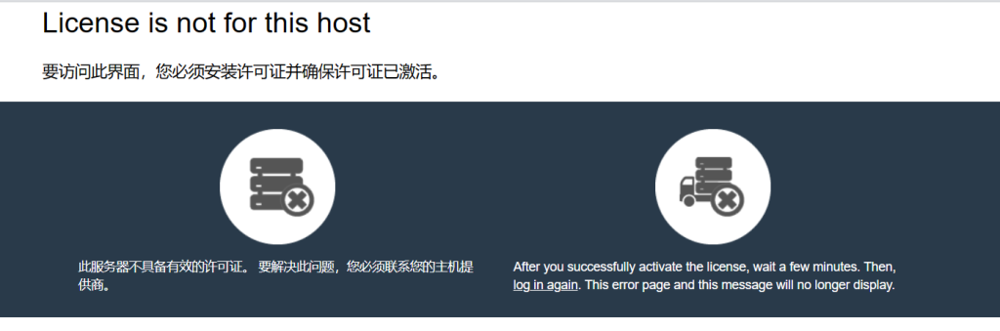
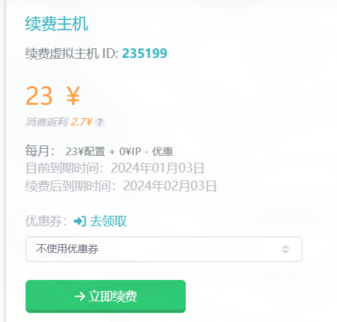

12月2日，莱云的面板许可证过期了，但是由于工作人员的一拖再拖加上面板的支付系统休假，导致cPanel无法使用。同时由于**iVampireSP**离开莱云团队，不仅服务态度直线下降，技术Bug也越来越多，现团队的最高负责人**木小韩**决定重启和改造整个系统。

12月3日，我只能迁移网站，并且选择了雨云的虚拟主机，谁知道cPanel什么时候恢复啊。

### 第一劫：导入.wpress文件

安装了all in one wp migration后，由于带宽限制，导入.wpress文件的进度非常慢，目测要几个小时才能完成，刚开始甚至让我以为卡住了。直到我升级了服务器才缓解。

现在使用的服务器非常贵，**每月要23元**，之前莱云的只要8元一个月，还不限带宽，实在是可惜。

### 第二劫：解决轻微的小擦伤

首先这个服务器比以前慢多了，我必须安装一个缓存插件来加速。而且不能上传大型文件，所以字体之类的别想了，只能希望用户不会用花里胡哨的字体来看我网站。

伪静态还出现了问题，短时间使用了朴素的固定链接。现在终于恢复正常了。

之前迁移服务器的过程太顺利，但这次甚至一度让我想要跑路，希望以后这种情况会少一点吧。