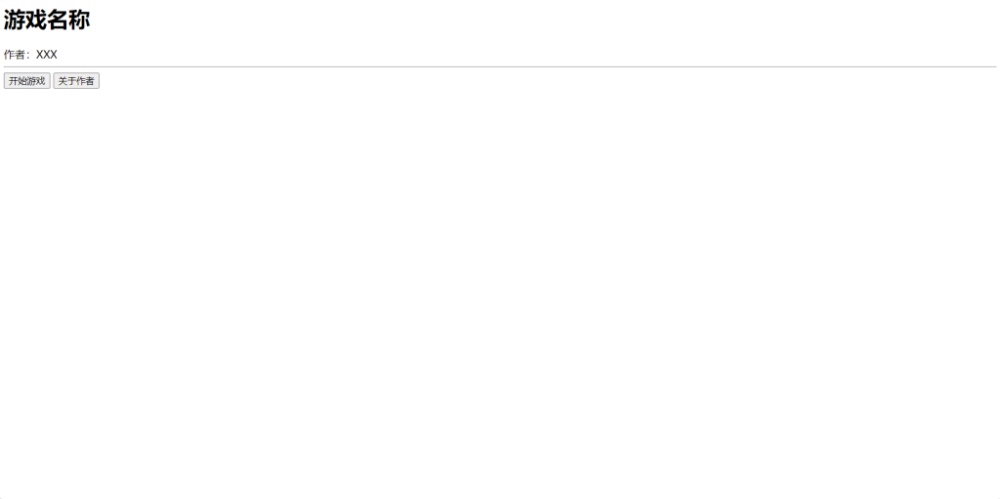

制作原生的HTML游戏并不困难，甚至比Python还要简单。

### 基础概念

* **页面**：每一个故事段就可以成为一个页面，UI也可以。一个页面对应一个**HTML**文件。

* **超链接**：玩家可以通过页面里的超链接跳转到其它页面。超链接可以是一段文字、一个按钮、一张图片之类的。

* **素材**：页面引用的资源，比如图片、音频之类的。

* **样式**：比如页面文字的颜色、背景的颜色、按钮长什么样。样式使用**CSS**编写，如果没有样式的话页面就不好看。

* **脚本**：通常使用**JavaScript**编写，属于高级用法，但由于篇幅的原因，不对JavaScript进行教学。

### 创建项目

在任意位置创建一个文件夹，名字可以是游戏全称，也可以是开发代号。

在里面创建第一个文件：index.html。

### 编写主菜单

使用VScode之类的代码编辑器打开index.html。

这个文件非常重要，这是玩家进入游戏的第一个页面，因此通常是主菜单或一些重要提示。

HTML有一个固定结构，照着抄就行：

&lt;html&gt;
    &lt;head&gt;
        &lt;meta charset="UTF-8"&gt;
        &lt;meta name="viewport" content="width=device-width, initial-scale=1.0, minimum-scale=0.5, maximum-scale=2.0, user-scalable=yes" /&gt; 
    &lt;/head&gt;
    &lt;body&gt;
        
    &lt;/body&gt;
&lt;/html&gt;

尖括号&lt;XXX&gt;包围的内容是一个**标签**，标签有一定的功能，有的标签成双成对出现，有的只有一个。在标签加入一个斜杠代表一个成双成对的标签结束。

[admonition]

比如：

这是文字，&lt;b&gt;但是有粗体！&lt;/b&gt;

会显示为：

这是文字，**但是有粗体！**

[/admonition]

常用的文字修饰标签如下：

&lt;b&gt;**粗体**&lt;i&gt;*斜体*&lt;u&gt;下划线&lt;del&gt;删除线

&lt;head&gt;里面通常放入页面本身的信息，玩家看不见，比如编码、标准之类的。&lt;body&gt;里面通常放入玩家看得见的内容。

开始写页面的内容吧！

&lt;html&gt;
    &lt;head&gt;
        &lt;meta charset="UTF-8"&gt;
        &lt;meta name="viewport" content="width=device-width, initial-scale=1.0, minimum-scale=0.5, maximum-scale=2.0, user-scalable=yes" /&gt; 
    &lt;/head&gt;
    &lt;body&gt;
        &lt;h1&gt;游戏名称&lt;/h1&gt;
        &lt;span&gt;作者：XXX&lt;/span&gt;
        &lt;hr&gt;
        &lt;a href="#"&gt;&lt;button&gt;开始游戏&lt;/button&gt;&lt;/a&gt;
        &lt;a href="#"&gt;&lt;button&gt;关于作者&lt;/button&gt;&lt;/a&gt;
    &lt;/body&gt;
&lt;/html&gt;

常用的标签如下：

&lt;span&gt;文本&lt;h1&gt;&lt;h2&gt;&lt;h3&gt;&lt;h4&gt;&lt;h5&gt;&lt;h6&gt;标题（数字越大，大小越小）&lt;a href="*目标路径*"&gt;超链接（可以包围任何东西）&lt;button&gt;按钮&lt;br&gt;换行（只有一个）&lt;hr&gt;水平分割线（只有一个）&lt;div&gt;卡片（高级用法）&lt;style&gt;内联样式（高级用法）&lt;script&gt;内联脚本（高级用法）

这是一个非常简陋的页面，但是加点样式可以缓解这种情况。

创建第二个文件：style.css，输入：

html {
    background-color: black;
    margin: 10rem;
}
h1, h2, span {
    color: white;
}
h1 {
    font-size: 5rem;
    text-align: center;
}
h2 {
    font-size: 3rem;
}
button {
    width: 200px;
    height: 60px;
}

保存了没有效果？因为样式还没在页面里引用，在&lt;head&gt;里面加一条：

&lt;link rel="stylesheet" href="style.css"&gt; 

也就是这样：

&lt;html&gt;
    &lt;head&gt;
        &lt;meta charset="UTF-8"&gt;
        &lt;meta name="viewport" content="width=device-width, initial-scale=1.0, minimum-scale=0.5, maximum-scale=2.0, user-scalable=yes" /&gt;
        &lt;link rel="stylesheet" href="style.css"&gt; 
    &lt;/head&gt;
    &lt;body&gt;
        &lt;h1&gt;游戏名称&lt;/h1&gt;
        &lt;span&gt;作者：XXX&lt;/span&gt;
        &lt;hr&gt;
        &lt;a href="#"&gt;&lt;button&gt;开始游戏&lt;/button&gt;&lt;/a&gt;
        &lt;a href="#"&gt;&lt;button&gt;关于作者&lt;/button&gt;&lt;/a&gt;
    &lt;/body&gt;
&lt;/html&gt;

这样就顺眼多了，但由于篇幅的原因，不对CSS进行教学。

### 编写其它页面

创建第三个文件：about.html，都知道怎么写了，不用我说：

&lt;html>
    &lt;head>
        &lt;meta charset="UTF-8">
        &lt;meta name="viewport" content="width=device-width, initial-scale=1.0, minimum-scale=0.5, maximum-scale=2.0, user-scalable=yes" />
        &lt;link rel="stylesheet" href="style.css"> 
    &lt;/head>
    &lt;body>
        &lt;h2>作者名称&lt;/h2>
        &lt;hr>
        &lt;span>这是我的游戏，希望喜欢&lt;/span>&lt;br>
        &lt;span>你可以在这里联系我：&lt;/span>&lt;br>
        &lt;a href="#">&lt;button>博客&lt;/button>&lt;/a>
        &lt;a href="#">&lt;button>QQ&lt;/button>&lt;/a>
        &lt;a href="#">&lt;button>微信&lt;/button>&lt;/a>
        &lt;a href="#">&lt;button>邮箱&lt;/button>&lt;/a>
        &lt;br>
        &lt;a href="#">返回&lt;/a>
    &lt;/body>
&lt;/html>

### 创建超链接

但是有一个很严重的问题：点击按钮时不能跳转到其它页面。

很简单，在#号替换成目标路径就行了，在同一文件夹下，只需要输入文件名：

&lt;html>
    &lt;head>
        &lt;meta charset="UTF-8">
        &lt;meta name="viewport" content="width=device-width, initial-scale=1.0, minimum-scale=0.5, maximum-scale=2.0, user-scalable=yes" />
        &lt;link rel="stylesheet" href="style.css"> 
    &lt;/head>
    &lt;body>
        &lt;h2>作者名称&lt;/h2>
        &lt;hr>
        &lt;span>这是我的游戏，希望喜欢&lt;/span>&lt;br>
        &lt;span>你可以在这里联系我：&lt;/span>&lt;br>
        &lt;a href="#">&lt;button>博客&lt;/button>&lt;/a>
        &lt;a href="#">&lt;button>QQ&lt;/button>&lt;/a>
        &lt;a href="#">&lt;button>微信&lt;/button>&lt;/a>
        &lt;a href="#">&lt;button>邮箱&lt;/button>&lt;/a>
        &lt;br>
        &lt;a href="index.html">返回&lt;/a>
    &lt;/body>
&lt;/html>

需要注意的是，如果要页面之间可以双向跳转，两个页面都需要设置超链接：

&lt;html>
    &lt;head>
        &lt;meta charset="UTF-8">
        &lt;meta name="viewport" content="width=device-width, initial-scale=1.0, minimum-scale=0.5, maximum-scale=2.0, user-scalable=yes" />
        &lt;link rel="stylesheet" href="style.css"> 
    &lt;/head>
    &lt;body>
        &lt;h1>游戏名称&lt;/h1>
        &lt;span>作者：XXX&lt;/span>
        &lt;hr>
        &lt;a href="#">&lt;button>开始游戏&lt;/button>&lt;/a>
        &lt;a href="about.html">&lt;button>关于作者&lt;/button>&lt;/a>
    &lt;/body>
&lt;/html>

在其它页面中也是一样的。