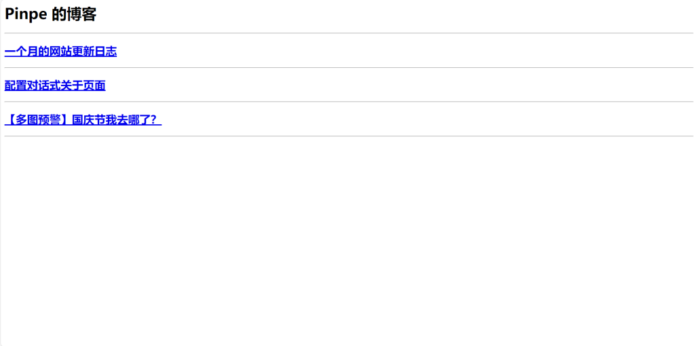
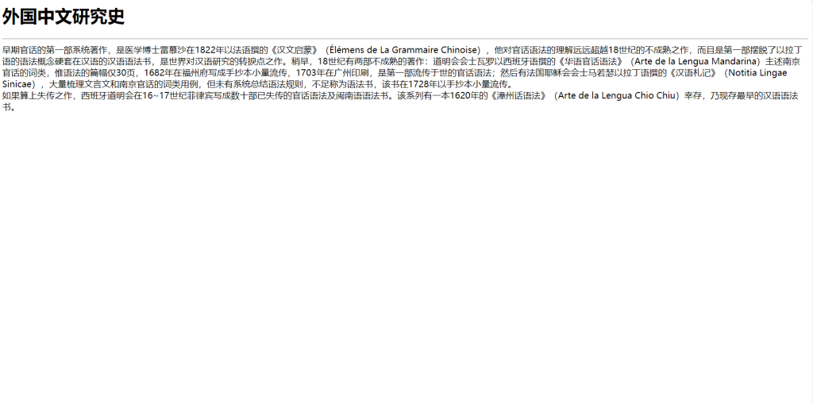

博客网站的结构很简单，大概只有三种页面类型：链接到文章和页面的主页、文章页面、独立页面。

如果要求不高，其中文章页面、独立页面可以合并成一个页面类型。因此最多只需要写2个Python脚本就够了。

### 创建主页文件.py

主页文件只有两个功能：显示博客名称、显示和链接文章或其它页面。

但是首先，必须要输入数据才能生成吧？因此需要一个字符串变量和一个列表变量，在里面填写数据：

# 数据输入
博客标题 = ''
文章列表 = &#91;
    ''
]

然后就可以创建index.html文件了，方便生成页面：

# 数据输入
博客标题 = ''
文章列表 = &#91;
    ''
]

# 创建文件
index = open('index.html', 'w', encoding='utf-8')

通常来说，HTML头部的部分是可以一成不变的，因此只需要把一些字符用变量替代就可以了：

# 数据输入
博客标题 = ''
文章列表 = &#91;
    ''
]

# 创建文件
index = open('index.html', 'w', encoding='utf-8')

# 生成头部部分
index.write(
f'''
&lt;html>
    &lt;head>
        &lt;meta charset="UTF-8">
        &lt;meta name="viewport" content="width=device-width, initial-scale=1.0, minimum-scale=0.5, maximum-scale=2.0, user-scalable=yes" /> 
        &lt;title>{博客标题}&lt;/title>
    &lt;/head>
    &lt;body>
        &lt;h1>{博客标题}&lt;/h1>
        &lt;hr>
''')

然后就可以生成页面的主体，最简单的方法是使用for遍历文章列表，中间用再把一些字符用变量替代，中间用&lt;hr>分割：

# 数据输入
博客标题 = ''
文章列表 = &#91;
    ''
]

# 创建文件
index = open('index.html', 'w', encoding='utf-8')

# 生成头部部分
index.write(
f'''
&lt;html>
    &lt;head>
        &lt;meta charset="UTF-8">
        &lt;meta name="viewport" content="width=device-width, initial-scale=1.0, minimum-scale=0.5, maximum-scale=2.0, user-scalable=yes" /> 
        &lt;title>{博客标题}&lt;/title>
    &lt;/head>
    &lt;body>
        &lt;h1>{博客标题}&lt;/h1>
        &lt;hr>
''')

# 生成文章列表
for text in 文章列表:
    index.write(
    f'''
        &lt;h2>&lt;a href="{text}.html">{text}&lt;/a>&lt;/h2>
        &lt;hr>
    ''')

最后，再来一个华丽的收尾：

# 数据输入
博客标题 = ''
文章列表 = &#91;
    ''
]

# 创建文件
index = open('index.html', 'w', encoding='utf-8')

# 生成头部部分
index.write(
f'''
&lt;html>
    &lt;head>
        &lt;meta charset="UTF-8">
        &lt;meta name="viewport" content="width=device-width, initial-scale=1.0, minimum-scale=0.5, maximum-scale=2.0, user-scalable=yes" /> 
        &lt;title>{博客标题}&lt;/title>
    &lt;/head>
    &lt;body>
        &lt;h1>{博客标题}&lt;/h1>
        &lt;hr>
''')

# 生成文章列表
for text in 文章列表:
    index.write(
    f'''
        &lt;h2>&lt;a href="{text}.html">{text}&lt;/a>&lt;/h2>
        &lt;hr>
    ''')

# 生成页尾部分
index.write(
f'''
    &lt;/body>
&lt;/html>
''')

输入以下数据时，效果是这样的：

博客标题 = 'Pinpe 的博客'
文章列表 = &#91;
    '一个月的网站更新日志',
    '配置对话式关于页面',
    '【多图预警】国庆节我去哪了？'
]

&lt;html>
    &lt;head>
        &lt;meta charset="UTF-8">
        &lt;meta name="viewport" content="width=device-width, initial-scale=1.0, minimum-scale=0.5, maximum-scale=2.0, user-scalable=yes" /> 
        &lt;title>Pinpe 的博客&lt;/title>
    &lt;/head>
    &lt;body>
        &lt;h1>Pinpe 的博客&lt;/h1>
        &lt;hr>

        &lt;h2>&lt;a href="一个月的网站更新日志.html">一个月的网站更新日志&lt;/a>&lt;/h2>
        &lt;hr>
    
        &lt;h2>&lt;a href="配置对话式关于页面.html">配置对话式关于页面&lt;/a>&lt;/h2>
        &lt;hr>
    
        &lt;h2>&lt;a href="【多图预警】国庆节我去哪了？.html">【多图预警】国庆节我去哪了？&lt;/a>&lt;/h2>
        &lt;hr>
    
    &lt;/body>
&lt;/html>

### 创建文章或页面文件.py

需要一个单行字符串变量和一个多行字符串变量：

# 数据输入
文章或页面标题 = ''
内容 = '''

'''

创建的文件名就是文章/页面标题：

# 数据输入
文章或页面标题 = ''
内容 = '''

'''

# 创建文件
page = open(f'{文章或页面标题}.html', 'w', encoding='utf-8')

然后更加简单了，只需要对变量替换就可以实现：

# 数据输入
文章或页面标题 = ''
内容 = '''

'''

# 创建文件
page = open(f'{文章或页面标题}.html', 'w', encoding='utf-8')

# 生成页面
page.write(
f'''
&lt;html>
    &lt;head>
        &lt;meta charset="UTF-8">
        &lt;meta name="viewport" content="width=device-width, initial-scale=1.0, minimum-scale=0.5, maximum-scale=2.0, user-scalable=yes" /> 
        &lt;title>{文章或页面标题}&lt;/title>
    &lt;/head>
    &lt;body>
        &lt;h1>{文章或页面标题}&lt;/h1>
        &lt;hr>
        {内容}
    &lt;/body>
&lt;/html>
''')

输入以下数据时，效果是这样的：

文章或页面标题 = '外国中文研究史'
内容 = '''
早期官话的第一部系统著作，是医学博士雷慕沙在1822年以法语撰的《汉文启蒙》（Élémens de La Grammaire Chinoise），他对官话语法的理解远远超越18世纪的不成熟之作，而且是第一部摆脱了以拉丁语的语法概念硬套在汉语的汉语语法书，是世界对汉语研究的转捩点之作。稍早，18世纪有两部不成熟的著作：道明会会士瓦罗以西班牙语撰的《华语官话语法》（Arte de la Lengua Mandarina）主述南京官话的词类，惟语法的篇幅仅30页，1682年在福州府写成手抄本小量流传，1703年在广州印刷，是第一部流传于世的官话语法；然后有法国耶稣会会士马若瑟以拉丁语撰的《汉语札记》（Notitia Lingae Sinicae），大量梳理文言文和南京官话的词类用例，但未有系统总结语法规则，不足称为语法书，该书在1728年以手抄本小量流传。&lt;br>
如果算上失传之作，西班牙道明会在16~17世纪菲律宾写成数十部已失传的官话语法及闽南语语法书。该系列有一本1620年的《漳州话语法》（Arte de la Lengua Chio Chiu）幸存，乃现存最早的汉语语法书。
'''

&lt;html>
    &lt;head>
        &lt;meta charset="UTF-8">
        &lt;meta name="viewport" content="width=device-width, initial-scale=1.0, minimum-scale=0.5, maximum-scale=2.0, user-scalable=yes" /> 
        &lt;title>外国中文研究史&lt;/title>
    &lt;/head>
    &lt;body>
        &lt;h1>外国中文研究史&lt;/h1>
        &lt;hr>
        
早期官话的第一部系统著作，是医学博士雷慕沙在1822年以法语撰的《汉文启蒙》（Élémens de La Grammaire Chinoise），他对官话语法的理解远远超越18世纪的不成熟之作，而且是第一部摆脱了以拉丁语的语法概念硬套在汉语的汉语语法书，是世界对汉语研究的转捩点之作。稍早，18世纪有两部不成熟的著作：道明会会士瓦罗以西班牙语撰的《华语官话语法》（Arte de la Lengua Mandarina）主述南京官话的词类，惟语法的篇幅仅30页，1682年在福州府写成手抄本小量流传，1703年在广州印刷，是第一部流传于世的官话语法；然后有法国耶稣会会士马若瑟以拉丁语撰的《汉语札记》（Notitia Lingae Sinicae），大量梳理文言文和南京官话的词类用例，但未有系统总结语法规则，不足称为语法书，该书在1728年以手抄本小量流传。&lt;br>
如果算上失传之作，西班牙道明会在16~17世纪菲律宾写成数十部已失传的官话语法及闽南语语法书。该系列有一本1620年的《漳州话语法》（Arte de la Lengua Chio Chiu）幸存，乃现存最早的汉语语法书。

    &lt;/body>
&lt;/html>

### 文件下载

所有使用的脚本：

[页面生成器](http://blog.pinpe.top/wp-content/uploads/2023/10/页面生成器.zip)[下载](http://blog.pinpe.top/wp-content/uploads/2023/10/页面生成器.zip)