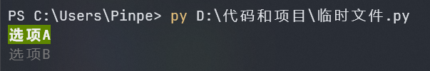
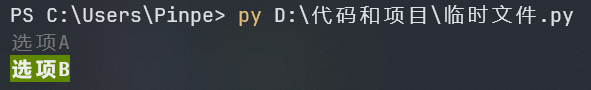
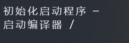
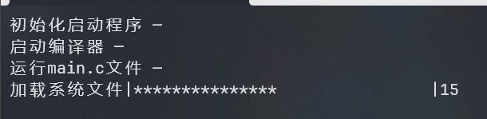

### 选项菜单

这个选项菜单可以使用W和S移动，按Enter确定，就像日常使用的界面一样熟悉便捷。

这是如何做到的呢？其实很简单。

#### 导入库

这个效果是使用conkits库，这个库的制作大佬我还认识。

from conkits import Choice

#### 输入文案

新建一个列表，写上选项的文案，字符串类型：

from conkits import Choice

taxt = &#91;
    '选项A',
    '选项B'
]

#### 调用函数

再新建一个列表，写上对应的函数名称，不需要加括号和引号。

from conkits import Choice

taxt = &#91;
    '选项A',
    '选项B'
]
method = &#91;
    A,
    B
]

在这段代码中，如果用户选择选项A，那会运行A函数，以此类推。

#### 创建函数

有函数名了，但是函数本身哪去了？没有？造一个！

from conkits import Choice

taxt = &#91;
    '选项A',
    '选项B'
]
def A():
    print('这是选项A')
def B():
    print('这是选项B')
method = &#91;
    A,
    B
]

需要注意的是，函数必须要在调用函数的列表前面。

#### 启动菜单

把菜单的灵魂加上，完美！

from conkits import Choice

taxt = &#91;
    '选项A',
    '选项B'
]
def A():
    print('这是选项A')
def B():
    print('这是选项B')
method = &#91;
    A,
    B
]
option = Choice(options = taxt, methods = method)
option.run()

其中，变量option、taxt、method的名称都是可以改变的。Choice函数的参数定义如下：

* options：菜单文案列表

* methods：调用函数列表

### 优雅地为文字添加颜色

一般我们打印彩色文字时都这样写：

printf("\033&#91;1;30;43m每个月的零花钱：%d。\033&#91;0m\n", pocket) ;
printf("最低生活保障：%d。\n\n", subsistenceAllowance) ;
printf("一个月可以买：\n") ;
printf("\033&#91;1m%d\033&#91;0m 台 4000 元手机。\n", phone) ;
printf("\033&#91;1m%d\033&#91;0m 台 8000 元电脑。\n", computer) ;
printf("\033&#91;1m%d\033&#91;0m 款 300 元 3A 游戏。\n", game) ;
printf("V \033&#91;1m%d\033&#91;0m 人 50 元。\n\n", v50) ;
printf("输入\033&#91;1m任意字符\033&#91;0m关闭...") ;

这是一段C语言的代码片段，本来C语言的语法就抽象，再加上传统的颜色控制码使这段代码更具欣赏价值。

不仅内行人看的头痛，外行人还以为是乱码。

但是Python就不用担心这种问题，rich库把我们从水深火热中拉了回来。

#### 导入库

from rich import print

需要注意的是，这时候原版的print函数已经被rich接手了，实测在部分用途下一些功能无法正常使用，所以建议与原版区分开。

from rich import print as rprint

#### 前景色

rich的语法与HTML类似。使用方括号表示一个标签，直接写在字符串里。

设置前景色，只需要在标签里面写颜色的名字就行了，比如说红色文字：

rprint('&#91;red]Hello world!&#91;/red]')

#### 背景色

使用[on &lt;背景色名称&gt;]可以设置背景色，比如说背景为青色的文字：

rprint('&#91;on cyan]慧家智能家庭中枢&#91;/on cyan]')

#### 特殊样式

rich支持文字的特殊样式，比如加粗、斜体、删除线等，以下是一些样式：

* bold：加粗

* italic：斜体

* underline：下划线

* strikethrough：删除线

和颜色一样，只需要在标签里面写样式的名字就行了，比如说加粗文字：

rprint('&#91;bold]这是一段重要的文字&#91;/bold]')

#### 组合

颜色和样式可以组合使用，并且无需打开多个标签，只需要在标签里面加空格：

rprint('&#91;black on yellow bold underline]Pink OS未正确退出&#91;/black on yellow bold underline]')

前景色要放在背景色前面。

#### 装逼功能

在终端输入这个命令试试看：

python -m rich

### TUI

使用Textual构建TUI，之前已经有写教程了：[Textual制作TUI界面 – Pinpe的云端](http://blog.pinpe.top/textual%e5%88%b6%e4%bd%9ctui%e7%95%8c%e9%9d%a2/)

### 一些迷你代码

#### 清屏

def cls():
    print('\033&#91;2J')
    print('\033&#91;1;1H',end='')

无限平台的清屏函数，无参数。

#### 逐字打印文字

def dprint(string):
    for char in list(string):
        print(char, end='', flush=True)
        time.sleep(0.05)

像RPG游戏一样逐字出现的文字，参数如下：

* string：想要打印的文字

#### 光标控制

class cursor:
    def show():
        print('\033&#91;?25h',end='')
    def hide():
        print('\033&#91;?25l',end='')

控制光标的显示和隐藏，cursor.show()显示光标；cursor.hide()隐藏光标，无参数。

#### 加载动画

def load(string,sum):
    timeflush=0.25
    for i in range(0, int(sum/timeflush)):
        list = &#91;"\\", "|", "/", "—"]
        index = i % 4
        print("\r"+string+' {}'.format(list&#91;index]),end='')
        time.sleep(timeflush)

给加载加入旋转的线，让用户觉得没死机，参数如下：

* string：加载提示文字

* sum：加载时间

#### 进度条

def bar(string1,string2,num):
    timeflush = 0.5
    for i in range(0, int(num/timeflush)+1):
        print("\r"+string1 + "|" + "*" * i + " "*(int(num/timeflush)+1-i)+"|" + str(i), end="")
        time.sleep(timeflush)
    print("\r"+string2)

显示进度条，直观地表示进度，参数如下：

* string1：加载提示文字

* string2：完成提示文字

* num：加载时间