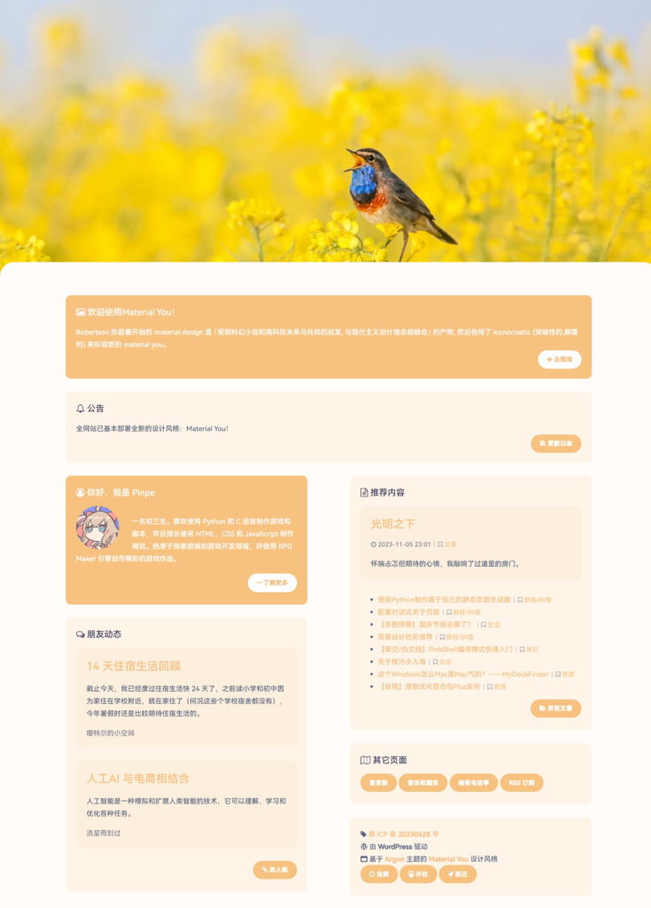
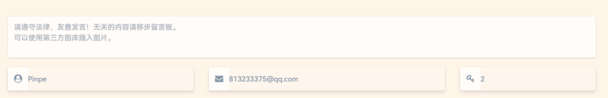
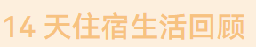

这周了解到了Material You，我很喜欢，于是把整个网站改头换面。

以往的 Argon Next 强调简洁和空间感，对于主题色的优先级不是特别大，但是新的Material You完全扁平，而且主题色对整个页面的影响是决定性的，因为无论是标题、链接、板块甚至是背景等都有应用主题色，仅仅明度有变化。Material You带给用户的主观感受比以往更年轻，更有活力，更适合青少年的气质。

这次装修持续了几天时间，适配了大多数控件，目前已经基本完成。

但是现在仍有不足：还有部分控件未适配，甚至还保留阴影（图一）；整体过于明亮；一些文字可读性较差（图二）…但是会在以后的更新慢慢解决。

Material You官方宣传片：[https://www.bilibili.com/video/BV1mv4115781](https://www.bilibili.com/video/BV1mv4115781)