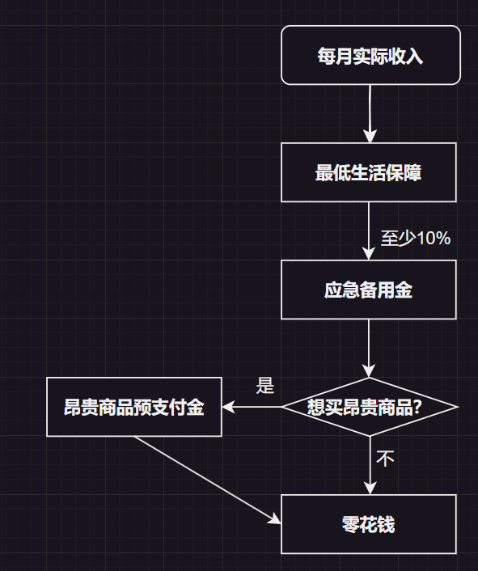

当前经济下行，自己的钱更加必须要经过合理的调度才能做到长远发展。

因此，我很久之前就构思了一个靠谱的生活经济调度机制，现在分享给大家。

### 术语定义

**每月实际收入**：每月实际到手的收入。

* 如果收入不稳定（个体户、自由职业、计件等）：取每月平均实际收入。

* 如果是稳定日结：每天的实际收入 * 每月天数。

* **最低生活保障**：每月**绝对必要**的支出。（食物、房租、水电气费、车贷等）

* **应急备用金**：应急备用金应该每个月都从收入扣除并存起来，用于养老、医疗、破产后维持最低生活保障等，建议最低金额为每月实际收入10%。

* **昂贵商品预支付金**：每个月从收入扣除并存起来，任意金额，积少成多就可以买新电脑、新手机、名牌包了。

* **零花钱**：完全可以自由支配的钱。

### 调度流程

* 从**每月实际收入**开始计算。

* 去除**最低收入保障**。

* 去除**应急备用金**。

* 如果想买昂贵商品，则去除**昂贵商品预支付金**，否则就跳过。

* 剩下的钱就是**零花钱**。

每月或发工资时执行一次。