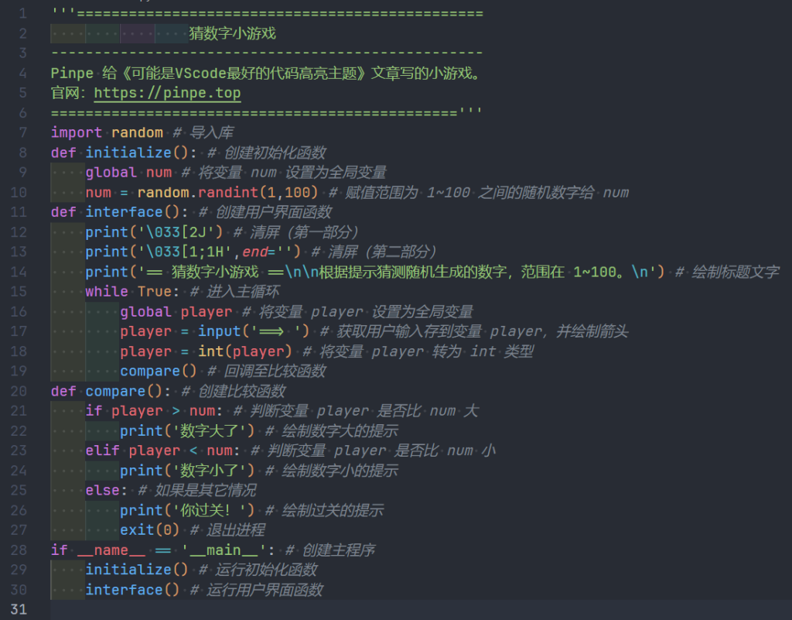
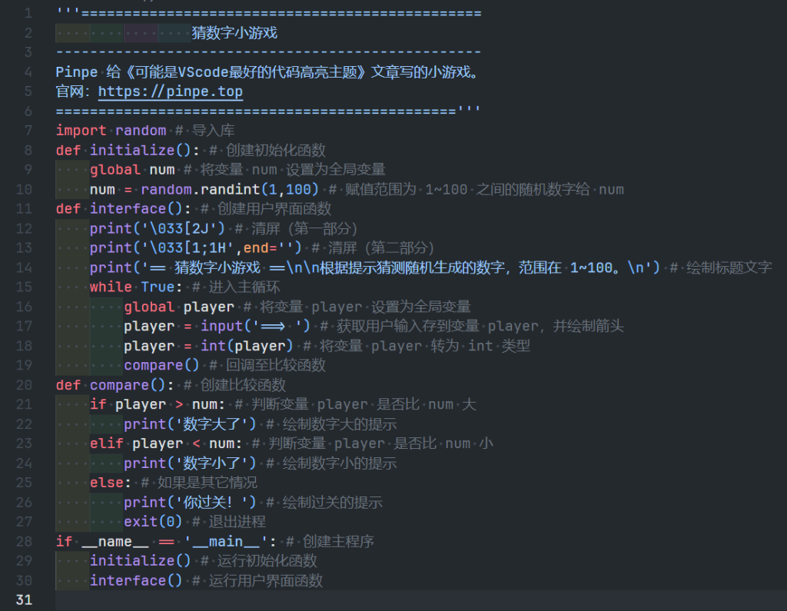
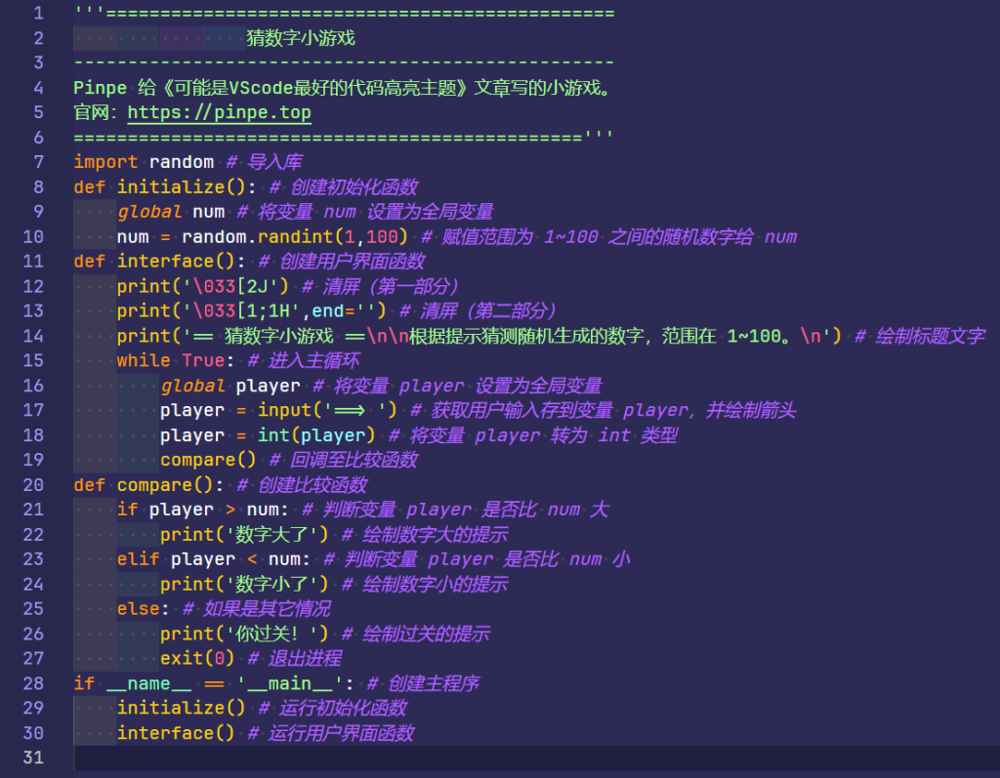

在VScode中，有很多代码高亮主题，但挑来挑去我还是选择了：**One Dark Pro**。

**One Dark Pro**的效果

可以看到每个字母都覆盖了颜色，没有一点点白，颜色也很多，也有字体变化，然鹅其它的高亮是这样的：

**GitHub Theme**的效果

**Shades of Purple**的效果

颜色少了很多，变量之类的覆盖不完全，所以看起来不仅单调乏味，而且不知道变量有没有打错。（客观的，无恶意）

所以我认为**One Dark Pro**可能是VScode最好的代码高亮主题，并且用了很久。

这个主题还支持Highlight.js，效果如下：

'''===============================================
                猜数字小游戏
--------------------------------------------------
Pinpe 给《可能是VScode最好的代码高亮主题》文章写的小游戏。
官网：https://pinpe.top
==============================================='''
import random # 导入库
def initialize(): # 创建初始化函数
    global num # 将变量 num 设置为全局变量
    num = random.randint(1,100) # 赋值范围为 1~100 之间的随机数字给 num
def interface(): # 创建用户界面函数
    print('\033&#91;2J') # 清屏（第一部分）
    print('\033&#91;1;1H',end='') # 清屏（第二部分）
    print('== 猜数字小游戏 ==\n\n根据提示猜测随机生成的数字，范围在 1~100。\n') # 绘制标题文字
    while True: # 进入主循环
        global player # 将变量 player 设置为全局变量
        player = input('==> ') # 获取用户输入存到变量 player，并绘制箭头
        player = int(player) # 将变量 player 转为 int 类型
        compare() # 回调至比较函数
def compare(): # 创建比较函数
    if player > num: # 判断变量 player 是否比 num 大
        print('数字大了') # 绘制数字大的提示
    elif player &lt; num: # 判断变量 player 是否比 num 小
        print('数字小了') # 绘制数字小的提示
    else: # 如果是其它情况
        print('你过关！') # 绘制过关的提示
        exit(0) # 退出进程
if __name__ == '__main__': # 创建主程序
    initialize() # 运行初始化函数
    interface() # 运行用户界面函数

不过可惜的是，这个版本的效果并不是很好，一大片白色，但能看就行。

你可以在VScode商店里下载到，也可以去GitHub仓库Clone：[https://github.com/Binaryify/OneDark-Pro](https://github.com/Binaryify/OneDark-Pro)