Mini Metro（迷你地铁）是一款模拟益智类游戏，你需要合理规划地铁线路使站点不再拥挤。

本文章教你**利用环线来更高效地运输乘客**，这样达到要求的几率就会升高很多。

### 此方法的优缺点

#### 优点

* 客流量能达到500左右，有时甚至可以达到1000左右。

* 操作简单。

* 所需线路少，只需要2条左右的线路。

[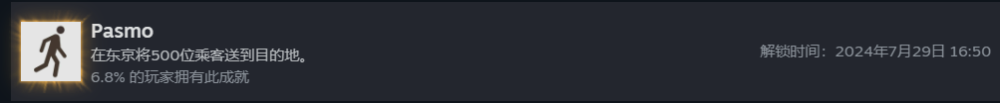](images/成就.png)

[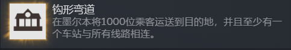](images/逆天成就1.png)

[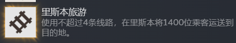](images/逆天成就2.png)

#### 缺点

* **费隧道（桥梁）**，以至于经常紧缺。

* **线路可能饱和**，新列车无法启用。

[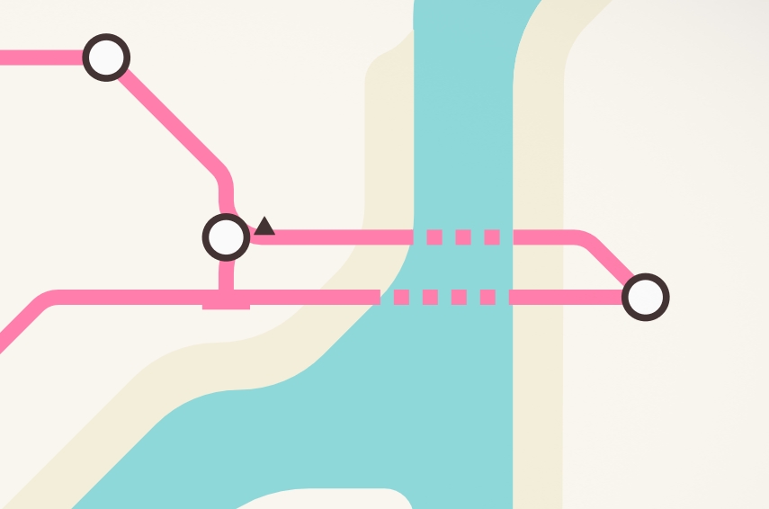](images/隧道缺点.png)如图，一条河需要两座隧道（桥梁）

### 开始游戏

地图选择了东京，只是因为配色好看。（当然其它地图也可以用这套方法）

[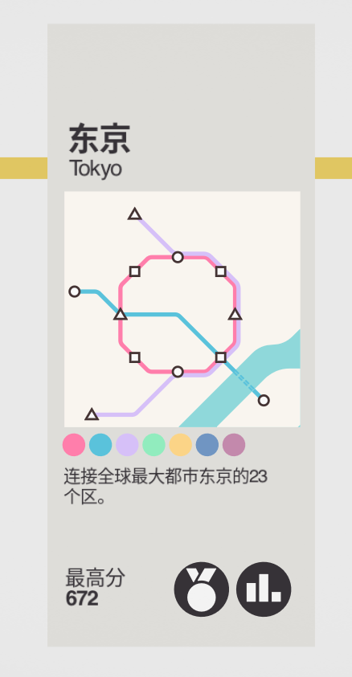](images/地图.png)

#### 前期

**刚开始就可以设置环线了**，这时站点和乘客都很少，什么都不用动。**如果出现新站，直接纳入即可**。

[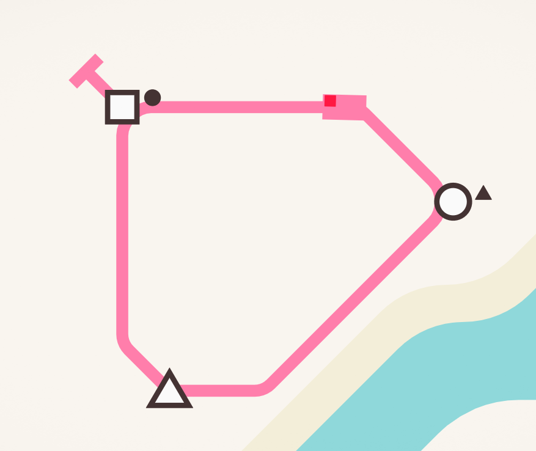](images/刚开始.png)

等到站点和乘客有一点点规模时，可以**启用新列车**。

#### 中期

如果一条线路无法承受逐渐增多的站点和乘客，并且隧道足够时，可以**开通另一条线路**。

另一条线路可以与第一条线路相似，**如果出现新的站点，两条线必须都要纳入**。

[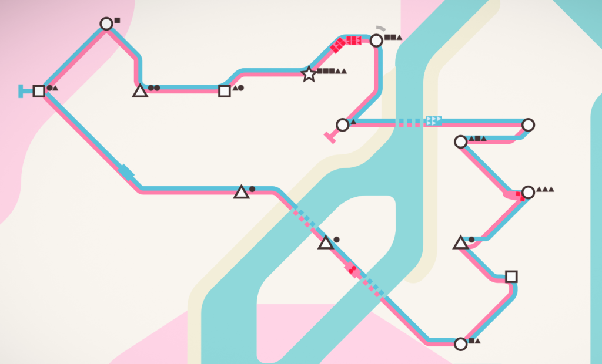](http://blog.pinpe.top/wp-content/uploads/2024/07/双环线.png)

#### 后期

随着站点和乘客进一步增多，两条线路也承受不了时，需要**再次开通新线路或重新规划**。

如果没有所需资源，只能自求多福了。

[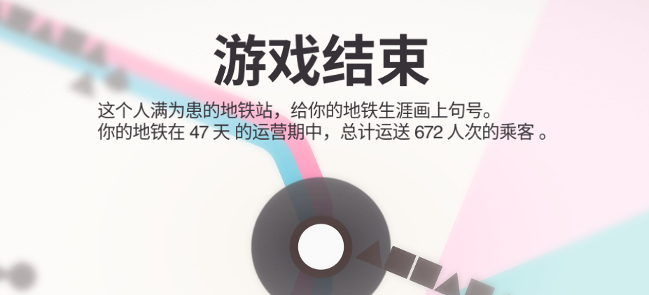](images/结束.png)

### 需要注意

#### 保留列车

**保留列车或新干线至少一辆**，否则新线路就没有车了。

[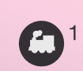](images/保留列车.png)

#### 资源选择

每周选择资源时，请根据以下重要度选择：

### 隧道（桥梁）>新干线>列车>车厢>换乘枢纽>线路

[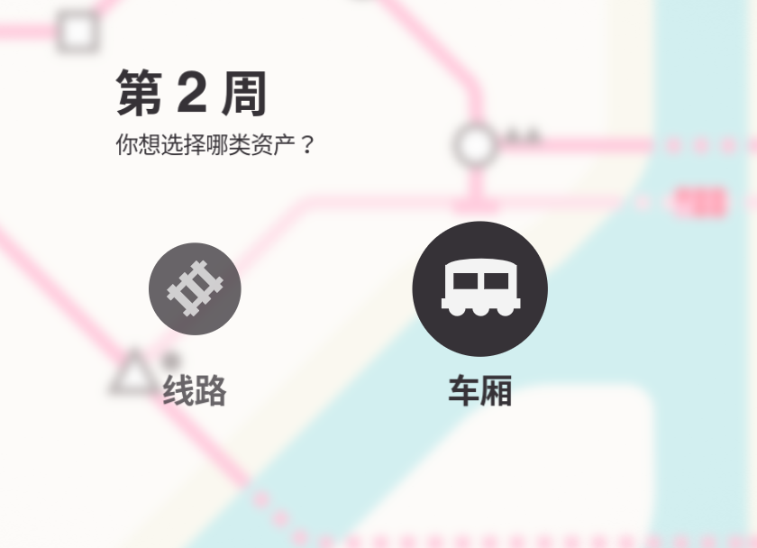](images/首选车厢.png)在线路与车厢之间，首选车厢

[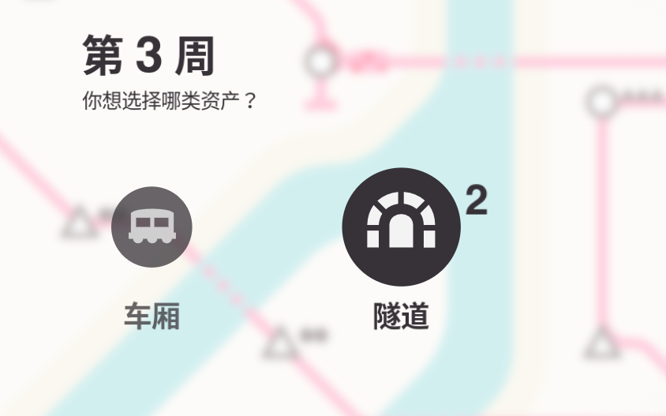](images/首选隧道.png)在车厢与隧道（桥梁）之间，首选隧道（桥梁）

#### 换乘枢纽

**换乘枢纽可以增大单个站点的容量**，适用于经常堵塞或正在堵塞的站点。

[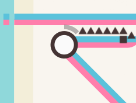](images/换乘枢纽.png)换乘枢纽的图标比普通站点大

#### 新干线

如果地图是**日本城市**，**会有速度超快的新干线**，这在站点间隔较远的地方尤为有用。

[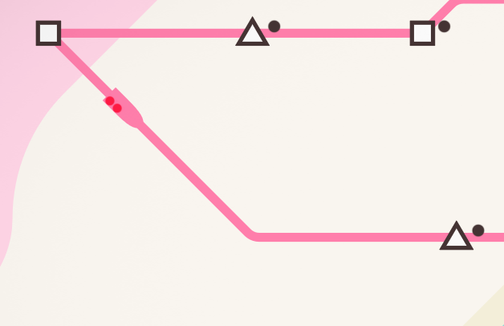](images/新干线.png)

#### 偏僻站点的处理方法

如果有个站点在河流之外，**在以下条件下**，可以使用这个办法解决：

* 有一座隧道（桥梁）

* 有一辆列车和一条备用线路

* 附近有一个换乘枢纽

如图，**将该站点连接到最近的换乘枢纽**：

[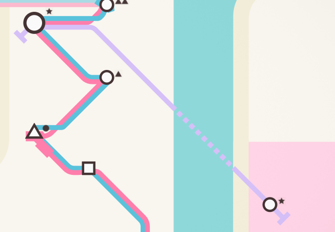](images/偏僻站点.png)