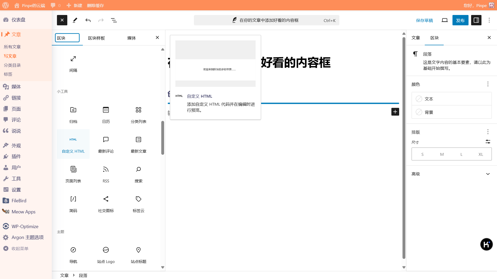

### 必要：创建HTML和CSS解析环境

这篇文章提供的所有代码都需要使用“自定义HTML”区块来解析。

可在所有区块列表中找到。

另外所有代码都修改自[喵喵博客志](https://www.mmbkz.cn/dd5a357f.html)，感谢提供。

### 迷幻紫

#### 代码

&lt;div &gt;在这里输入文本&lt;/div&gt;

#### 预览

一只敏捷的棕色狐狸跳过一只懒惰的狗

### 西瓜红

#### 代码

&lt;div &gt;在这里输入文本&lt;/div&gt;

#### 预览

一只敏捷的棕色狐狸跳过一只懒惰的狗

### 天空之镜

#### 代码

&lt;div >在这里输入文本&lt;/div>

#### 预览

一只敏捷的棕色狐狸跳过一只懒惰的狗

### 小宇宙

#### 代码

&lt;div >在这里输入文本&lt;/div>

#### 预览

一只敏捷的棕色狐狸跳过一只懒惰的狗

### 橄榄绿

#### 代码

&lt;div >在这里输入文本&lt;/div>

#### 预览

一只敏捷的棕色狐狸跳过一只懒惰的狗

### 小太阳

#### 代码

&lt;div >在这里输入文本&lt;/div>

#### 预览

一只敏捷的棕色狐狸跳过一只懒惰的狗

### 优雅紫

#### 代码

&lt;div >在这里输入文本&lt;/div>

#### 预览

一只敏捷的棕色狐狸跳过一只懒惰的狗

### 深邃黑

#### 代码

&lt;div >在这里输入文本&lt;/div>

#### 预览

一只敏捷的棕色狐狸跳过一只懒惰的狗