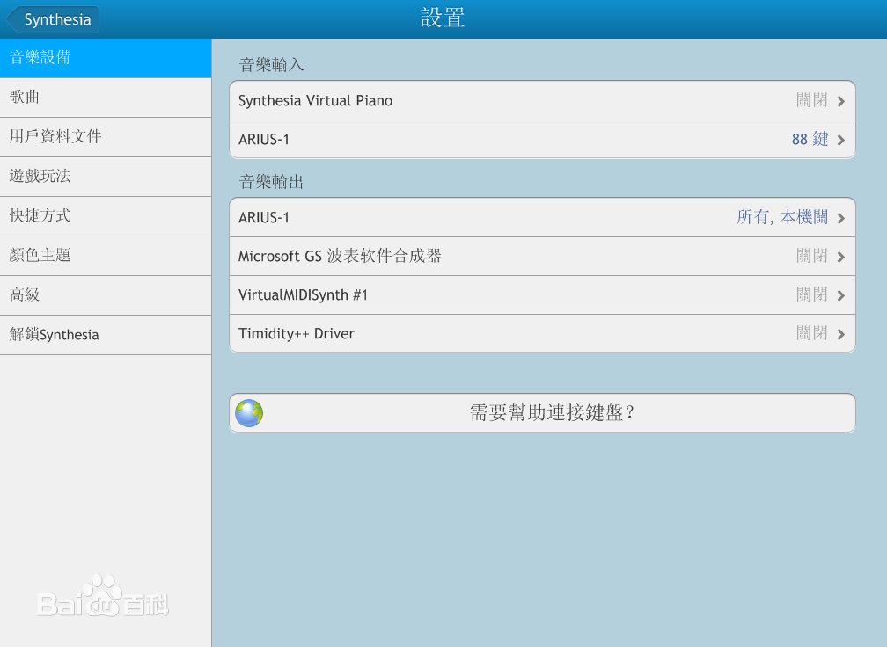
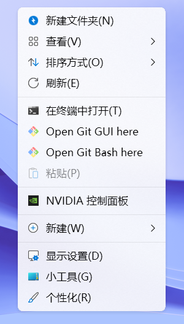
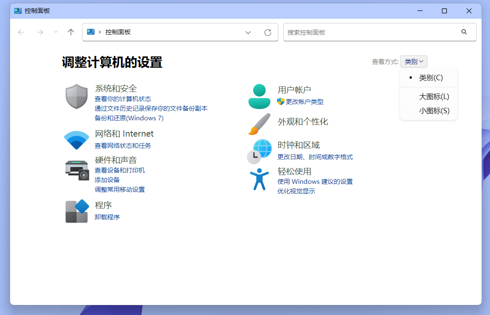
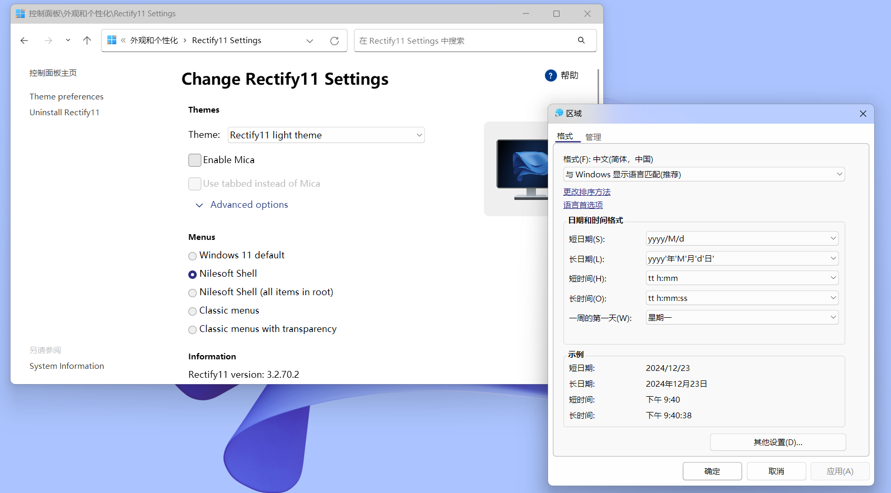
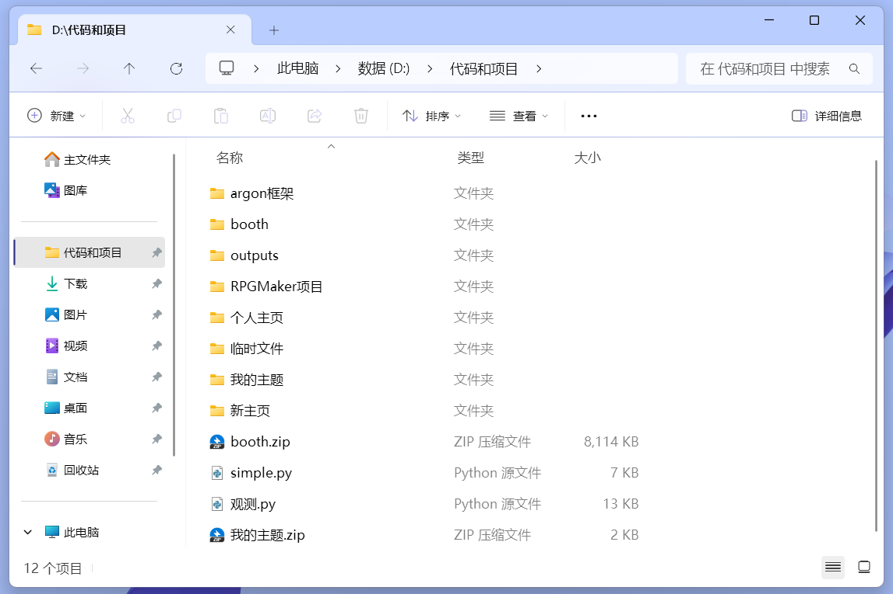
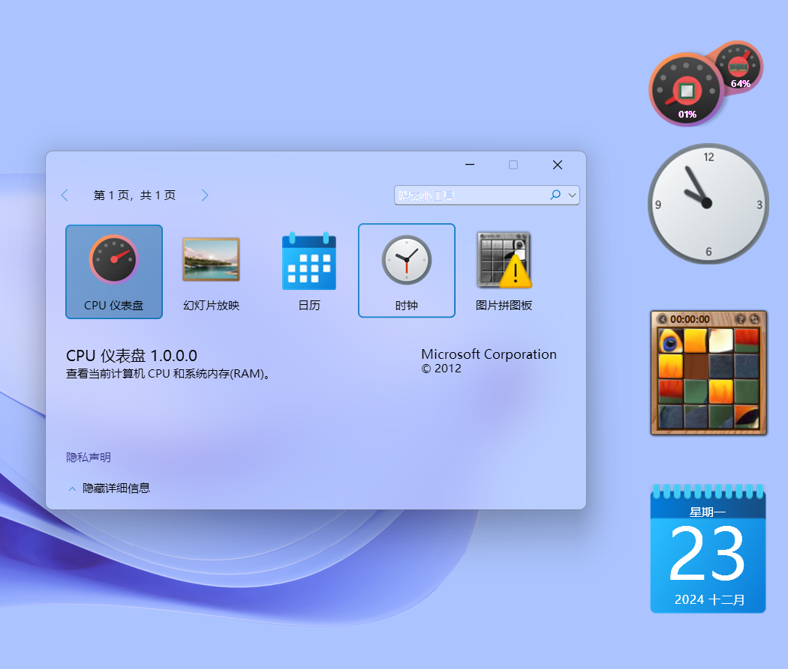
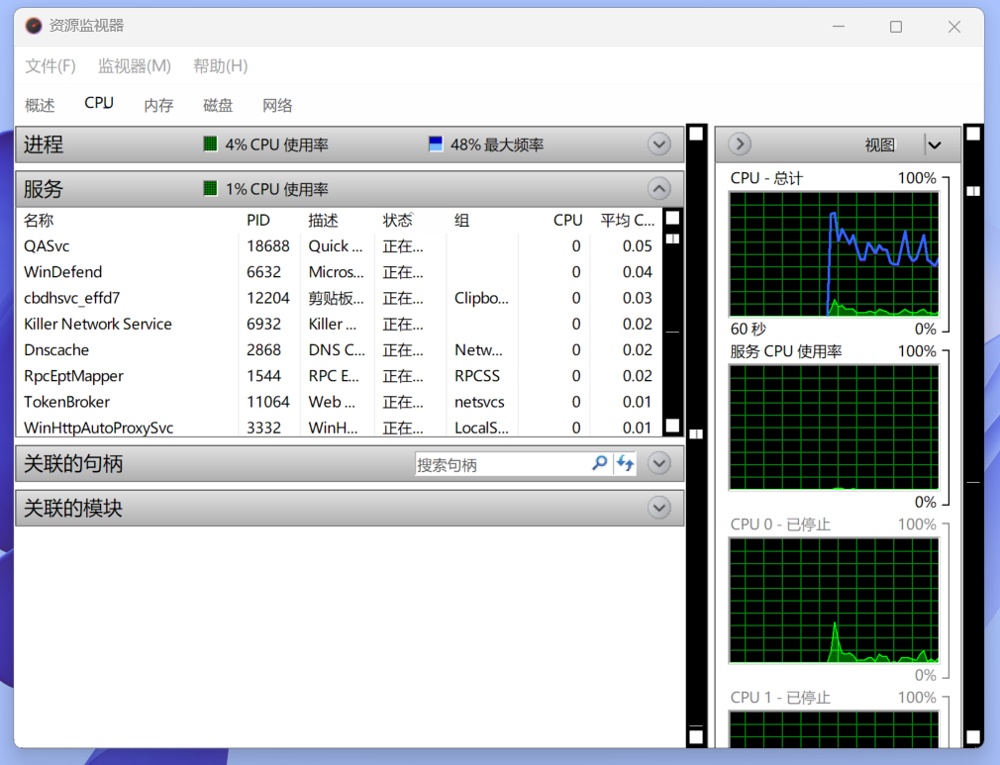
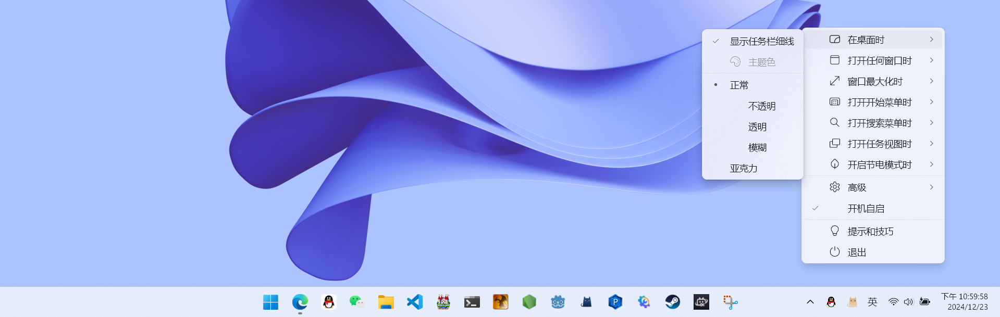
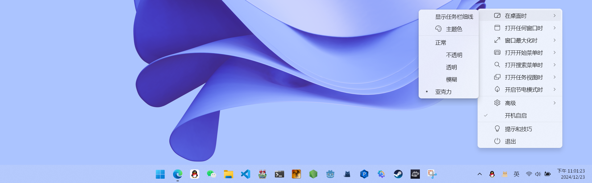

Windows从1986年发展至今，已经经过了很多轮迭代，到现在的Windows11已经是什么都有了，包括历代的界面，甚至没有经过深度翻新，还保留着原汁原味。

这导致了体验严重割裂，你可以在一个屏幕上同时看见Fluent、Metro，甚至是Basic之类的各种风格。

因此，既然微软不想改，开源社区就要出手了。

### Rectify11

这是专门解决界面一致性的软件，不仅可以重绘系统图标，修改Basic界面样式，添加更多动画，还可以优化右键菜单，移植Windows7的小组件。

此为侵入性修改，会直接修改系统数据，务必创建还原点。

新的右键菜单，应该比原版更高效一些

新的控制面板和Basic界面

微调了资源管理器

熟悉的小组件

但万物不是完美的，还是会有一点小瑕疵，比如在资源监视器就有滚动条的Bug，但对我来说这个软件不常用，影响不大：

安装教程：[https://xiaoyi.vc/rectify-11-setup.html](https://xiaoyi.vc/rectify-11-setup.html)官方网站：[https://rectify11.net/](https://rectify11.net/)

[ GitHub](https://github.com/)[Rectify11/Installer](https://github.com/Rectify11/Installer)  

提供站内下载：

[Rectify11Installer (x64)](https://blog.pinpe.top/wp-content/uploads/2024/12/Rectify11Installer-x64.zip)[下载](https://blog.pinpe.top/wp-content/uploads/2024/12/Rectify11Installer-x64.zip)

### MicaForEveryone

原版的云母模糊效果有一个根本性问题：只会对桌面采样，不能识别窗口底下真正有什么：

这不能完全算毛玻璃效果，而这款软件就可以完美解决这个问题：

[ GitHub](https://github.com/)[MicaForEveryone/MicaForEveryone](https://github.com/MicaForEveryone/MicaForEveryone)  

提供站内下载：

[MicaForEveryone_v1.3.1.2_64Bit](https://blog.pinpe.top/wp-content/uploads/2024/12/MicaForEveryone_v1.3.1.2_64Bit.7z)[下载](https://blog.pinpe.top/wp-content/uploads/2024/12/MicaForEveryone_v1.3.1.2_64Bit.7z)

### TranslucentTB

界面和模糊都已经优化好了，但还缺了个任务栏，就可以使用这个软件修改，还支持亚克力、完全透明等模式，还可以根据场景自动切换。

修改前

修改后

可以到微软商店搜索此软件，免费。