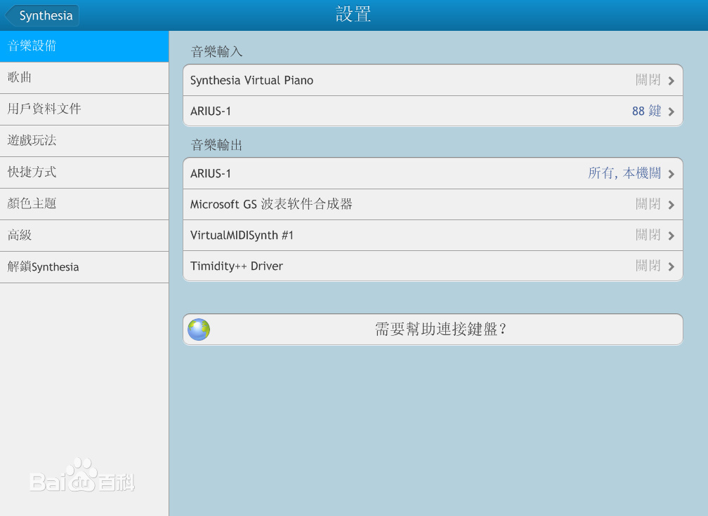
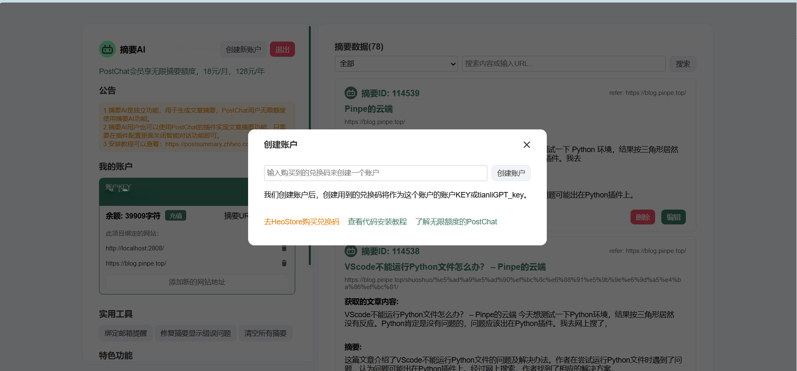
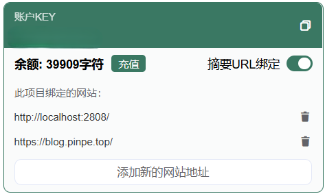
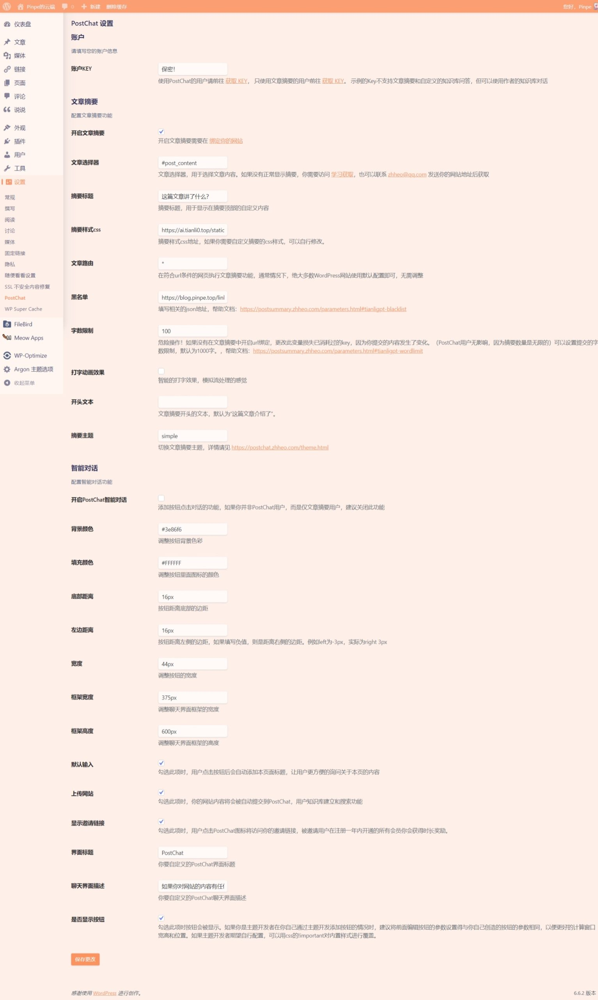
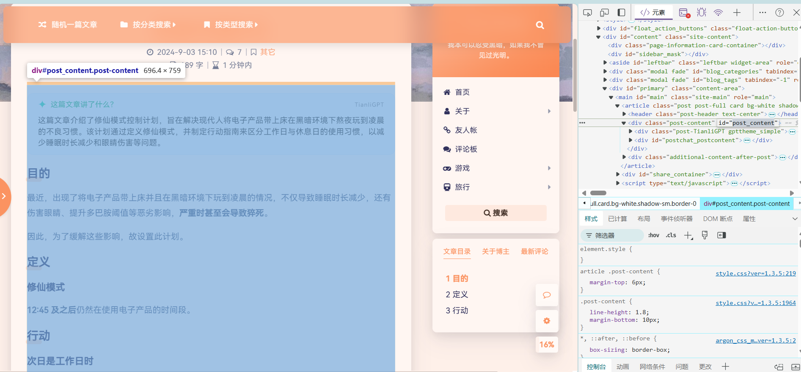

↑效果见上↑

很多博客都紧跟AI潮流，推出了AI摘要的功能，这个功能可以快速了解文章内容，对于引导阅读有很大益处。

### 注册和购买

打开网站：[**https://postsummary.zhheo.com/**](https://postsummary.zhheo.com/)，进入如下页面：

点击“**使用QQ登录**”，登录完成后进入与这个类似的页面：

点击“**去HeoStore购买兑换码**”，“**选择商品“摘要AI**”，然后使用支付宝购买，填写兑换码（卡密）。

价格为**8.99**元，无限时长，可输入**50000**个token给ai，**经过适当配置后**，基本上够用了。

### 绑定网站

在这里绑定网站：

默认会内置http://localhost:2808/，我不知道干嘛用的，不用管它，只需要点击”**添加新的网站地址**“，输入你的博客域名，确定。

### 插入代码或安装插件

详情请看文档：

* **插件**：[https://postsummary.zhheo.com/plugin/](https://postsummary.zhheo.com/plugin/)

* **插入代码**：[https://postsummary.zhheo.com/theme/custom.html](https://postsummary.zhheo.com/theme/custom.html)

### 配置

不同的版本都有不同的配置方法，这里举例一下我的配置：

* **账户KEY**：你的KEY，购买后都会有。

* **文章选择器**：页面的文章内容部分的id，可以按照这个方法看：

* **摘要标题**：摘要块的标题内容，比如我的是”这篇文章讲了什么？“。

* **摘要样式css**：如果不是极客，不用改。

* **文章路由**：非特殊情况不用改。

* **黑名单**：一个指向.json文件的**URL**，会根据.json文件的内容屏蔽特定的URL（不会显示摘要），格式为：

{
  "blackurls": &#91;
    "&lt;屏蔽URL1>",
    "&lt;屏蔽URL2>",
    ...
  ]
}

[admonition]

例如，我的是这样的：

{
  "blackurls": &#91;
    "http://blog.pinpe.top/comments/",
    "http://blog.pinpe.top/archive/",
    "http://blog.pinpe.top/friend/"
  ]
}

这会对http://blog.pinpe.top/comments/、http://blog.pinpe.top/archive/、http://blog.pinpe.top/friend/进行屏蔽，分别对应*评论板*、*时光机*、*友人帐*页面。

[/admonition]

* **字数限制**：提交给AI的字数，**越多越消耗token**，默认是1000，但我认为100就可以用了。

* **打字动画效果**：顾名思义，但我认为这个动画可能会造成视觉负担，就没开。

* **开头文本**：AI说的套话，比如总是会说”这篇文章介绍了XXXXX“

* **摘要主题**：摘要块的外观，目前有三种主题，我用的是**simple**，不仅简约，还适合各色风格网站。

对了，如果没买订阅制的，一定要把下面的PostChat智能对话关掉。

### 大功告成！