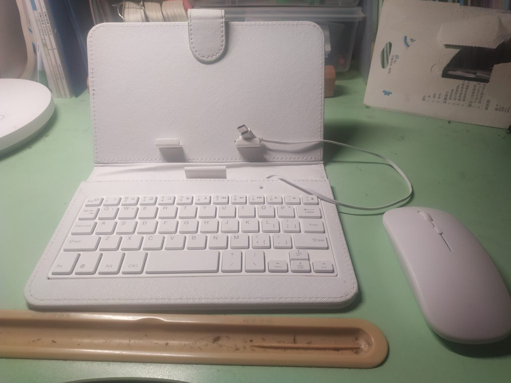
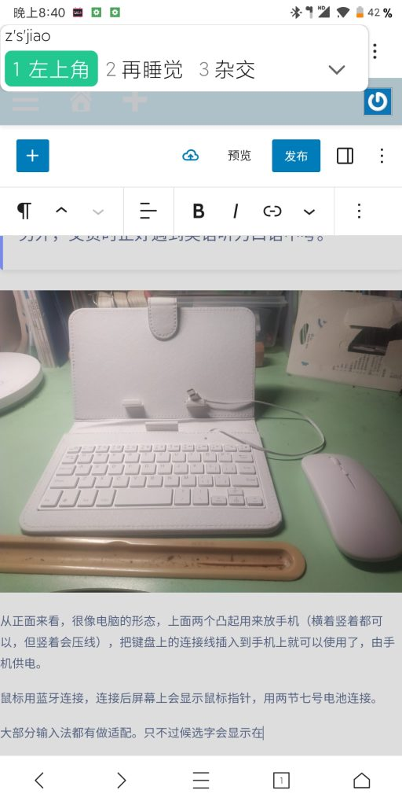
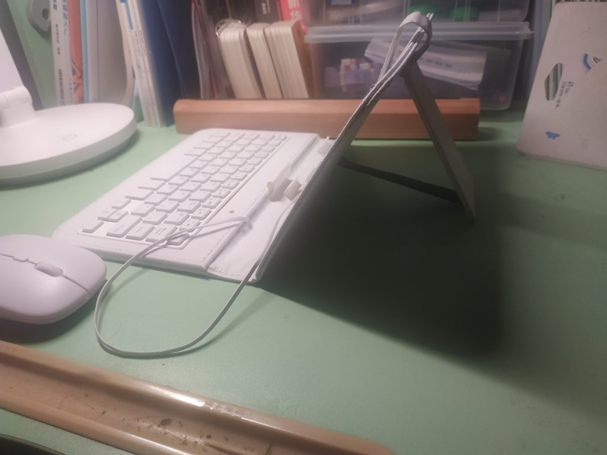
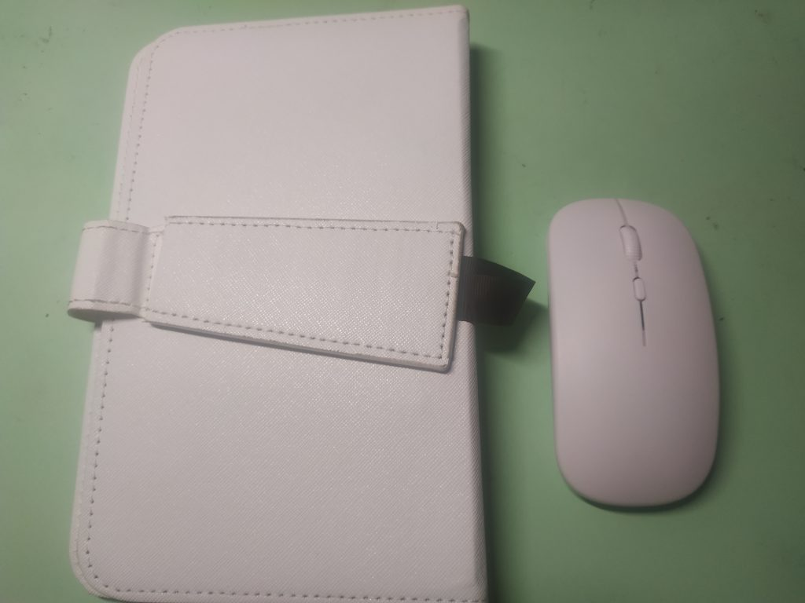

最近受到同学的诱惑，脑子一热花了 50 软妹币买了一把。。。键盘和鼠标？

说实话，我不知道手机也是能连接键盘和鼠标的，也不知道好不好用，抱着试试看的心态体验了一下。

从正面来看，很像电脑的形态，上面两个凸起用来放手机（横着竖着都可以，但竖着会压线），把键盘上的连接线插入到手机上就可以使用了，由手机供电。

鼠标用蓝牙连接，连接后屏幕上会显示鼠标指针，用两节七号电池供电。

大部分输入法都有做适配。只不过候选字会显示在左上角：

键盘布局很小，而且单引号和双引号居然是按 Fn 激活的，而不是 Ctrl。按鼠标的右键也不会出现右键菜单，而是返回，中键是主页，不是很符合电脑的习惯。

背面有一个支架，可以把屏幕立起来。

键盘也可以合上，就像真正的本子，大小甚至可以放在我的口袋里，便携性真的拉满了。想象一下，在火车上，你优雅地掏出这套键盘，不到半分钟，你的手机立马就变成了一个工作站，等着周围人向你投来羡（bi）慕（yi）的目光吧。

至于用处是什么，这篇文章就是我用这套键盘写的，写代码也可以用。

传说之下、三角符文的手机移植版理论上也可以用这套键盘玩，而无需虚拟游戏键盘。