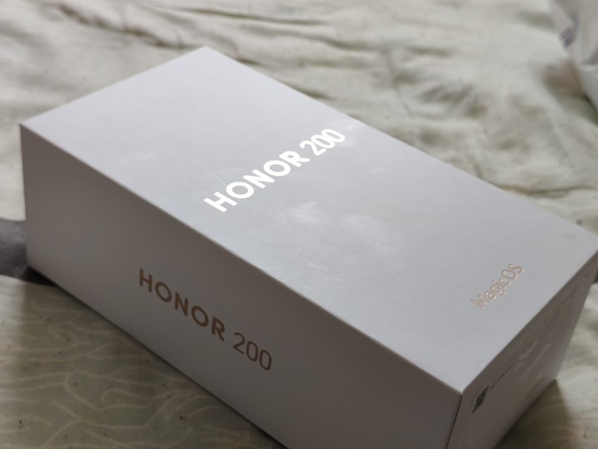
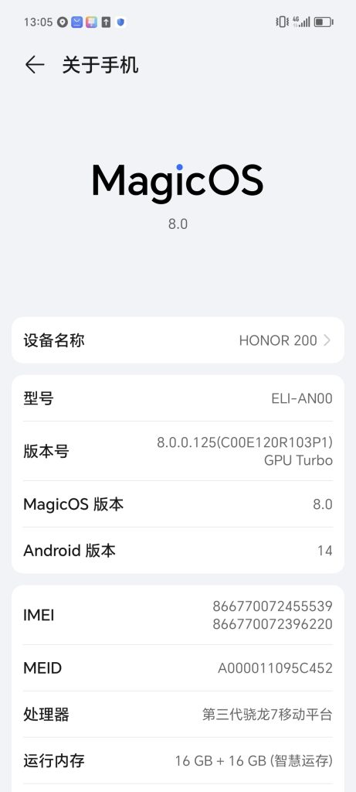
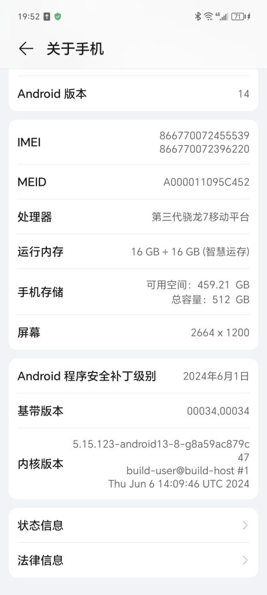
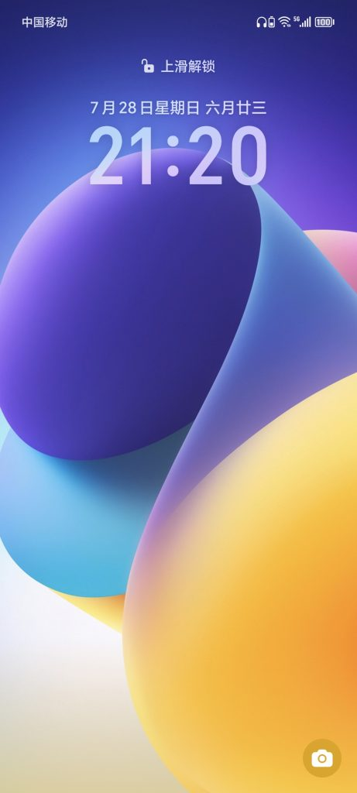
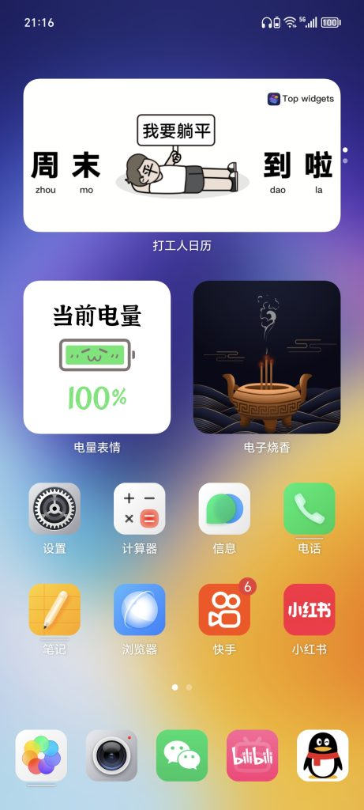
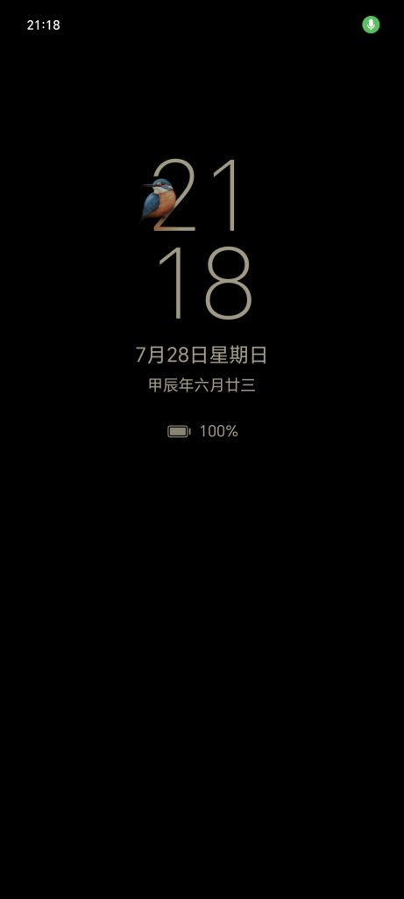
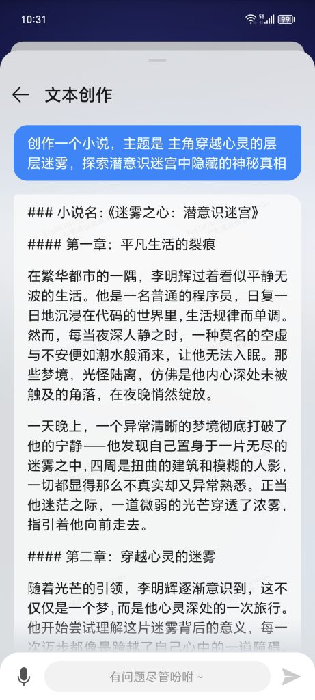
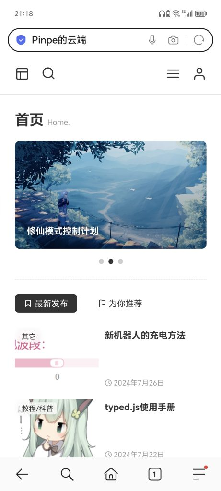

之前的Redme 6实在是太老了，于是趁此机会买个新手机，最后还是花2600块左右入手了荣耀的HONOR 200。

包装盒

配置信息

我不是很懂手机，而且这么短时间里也看不出明显的优劣，就晒晒我调过的桌面和系统。

锁屏

桌面

我觉得这个系统的可玩性挺高的，有很多小组件用。（抄的苹果的吧）

这个页面的果味更是太冲了。

而且这个手机还有熄屏显示功能，可以在不打开屏幕的情况下看时间。

人工智能大模型都集成了。

尝试打开我的网站。