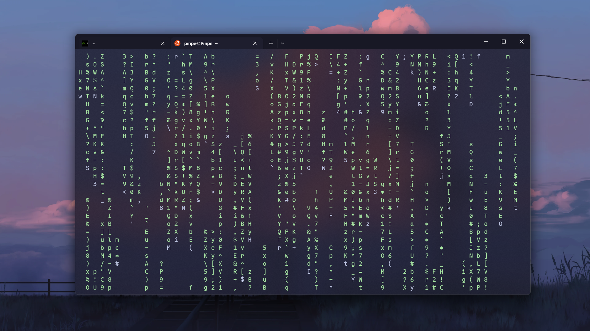
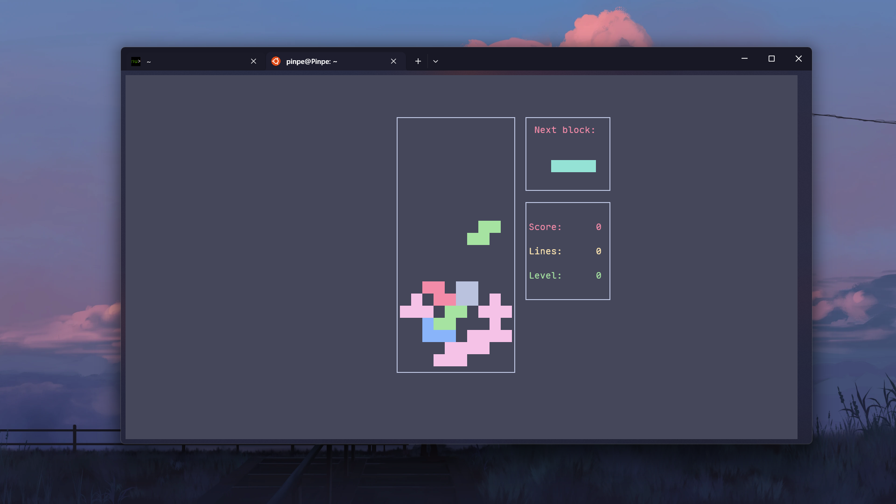
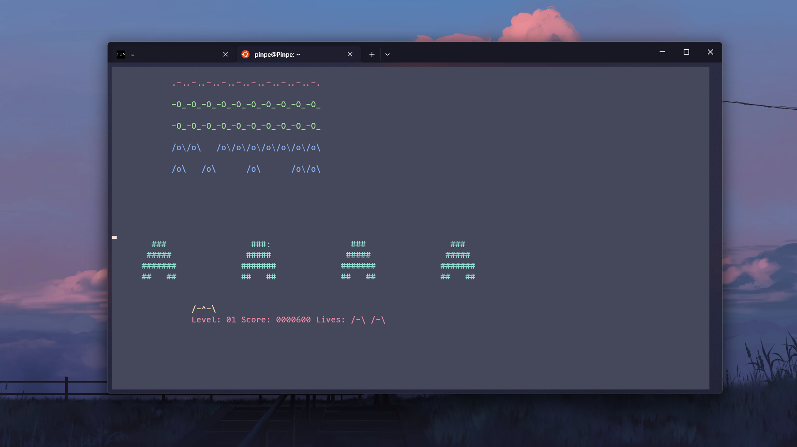
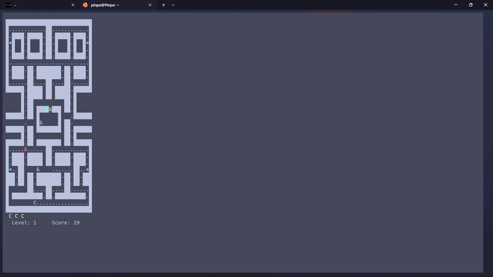
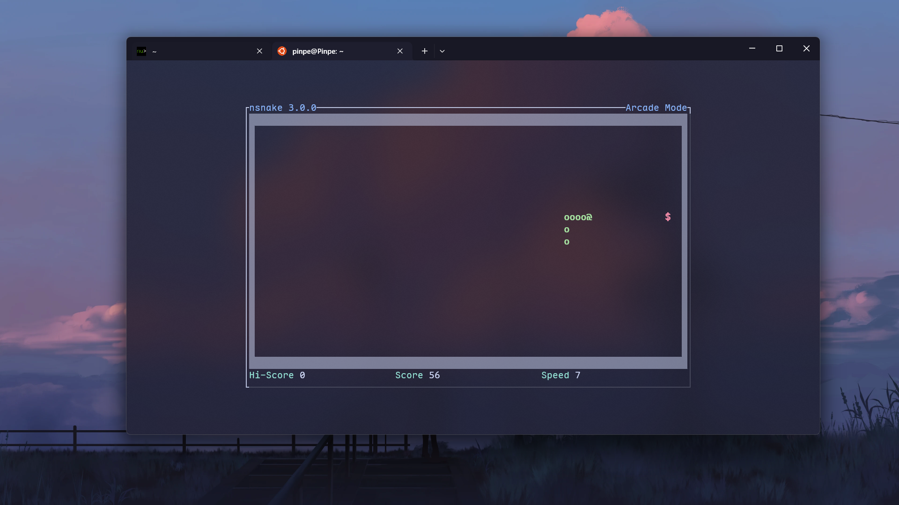

### 前言：工作与创作之分

命令行是计算机最基础，也是最古老的交互方式。命令行的雏形甚至可以追溯到1960年代的电传打字机，作为首个有效人机交互设备，通过键盘输入字符并通过打印机输出结果，便成为早期计算机的主要交互方式。

你对命令行和终端有怎样的印象？我想大多数人都会说“单调”“呆板”“高冷”吧？虽然比起GUI来说确实不是很易用，但是也不一定是你想的那样，因为在计算机历史的漫漫长河中，总会有万能且伟大的程序员写一些“无用的”“不切实际的”程序，这或许就是工作与创作的区别吧。

注意：此文章的所有程序最好在Linux运行，因为大部分都不支持其它平台。

### 酷炫类：让你成为“黑客”

#### 我自制的fetch

我不久前无聊，于是自己整了一个fetch，可以输出一个五彩缤纷的头像，大型字体的名字，以及我电脑的大概配置，然后就迷上终端玩具了，甚至为此安装了WSL：

实际上本身也没有什么技术含量，只是文字排版比较麻烦，源码贴这了：

from outputs import *

fetch = f'''
{color.red}⣿⣆⠱⣝⡵⣝⢅⠙⣿⢕⢕⢕⢕⢝⣥⢒⠅⣿⣿⣿⡿⣳⣌⠪⡪⣡⢑{style.rst}      {color.blue}██████╗ ██╗███╗   ██╗██████╗ ███████╗{style.rst}
{color.yellow}⣿⣿⣦⠹⣳⣳⣕⢅⠈⢗⢕⢕⢕⢕⢕⢈⢆⠟⠋⠉⠁⠉⠉⠁⠈⠼⢐{style.rst}      {color.blue}██╔══██╗██║████╗  ██║██╔══██╗██╔════╝{style.rst}
{color.green}⢰⣶⣶⣦⣝⢝⢕⢕⠅⡆⢕⢕⢕⢕⢕⣴⠏⣠⡶⠛⡉⡉⡛⢶⣦⡀⠐{style.rst}      {color.blue}██████╔╝██║██╔██╗ ██║██████╔╝█████╗  {style.rst}
{color.cyan}⡄⢻⢟⣿⣿⣷⣕⣕⣅⣿⣔⣕⣵⣵⣿⣿⢠⣿⢠⣮⡈⣌⠨⠅⠹⣷⡀{style.rst}      {color.blue}██╔═══╝ ██║██║╚██╗██║██╔═══╝ ██╔══╝  {style.rst}
{color.blue}⡵⠟⠈⢀⣀⣀⡀⠉⢿⣿⣿⣿⣿⣿⣿⣿⣼⣿⢈⡋⠴⢿⡟⣡⡇⣿⡇{style.rst}      {color.blue}██║     ██║██║ ╚████║██║     ███████╗{style.rst}
{color.purple}⠁⣠⣾⠟⡉⡉⡉⠻⣦⣻⣿⣿⣿⣿⣿⣿⣿⣿⣧⠸⣿⣦⣥⣿⡇⡿⣰{style.rst}      {color.blue}╚═╝     ╚═╝╚═╝  ╚═══╝╚═╝     ╚══════╝{style.rst}
{color.white}⢰⣿⡏⣴⣌⠈⣌⠡⠈⢻⣿⣿⣿⣿⣿⣿⣿⣿⣿⣿⣬⣉⣉⣁⣄⢖⢕{style.rst}
{style.rst}⢻⣿⡇⢙⠁⠴⢿⡟⣡⡆⣿⣿⣿⣿⣿⣿⣿⣿⣿⣿⣿⣿⣿⣿⣿⣷⣵{style.rst}      ╭─────────┬─────────────────────────╮
{color.red}⣄⣻⣿⣌⠘⢿⣷⣥⣿⠇⣿⣿⣿⣿⣿⣿⠛⠻⣿⣿⣿⣿⣿⣿⣿⣿⣿{style.rst}      │   {color.yellow}{style.bold}OS{style.rst}    │  {color.green}Windows 11{style.rst}             │
{color.yellow}⢄⠻⣿⣟⠿⠦⠍⠉⣡⣾⣿⣿⣿⣿⣿⣿⢸⣿⣦⠙⣿⣿⣿⣿⣿⣿⣿{style.rst}      │   {color.yellow}{style.bold}CPU{style.rst}   │  {color.green}Intel Core i7-12700H{style.rst}   │
{color.green}⡑⣑⣈⣻⢗⢟⢞⢝⣻⣿⣿⣿⣿⣿⣿⣿⠸⣿⠿⠃⣿⣿⣿⣿⣿⣿⡿{style.rst}      │   {color.yellow}{style.bold}GPU{style.rst}   │  {color.green}GeForce RTX 3050 Ti{style.rst}    │
{color.cyan}⡵⡈⢟⢕⢕⢕⢕⣵⣿⣿⣿⣿⣿⣿⣿⣿⣿⣶⣶⣿⣿⣿⣿⣿⠿⠋⣀{style.rst}      ╰─────────┴─────────────────────────╯

'''
output.echo(fetch)

对了，想要运行这个程序，需要Python环境以及outputs库，请先安装一下呢：

pip install outputs==1.13

#### cmatrix

这是一个模仿《黑客帝国》代码雨的程序，看起来非常华丽酷炫：

安装：

sudo apt install cmatrix

运行：

cmatrix

可以添加-h选项打开帮助：

 Usage: cmatrix -&#91;abBcfhlsmVx] &#91;-u delay] &#91;-C color]
 -a: Asynchronous scroll
 -b: Bold characters on
 -B: All bold characters (overrides -b)
 -c: Use Japanese characters as seen in the original matrix. Requires appropriate fonts
 -f: Force the linux $TERM type to be on
 -l: Linux mode (uses matrix console font)
 -L: Lock mode (can be closed from another terminal)
 -o: Use old-style scrolling
 -h: Print usage and exit
 -n: No bold characters (overrides -b and -B, default)
 -s: "Screensaver" mode, exits on first keystroke
 -x: X window mode, use if your xterm is using mtx.pcf
 -V: Print version information and exit
 -u delay (0 - 10, default 4): Screen update delay
 -C &#91;color]: Use this color for matrix (default green)
 -r: rainbow mode
 -m: lambda mode

Ctrl+C可以退出。

#### hollywood

如果cmatrix还不够炫酷，那还有更炫酷的，它可以启动一些程序，然后分屏展示出来，就是对电脑性能有点高：

安装：

sudo apt install hollywood

运行：

hollywood

### 趣味类：居然还有这种玩法

#### sl

这个程序可以让火车经过你的终端：

安装：

sudo apt install sl

运行：

sl

Ctrl+Z可以退出。

#### asciiquarium

现在终端看起来特别强大，都可以养“鱼”了，俨然是个赛博鱼缸，鱼的种类和突发事件还非常丰富，似乎已经成为了小生态圈：

安装：

sudo apt install asciiquarium

运行：

asciiquarium

Ctrl+C可以退出，鼠标滚轮滚动可以快进。

#### cowsay

会说话的神奇的牛：

安装：

sudo apt install cowsay

运行：

cowsay "牛牛要说的话语"

可以添加-h选项打开帮助：

cow{say,think} version 3.03, (c) 1999 Tony Monroe
Usage: cowsay &#91;-bdgpstwy] &#91;-h] &#91;-e eyes] &#91;-f cowfile]
          &#91;-l] &#91;-n] &#91;-T tongue] &#91;-W wrapcolumn] &#91;message]

#### espeak

这个程序可以文字转语音，但声线是及其机械化的男声，像早期语音合成一样，另外需要插上音响/耳机才能听到声音，所以SSH之类终端的就不能用了。

安装：

sudo apt install espeak

运行：

espeak "要转换的文字"

可以添加-h选项打开帮助：

eSpeak text-to-speech: 1.48.15  16.Apr.15  Data at: /usr/lib/x86_64-linux-gnu/espeak-data

espeak &#91;options] &#91;"&lt;words&gt;"]

-f &lt;text file&gt;   Text file to speak
--stdin    Read text input from stdin instead of a file

If neither -f nor --stdin, then &lt;words&gt; are spoken, or if none then text
is spoken from stdin, each line separately.

-a &lt;integer&gt;
           Amplitude, 0 to 200, default is 100
-g &lt;integer&gt;
           Word gap. Pause between words, units of 10mS at the default speed
-k &lt;integer&gt;
           Indicate capital letters with: 1=sound, 2=the word "capitals",
           higher values indicate a pitch increase (try -k20).
-l &lt;integer&gt;
           Line length. If not zero (which is the default), consider
           lines less than this length as end-of-clause
-p &lt;integer&gt;
           Pitch adjustment, 0 to 99, default is 50
-s &lt;integer&gt;
           Speed in approximate words per minute. The default is 175
-v &lt;voice name&gt;
           Use voice file of this name from espeak-data/voices
-w &lt;wave file name&gt;
           Write speech to this WAV file, rather than speaking it directly
-b         Input text encoding, 1=UTF8, 2=8 bit, 4=16 bit
-m         Interpret SSML markup, and ignore other &lt; &gt; tags
-q         Quiet, don't produce any speech (may be useful with -x)
-x         Write phoneme mnemonics to stdout
-X         Write phonemes mnemonics and translation trace to stdout
-z         No final sentence pause at the end of the text
--compile=&lt;voice name&gt;
           Compile pronunciation rules and dictionary from the current
           directory. &lt;voice name&gt; specifies the language
--ipa      Write phonemes to stdout using International Phonetic Alphabet
--path="&lt;path&gt;"
           Specifies the directory containing the espeak-data directory
--pho      Write mbrola phoneme data (.pho) to stdout or to the file in --phonout
--phonout="&lt;filename&gt;"
           Write phoneme output from -x -X --ipa and --pho to this file
--punct="&lt;characters&gt;"
           Speak the names of punctuation characters during speaking.  If
           =&lt;characters&gt; is omitted, all punctuation is spoken.
--sep=&lt;character&gt;
           Separate phonemes (from -x --ipa) with &lt;character&gt;.
           Default is space, z means ZWJN character.
--split=&lt;minutes&gt;
           Starts a new WAV file every &lt;minutes&gt;.  Used with -w
--stdout   Write speech output to stdout
--tie=&lt;character&gt;
           Use a tie character within multi-letter phoneme names.
           Default is U+361, z means ZWJ character.
--version  Shows version number and date, and location of espeak-data
--voices=&lt;language&gt;
           List the available voices for the specified language.
           If &lt;language&gt; is omitted, then list all voices.

#### cbonsai

这是一个可以养赛博盆栽的程序，你可以看它慢慢生长，也可以直接看现成的：

安装：

sudo apt install cbonsai

运行：

cbonsai

可以添加-h选项打开帮助：

Usage: cbonsai &#91;OPTION]...

cbonsai is a beautifully random bonsai tree generator.

Options:
  -l, --live             live mode: show each step of growth
  -t, --time=TIME        in live mode, wait TIME secs between
                           steps of growth (must be larger than 0) &#91;default: 0.03]
  -i, --infinite         infinite mode: keep growing trees
  -w, --wait=TIME        in infinite mode, wait TIME between each tree
                           generation &#91;default: 4.00]
  -S, --screensaver      screensaver mode; equivalent to -li and
                           quit on any keypress
  -m, --message=STR      attach message next to the tree
  -b, --base=INT         ascii-art plant base to use, 0 is none
  -c, --leaf=LIST        list of comma-delimited strings randomly chosen
                           for leaves
  -M, --multiplier=INT   branch multiplier; higher -&gt; more
                           branching (0-20) &#91;default: 5]
  -L, --life=INT         life; higher -&gt; more growth (0-200) &#91;default: 32]
  -p, --print            print tree to terminal when finished
  -s, --seed=INT         seed random number generator
  -W, --save=FILE        save progress to file &#91;default: $XDG_CACHE_HOME/cbonsai or $HOME/.cache/cbonsai]
  -C, --load=FILE        load progress from file &#91;default: $XDG_CACHE_HOME/cbonsai]
  -v, --verbose          increase output verbosity
  -h, --help             show help

Ctrl+C&nbsp;可以退出。

#### toilet

我们在很多时候能看到类似于这种的大型字体，这种字体就可以通过这个程序生成：

安装：

sudo apt install toilet

运行：

toilet "想要生成的内容"

可以添加-h选项打开帮助：

  -f, --font &lt;name>        select the font
  -d, --directory &lt;dir>    specify font directory
  -s, -S, -k, -W, -o       render mode (default, force smushing,
                           kerning, full width, overlap)
  -w, --width &lt;width>      set output width
  -t, --termwidth          adapt to terminal's width
  -F, --filter &lt;filters>   apply one or several filters to the text
  -F, --filter list        list available filters
      --gay                rainbow filter (same as -F gay)
      --metal              metal filter (same as -F metal)
  -E, --export &lt;format>    select export format
  -E, --export list        list available export formats
      --irc                output IRC colour codes (same as -E irc)
      --html               output an HTML document (same as -E html)
  -h, --help               display this help and exit
  -I, --infocode &lt;code>    print FIGlet-compatible infocode
  -v, --version            output version information and exit
Usage: toilet &#91; -hkostvSW ] &#91; -d fontdirectory ]
              &#91; -f fontfile ] &#91; -F filter ] &#91; -w outputwidth ]
              &#91; -I infocode ] &#91; -E format ] &#91; message ]

### 游戏类：你无法想象队友在用什么打游戏

#### bastet

经典游戏《俄罗斯方块》移植到终端上了！（虽然一开始就是终端上的游戏）

安装：

sudo apt install bastet

运行：

bastet

Ctrl+C 可以退出。

#### ninvaders

最古老的游戏之一《太空侵略者》：

安装：

sudo apt install ninvaders

运行：

ninvaders

Ctrl+C 可以退出。

#### pacman4console

童年回忆《吃豆人》的终端版本，虽然画面变差了很多，里面的角色都变成字符了TwT：

安装：

sudo apt install pacman4console

运行：

pacman4console

Ctrl+C 可以退出。

#### nsnake

诺基亚的小游戏《贪吃蛇》也可以在终端玩了：

安装：

sudo apt install nsnake

运行：

nsnake