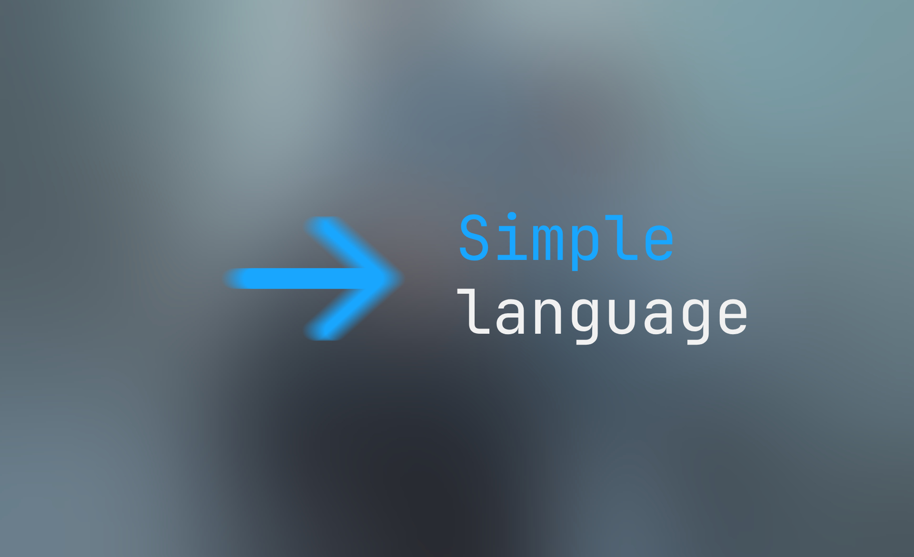

**Simple**，是一种**解释型的Esolang语言**，特色是**极度简单的语法、功能和机制**，也支持一部分Python语法，由**Pinpe**在**2024年初秋**因为洗澡时的灵光一现而开始开发，作为一门贯彻极简主义的语言，同时还保留一定的可读性。**除了四大核心语句，其它一切语句都是API**，而且**拒绝“无关紧要”的抽象概念**，例如循环、数据结构、函数、对象、模块，甚至注释，因此编写Simple程序**非常繁琐且需要抽象思维**。

解释器自带了一个简单的编辑器，因此**可以直接在终端上编辑代码**，而且**支持交互和脚本两种模式**。

要声明一个全局变量（也只有全局变量），**只需要给出变量名和值**，中间用:核心语句分隔：

hello: 'hi, mom'

**用putAPI可以打印到标准输出**：

hello: 'hi, mom'
put hello

**用keyAPI可以获取键盘输入**，其参数就是想要把结果传递到的变量：

put 'who: '
key name
hello: 'hi, ' + name
put hello

这就是你的第一个Simple程序，但实际上此时事情还没有开始奇怪起来。

### 数据类型

Simple有完整且简单的数据类型系统：

符号意义示例num数字（包含整数和浮点数）3、3.14str字符串（要用''或""包围）'hello'bool布尔值（只有True和Flase）True、FlaseNone空值Noneother除上面所述的其它类型（非标准）['list']、&lt;object&gt;

### 核心语句

核心语句每一样都不可缺少，否则就无法构成图灵完备，就像大脑一样，**只需用符号表示**。

#### :

{变量名}: {变量值}

**声明一个变量**，例如：

var: 'hello'

如果使用了未声明的变量，将返回**None**。

#### ::

:: {标签名}

**声明一个标签**，需要和下文的-&gt;搭配使用，实际上是语法糖，原形为：

{标签名}: {声明此标签时的行号}

示例：

:: my_label

#### -&gt;

{条件表达式（可选，默认为True）} -&gt; {跳转到的行号}

**当满足条件表达式里的条件时，指针就会跳转到相应的行号**，这是唯一可以控制代码流程的语句，例如：

sum == 90 -&gt; 8

最好和标签搭配使用，当代码行数变动时就不会波及到-&gt;：

sum == 90 -&gt; great

#### @

@ {想要执行的代码字符串}

**动态执行字符串里的代码**，例如：

var: 'hello'
@ "put '" + var + "'"

### API

API也是很重要的，没有API就无法进行实际操作，就像手一样，用简短单词标识。

由于API比较多，就不详细展开了，稍微讲一下每个API的用途，详细请看源代码：

* **sh、py：**分别调用系统Shell和Python解释器。

* **put、key：**输出和输入。

* **num、str、type：**前两个是转换到某种类型，后一个是检查类型。

* **len：**返回字符串的长度。

* **file、write：**文件操作。

* **sleep：**时间延迟。

* **tur_down、tur_up、tur_done、tur_to、tur_size、tur_color：**海龟画图。

### 部分抽象概念的实现

#### 注释

可使用变量代替：

rem: '这是一个注释'

#### 条件循环（也可以通过@升级为遍历）

var: 0
:: root
var: var + 1
put var
var != 5 -> root

### 示例代码

put 'a = '
key a
num a
put 'b = '
key b
num b

a > b -> big
a &lt; b -> less
put '两者相等\n'
-> quit

:: big
put 'a比b大\n'
-> quit

:: less
put 'a比b小\n'
-> quit

:: quit

### 解释器源码

import os
import time
import turtle

def clean():
    print('\033&#91;2J')
    print('\033&#91;H', end='')

def interpreter(pointer):
    try:
        if not pointer:
            pass
        elif 'sh' in pointer:
            pretreatment = pointer.replace('sh','').strip()
            exec(f'os.system({pretreatment})', globals())
        elif 'py' in pointer:
            pretreatment = pointer.replace('py','').strip()
            exec(pretreatment, globals())
        elif '@' in pointer:
            pretreatment = pointer.replace('@','').strip()
            interpreter(eval(pretreatment, globals()))
        elif 'put' in pointer:
            pretreatment = pointer.replace('put','')
            print(eval(pretreatment, globals()), end='', flush=False)
        elif 'write' in pointer:
            pointer = pointer.strip('write')
            parts = &#91;p.strip() for p in pointer.split(',')]
            name, content = parts&#91;0], parts&#91;1]
            exec(f"{name}.write({content})", globals())
        elif ':' in pointer and not '::' in pointer:
            pretreatment = pointer.split(':')
            name = pretreatment&#91;0]
            key = pretreatment&#91;1]
            exec(f'{name} = {key}', globals())
        elif '->' in pointer:
            pretreatment = pointer.split('->')
            condition = pretreatment&#91;0].strip()
            target_line = eval(pretreatment&#91;1], globals()) - 1
            if not condition or eval(condition, globals()):
                return target_line
        elif 'key' in pointer:
            pretreatment = pointer.replace('key','').strip()
            exec(f'{pretreatment} = input()', globals())
        elif 'num' in pointer:
            pretreatment = pointer.replace('num','').strip()
            try:
                exec(f'{pretreatment} = int({pretreatment})', globals())
            except Exception:
                exec(f'{pretreatment} = float({pretreatment})', globals())
        elif 'str' in pointer:
            pretreatment = pointer.replace('str','').strip()
            exec(f'{pretreatment} = str({pretreatment})', globals())
        elif 'type' in pointer:
            pretreatment = pointer.replace('type','').strip()
            global results
            if isinstance(eval(pretreatment), int) or isinstance(eval(pretreatment), float):
                results = 'num'
            elif isinstance(eval(pretreatment), str):
                results = 'str'
            else:
                results = 'other'
            exec(f'{pretreatment} = results', globals())
        elif 'len' in pointer:
            pretreatment = pointer.replace('len','').strip()
            exec(f'{pretreatment} = len({pretreatment})', globals())
        elif 'sleep' in pointer:
            pretreatment = pointer.replace('sleep','').strip()
            pretreatment = eval(pretreatment)
            time.sleep(pretreatment)
        elif 'file' in pointer:
            pretreatment = pointer.replace('file', '').strip()
            parts = &#91;p.strip() for p in pretreatment.split(',')]
            name, path, mode, encoding = parts
            exec(f"{name} = open({path}, {mode}, encoding={encoding})", globals())
        elif 'tur_down' == pointer:
            turtle.pendown()
        elif 'tur_up' == pointer:
            turtle.penup()
        elif 'tur_done' == pointer:
            turtle.done()
        elif 'tur_to' in pointer:
            pointer = pointer.strip('tur_to')
            parts = &#91;p.strip() for p in pointer.split(',')]
            x, y = parts&#91;0], parts&#91;1]
            exec(f'turtle.goto({x}, {y})', globals())
        elif 'tur_size' in pointer:
            pretreatment = pointer.replace('tur_size','').strip()
            pretreatment = eval(pretreatment, globals())
            turtle.pensize(pretreatment)
        elif 'tur_color' in pointer:
            pretreatment = pointer.replace('tur_color','').strip()
            pretreatment = eval(pretreatment, globals())
            turtle.pencolor(pretreatment)
        elif '::' in pointer:
            pass
        else:
            raise SyntaxError("invalid syntax")
    except NameError as err_obj:
        err_str = str(err_obj).replace('name', '').replace('is not defined', '').replace("'", '').strip()
        exec(f'{err_str} = None', globals())
        interpreter(pointer)
    return line + 1

def main():
    '''标签预处理'''
    global line
    line = 0
    while line &lt; len(all_code):
        pointer = all_code&#91;line]
        if '::' in pointer:
            pretreatment = pointer.replace('::','').strip()
            exec(f'{pretreatment} = {line + 1}', globals())
        line += 1

    '''解释器'''
    line = 0
    while line &lt; len(all_code):
        pointer = all_code&#91;line].strip()
        new_line = interpreter(pointer)
        line = new_line

'''编辑器'''
if __name__ == '__main__':
    all_code = &#91;]
    show_line = 1
    clean()
    print('\033&#91;1m\033&#91;34m欢迎使用由Pinpe制作的Simple语言\033&#91;m，此语言力求最极简的语法和机制，当前版本为\033&#91;1m\033&#91;33mb0.3\033&#91;m。\n编辑器的当前模式是\033&#91;1m\033&#91;33m交互\033&#91;m，可以使用\033&#91;4m\033&#91;31m回车键\033&#91;m直接执行一行程序，\033&#91;1m\033&#91;31m不支持->等部分功能\033&#91;m，输入\033&#91;4m\033&#91;31mscript\033&#91;m进入脚本模式，输入\033&#91;4m\033&#91;31mexit\033&#91;m退出。')
    while True:
        keyboard = input('\n\033&#91;1m\033&#91;33m输入\033&#91;m\033&#91;34m >> \033&#91;m')
        if keyboard == 'script':
            clean()
            print('编辑器的当前模式是\033&#91;1m\033&#91;33m脚本\033&#91;m，可以使用\033&#91;4m\033&#91;31mrun\033&#91;m执行多行程序，输入\033&#91;4m\033&#91;31mshell\033&#91;m进入交互模式。\n')
            while True:
                keyboard = input(f'\033&#91;1m\033&#91;33m{show_line}\033&#91;m\033&#91;34m | \033&#91;m')
                if keyboard == 'run':
                    clean()
                    main()
                    exit(0)
                elif keyboard == 'shell':
                    show_line = 1
                    clean()
                    print('\033&#91;1m\033&#91;34m欢迎使用由Pinpe制作的Simple语言\033&#91;m，此语言力求最极简的语法和机制，当前版本为\033&#91;1m\033&#91;33mb0.3\033&#91;m。\n编辑器的当前模式是\033&#91;1m\033&#91;33m交互\033&#91;m，可以使用\033&#91;4m\033&#91;31m回车键\033&#91;m直接执行一行程序，\033&#91;1m\033&#91;31m不支持->等部分功能\033&#91;m，输入\033&#91;4m\033&#91;31mscript\033&#91;m进入脚本模式，输入\033&#91;4m\033&#91;31mexit\033&#91;m退出。')
                    break
                else:
                    all_code.append(keyboard)
                    show_line += 1
        elif keyboard == 'exit':
            exit(0)
        else:
            all_code.append(keyboard)
            main()
            all_code = &#91;]