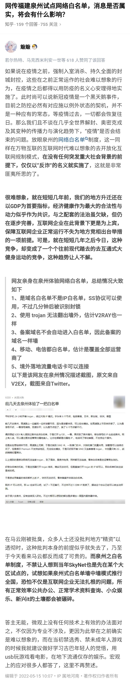
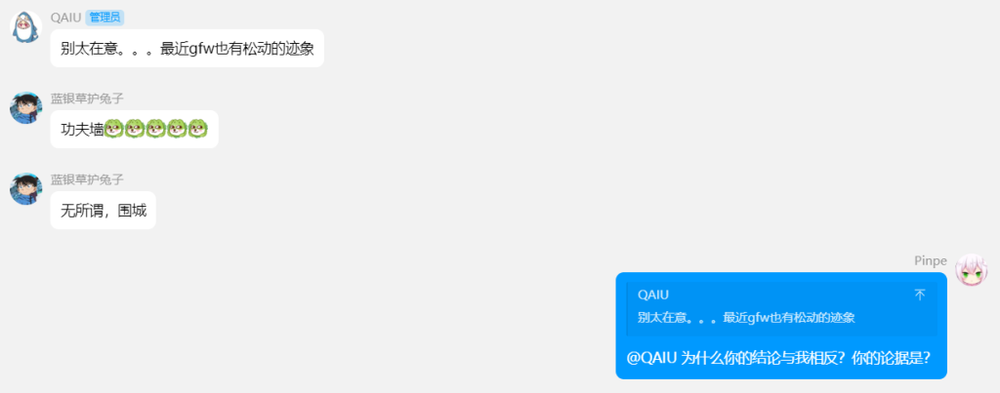
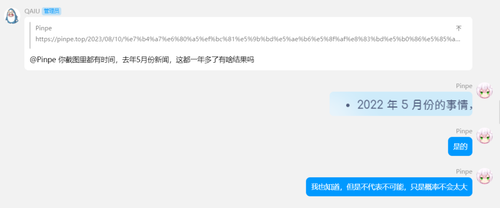

我有一个泉州的朋友，之前一直说我的网站不稳定。但别的地区都能打开，我也没有太放在心上。

最近APP马上需要备案了，我才无意间发现竟然有网络白名单这个东西。并且在泉州试点，以后可能会推广到全国。

这是一个知乎的回答：

大概率只有大型正规的网站才能访问，没有备案的小网站和个人博客没有什么立足之地了，除非你在外国。

去管管966、血汗工厂、就业环境都比这好。难道我们只配使用百度、CSDN？只配玩腾讯、网易、米哈游吗？

不过还是有一点希望的，目前应该还有三层保险：

* 2022年5月份的事情，时间较久，不知道会不会全国推广。

* 如果全国推广了，不知道法律是否严苛。

* 如果法律严苛，不知道会不会闭一只眼。

如果没有闭一只眼，那只能等死，或者是寻找其它灰色的方法（比如梯子之类性质的）。

**2023.8.11修订：**

昨天晚上我跟博主、Java工程师的qaiu聊了聊，他认为事情已经过去了较久的时间，也没有其它动静，可能真的是因为特殊原因搞的地方政策。

因为篇幅原因，聊天记录有删减。

更何况他好像根本没有把白名单放在眼里。