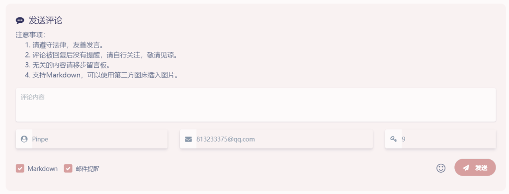

有点纳闷，用了这么久的服务器竟然不支持**STMP**，这意味着网站无法发送邮件了。虽然也可以配置第三方STMP，但是很麻烦，短时间是不会去搞了。

这是新修改的评论注意事项，里面提到了一个解决方法，就是“**自行关注**”。

该如何“自行关注”呢？有两个方法：

### 方法一：收藏夹

发布一个评论后，如果要等回复，可以将评论过的页面加入收藏夹（只需要加入评论过的页面）。

几天后再查看一次，通常就有回复。

### 方法二：手动提醒

如果是特殊的评论，可以直接表明需要这种方法。

我会先在网站里回复一遍，然后我自己手动把回复的内容发到你的邮箱，前提是你的邮箱必须可用。目前是免费的，但不要滥用。

由于这种方法耗费时间和人力，而且看起来很原始，所以建议采用方法一。