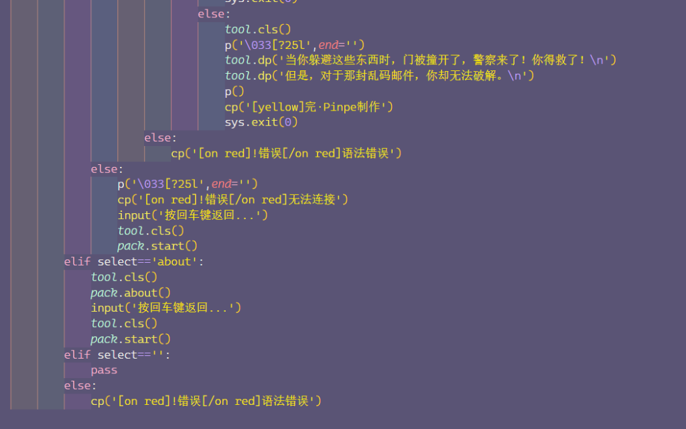
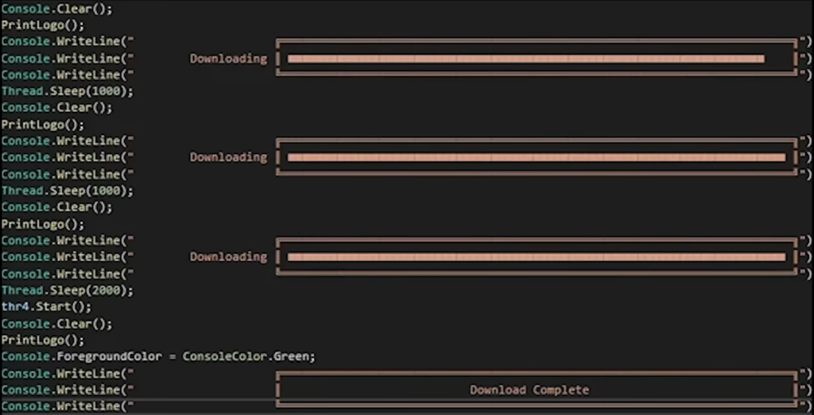

### 洋葱式嵌套

if var3==True:
    if var17==True:
        if menu_taxt==var6:
            if ver9==ver2:
                func()

### 绕来绕去

ver1=&#91;None]
ver2=None
ver3=&#91;window.show,window.hide]
ver4=ver2
ppy=func()
window.menu.kitt=&#91;ver3,tool.pin]
ver3=ppy

### 流体力学

### 太空大桥

### 面向结果编程

### 极富规律感

print('它要继续做它的医生梦，而我也要做那份工资不高但轻松的工作。')
time.sleep(2)
print('但这份宁静，被一个网红种草后就打破了。')
time.sleep(2)
print('它开始火了起来。')
time.sleep(2)
print('最直观的一点是来到站里的人变多了，但他们大多不需要帮助，而是成天拿着相机拍拍拍。')
time.sleep(2)
print('百合很不解，但毕竟人多起来了，应该感到高兴才对。')

### 这个C语言不对劲

int mian{}&#91;
printf('Hello'):
]