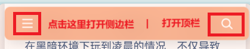

### 必须重视UX设计

**UX设计才是整个产品设计中的根。**如果UX设计配不上UI设计，整个产品就会变得中看不中用。

例如，我的博客在以前的版本中，为了统一UI体验，直接砍掉了导航栏，也没有其它任何像样的全站导航系统，导致在网站跑跳非常困难。

因此，这次我专门设计了UX（虽然因为技术原因，还有妥协之处），用起来至少舒服点。

### 我的UX设计原则

#### 充满沉浸感

**沉浸感**贯彻了整个博客，例如在UI方面，大部分元素和背景都有统一的主题色、封面图片的色调与主题色相似等。

而在UX方面，沉浸感也同样重要，例如用户第一眼就能看到全屏封面：

* **搜索栏**：给用户进入网站之前就可以搜索的机会。

* **主题语**：快速了解网站的时令主题（活动）。

* **动画箭头**：给用户的操作引导。

#### 不要给多余的选择

**一定要对外行友好，甚至可以把用户当电脑小白。**

多余的选择，甚至是不常用的选择，会干扰正常的选择判断速度，甚至可能会让人产生疑惑，最严重的会产生生疏感。

不久前我使用了新的右键菜单，在没有任何元素选中的情况下，只有一个选项：

哪怕选择了文字，也只会有两个选项，简直就是惜字如金：

对比一下浏览器原生的右键菜单：

虽然自带的右键菜单功能强大，但实际上用到的也就那几个，其它的都像装饰一样。（虽然有某些情况下会用到别的，但很少）而且视觉效果繁乱，甚至不同浏览器都有不同风格的右键菜单，操作也是不统一的。

而新的右键菜单不仅统一了风格和操作，而且大大简化了选项，也得到很强的扩展性，一举三得。（虽然目前只有最常用的功能，需要后面更新）

#### 拒绝超负荷视觉效果

首先“樱花”“Live2D人偶”“开屏公告”的所谓“网红”特效就不用说了，这肯定是不行的。

而且，有些看起来很精美也没有什么问题的设计，如果用户看的很累，还是要pass掉。

例如，之前有一次封面图是这样的：

加了阴影和圆角，看起来也没有什么问题，但就是看的很累（可能是图形太复杂了），最终还是撤掉了。

#### 提升空间效率

例如，页面向下滚动时，搜索栏会隐藏起来，页面向上则恢复原状：

#### 清晰的导航

全站有两个主要导航：搜索栏和侧边栏，两者功能是分开的。

搜索栏

侧边栏

* **搜索栏**：主要是给用户搜索内容的，可以随时显示。

* **侧边栏**：主要是跳转到特定页面的，固定在页面顶部。

事实上，**我不满意这样的导航**，因为这个操作逻辑在电脑上看真有点奇怪，但如果在手机上，一切都合理了。

侧边栏

原电脑顶栏

你肯定发现了，手机顶栏的按钮触发看起来反了，但原主题就这么写的，我也没那个技术去改，在漫长的权衡之下，只能选择这个非常折中和妥协的方案。

### 部分页面UX分析

#### 文章页面（顶部）

* **侧边栏功能区**：每个页面都有，提供一些便民服务和信息，还是文章目录的载体。

* **标题和元数据**：文章本身的信息，用户识别文章的主要方式。

* **AI摘要**：快速了解文章讲的什么，避免用户觉得货不对板。（**可能有错误**）

* **正文阅读区**：文章的主体，也是最重要的区域。

#### 文章页面（底部）

* **一键分享**：分享文章到国内主流平台。

* **评论区**：与博主和其他人活动的舞台。

* **发送评论**：无需登录，低门槛发送。

* **上/下一篇文章**：提供跳转到相邻文章的机会。

* **推荐文章**：推荐相似文章给用户，无缝衔接继续阅读。