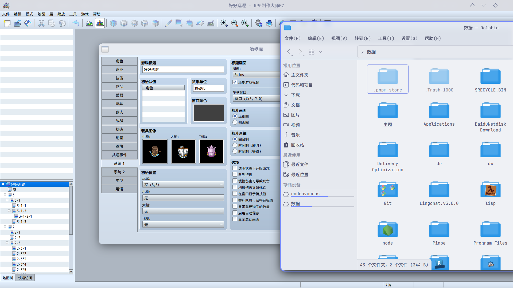
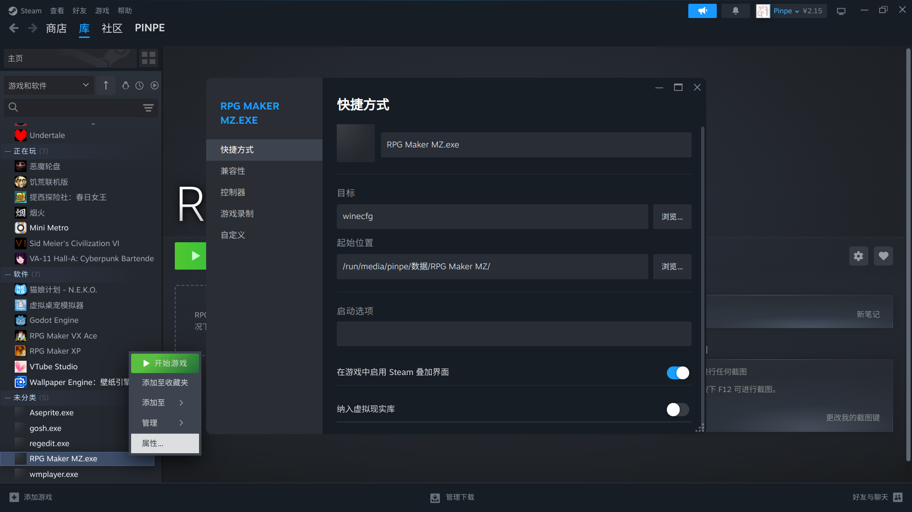
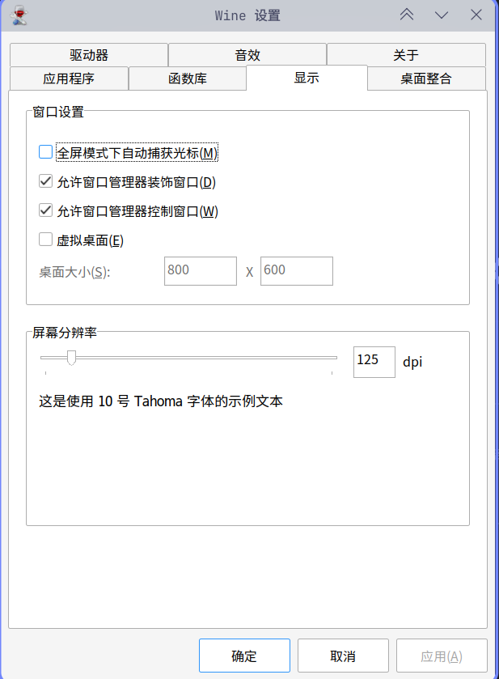
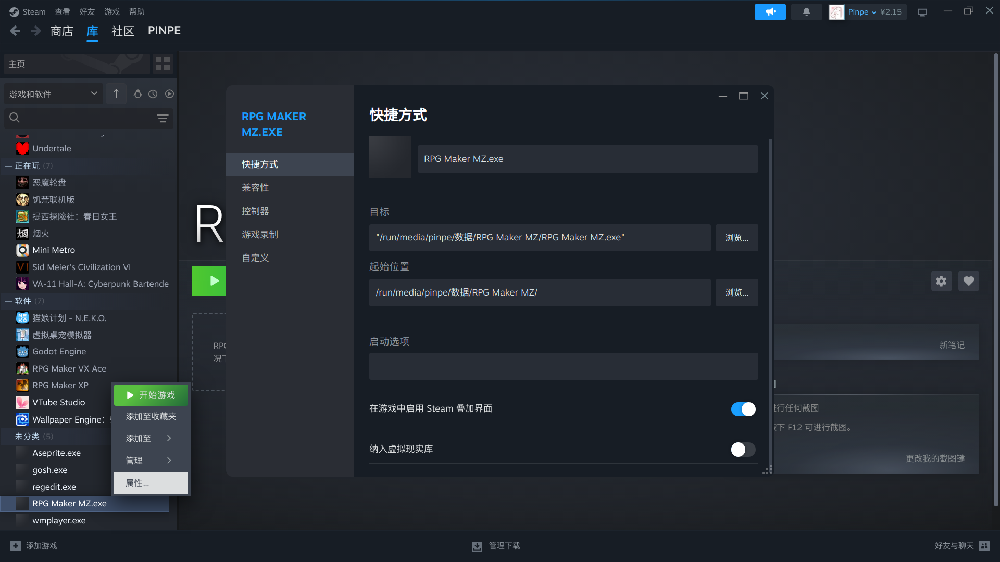
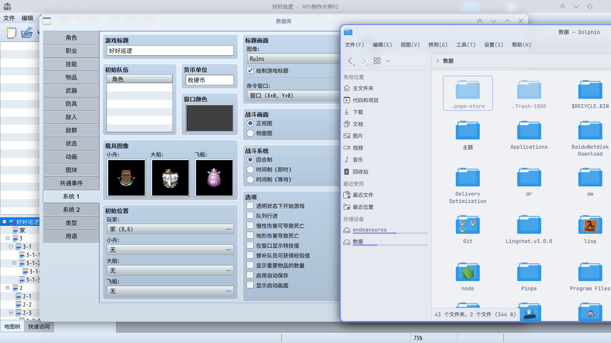

## 问题

RPG Maker是一个游戏引擎，我使用它做出了多款游戏，但是它不支持Linux系统，那么只能用兼容层运行了。

而基于Wine的Steam Proton算是比较好的兼容层，比Wine更加开箱即用，运行了一下后也没发现严重的功能问题，但是有一个小瑕疵：

如图，虽然看起来一切正常，但是文字和控件太小了，完全不跟随桌面设置的DPI，这在短时间内可以忍受，但是如果面对长时间的开发工作，还是很让人难受的。

## 解决

首先在Steam右键你需要改变DPI程序，打开“属性”，将“路径”改为 `winecfg` ，如图：

然后便打开了配置界面，打开“显示”选项卡，便可以设置成你想要的DPI了：

:::note
注意：此设置仅对单独的程序生效。
:::

最后，在Steam属性中的“路径”改回去，重启程序就能看到效果：

