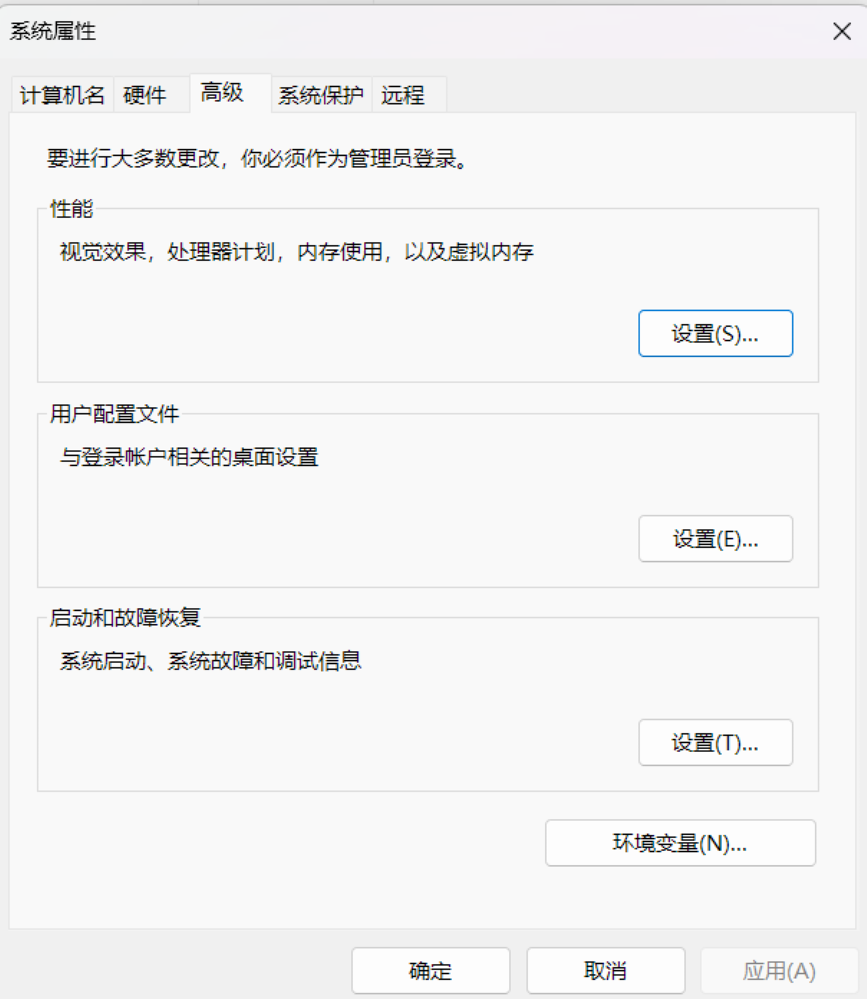
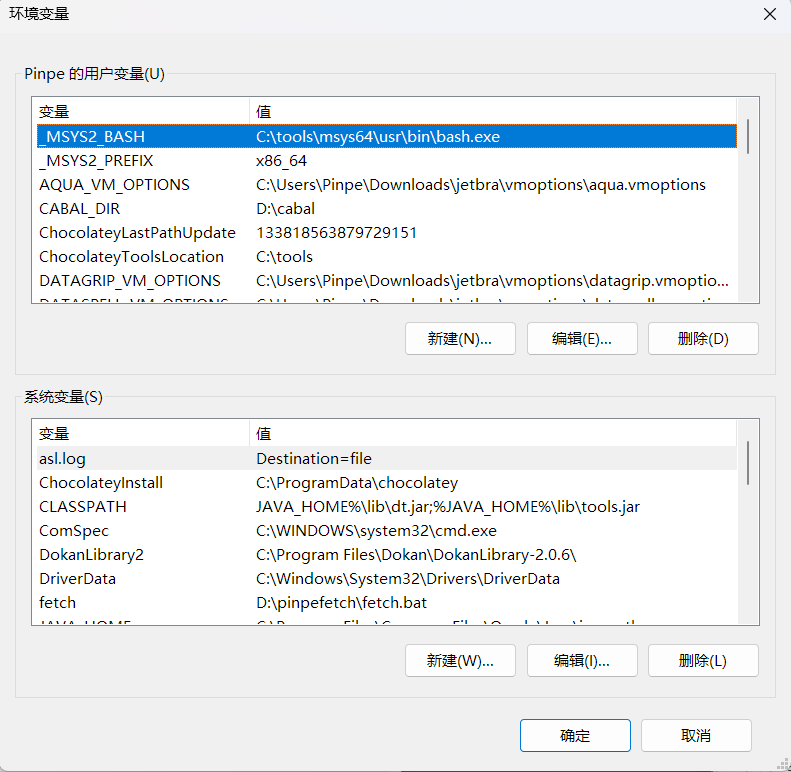
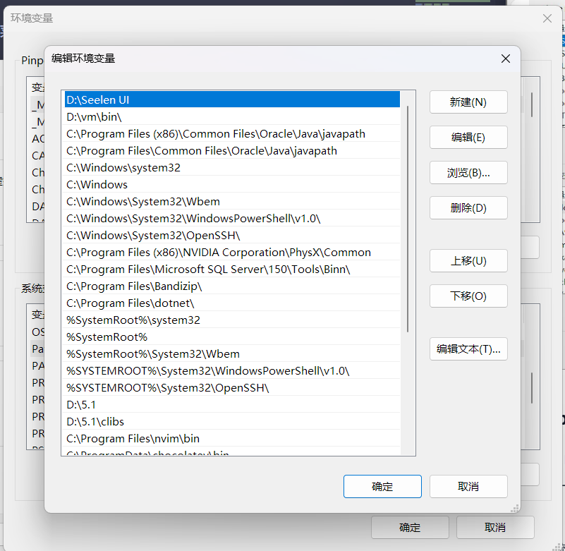

安装某个命令行软件和编程语言时，配置Path是Windows特有的流程，这里是详细的教程，以及易错点纠正。

## Stop1 找到软件的安装路径

配置Path需要具体的软件安装路径，这可能是一个文件或一个文件夹，具体路径可参照软件文档和你安装此软件的位置。

找到后，请复制路径到剪贴板备用。

:::tip
Windows10和Windows11可按`Win`+`V`键打开剪贴板，更低版本不支持。
:::

## Stop2 打开环境变量设置

打开开始菜单，搜索`环境变量`，选择`编辑系统环境变量`：

进入以下页面，点击`环境变量`，即可进入环境变量设置：

## Stop3 找到Path环境变量，并添加路径

:::important
这一步一定要做，不要添加到别的地方了，博主以前就经常犯这个错误，因此才有的这篇文章。
:::

在系统变量里面找到名为`Path`的数组型变量，点击编辑：

点击`新建`，粘贴第一步就复制的路径，一路确定，完成。