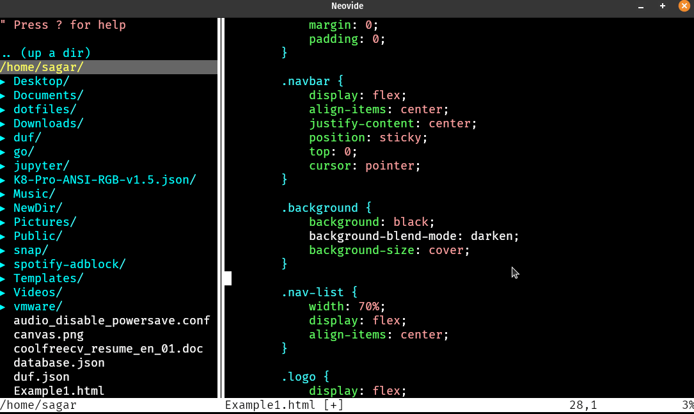

在一个配置良好的Vim系编辑器中，有一个吸引人的平滑光标效果，如下图所示：



但我用的是VScode，虽然自带平滑光标，但和这个比起来仍然有些逊色，有什么办法复刻一个呢？

:::warning
以下方法会导致帧数下降，需要强劲的电脑。<br>
而且尾迹效果可能与光标的文本重叠，z-index 似乎没有按预期工作。
:::

## Part1️⃣：✨安装扩展✨

打开扩展，下载并安装以下两个扩展：

::github{repo="be5invis/vscode-custom-css"}

::github{repo="BrandonKirbyson/VSCode-Animations"}

## Part2️⃣：✨复制和绑定样式✨

在用户文件夹之类的任何地方创建一个`.js`文件，然后将以下代码复制进去：

```javascript
// https://www.reddit.com/r/vscode/comments/11e66xh/i_made_neovide_alike_cursor_effect_on_vscode/

// 配置

// 将光标轨迹颜色设置为匹配用户的光标颜色
const Color = "#A052FF" // 如果设置为 "default"，则将使用主题的光标颜色。
// ! "default" 仅会引用 editorCursor.background
// "workbench.colorCustomizations": {
//     "editorCursor.background": "#A052FF",
// }

// 设置光标的样式为线型或块状
// 线型选项使用 fill() 绘制轨迹，块状选项使用 lineTo 绘制轨迹
const CursorStyle = "block" // 可选值为 'line' 或 'block'

// 设置光标轨迹的长度。值越大可能导致卡顿。
const TrailLength = 8 // 推荐值约为 8

// 设置处理光标创建/销毁事件的轮询速率（毫秒）。
const CursorUpdatePollingRate = 500 // 推荐值约为 500

// 是否使用阴影
const UseShadow = false
const ShadowColor = Color // 阴影颜色
const ShadowBlur = 15 // 阴影模糊程度


// imported from https://github.com/tholman/cursor-effects/blob/master/src/rainbowCursor.js
function createTrail(options) {
  const totalParticles = options?.length || 20
  let particlesColor = options?.color || "#A052FF"
  const style = options?.style || "block"
  const canvas = options?.canvas
  const context = canvas.getContext("2d")
  let cursor = { x: 0, y: 0 }
  let particles = []
  let width,height
  let sizeX = options?.size || 3
  let sizeY = options?.sizeY || sizeX*2.2
  let cursorsInitted = false

  // update canvas size
  function updateSize(x,y) {
    width = x
    height = y
    canvas.width = x
    canvas.height = y
  }

  // update cursor position
  function move(x,y) {
    x = x + sizeX/2
    cursor.x = x
    cursor.y = y
    if (cursorsInitted === false) {
      cursorsInitted = true
      for (let i = 0; i < totalParticles; i++) {
        addParticle(x, y)
      }
    }
  }

  // particle class
  class Particle {
    constructor(x, y) {
      this.position = { x: x, y: y }
    }
  }

  function addParticle(x, y, image) {
    particles.push(new Particle(x, y, image))
  }

  function calculatePosition() {
    let x = cursor.x,y = cursor.y

    for (const particleIndex in particles) {
      const nextParticlePos = (particles[+particleIndex + 1] || particles[0]).position
      const particlePos = particles[+particleIndex].position

      particlePos.x = x;
      particlePos.y = y;
      
      x += (nextParticlePos.x - particlePos.x) * 0.42
      y += (nextParticlePos.y - particlePos.y) * 0.35
    }
  }

  // for block cursor
  function drawLines() {
    context.beginPath()
    context.lineJoin = "round"
    context.strokeStyle = particlesColor
    const lineWidth = Math.min(sizeX,sizeY)
    context.lineWidth = lineWidth

    if (UseShadow) {
      context.shadowColor = ShadowColor;
      context.shadowBlur = ShadowBlur;
    }

    // draw 3 lines
    let ymut = (sizeY-lineWidth)/3
    for (let yoffset=0;yoffset<=3;yoffset++) {
      let offset = yoffset*ymut
      for (const particleIndex in particles) {
        const pos = particles[particleIndex].position
        if (particleIndex == 0) {
          context.moveTo(pos.x, pos.y + offset + lineWidth/2)
        } else {
          context.lineTo(pos.x, pos.y + offset + lineWidth/2)
        }
      }
    }
    context.stroke()
  }

  // for line cursor
  function drawPath() {
    context.beginPath()
    context.fillStyle = particlesColor
    if (UseShadow) {
      context.shadowColor = ShadowColor;
      context.shadowBlur = ShadowBlur;
    }

    // draw path
    for (let particleIndex=0;particleIndex<totalParticles;particleIndex++) {
      const pos = particles[+particleIndex].position
      if (particleIndex == 0) {
        context.moveTo(pos.x, pos.y)
      } else {
        context.lineTo(pos.x, pos.y)
      }
    }
    for (let particleIndex=totalParticles-1;particleIndex>=0;particleIndex--) {
      const pos = particles[+particleIndex].position
      context.lineTo(pos.x, pos.y+sizeY)
    }
    context.closePath()
    context.fill()

    context.beginPath()
    context.lineJoin = "round"
    context.strokeStyle = particlesColor
    context.lineWidth = Math.min(sizeX,sizeY)
    // for up&down
    let offset = -sizeX/2 + sizeY/2
    for (const particleIndex in particles) {
      const pos = particles[particleIndex].position
      if (particleIndex == 0) {
        context.moveTo(pos.x, pos.y + offset)
      } else {
        context.lineTo(pos.x, pos.y + offset)
      }
    }
    context.stroke()
  }

  function updateParticles() {
    if (!cursorsInitted) return

    context.clearRect(0, 0, width, height)
    calculatePosition()

    if (style=="line") drawPath()
    else if (style=="block") drawLines()
  }

  function updateCursorSize(newSize,newSizeY) {
    sizeX = newSize
    if (newSizeY) sizeY = newSizeY
  }

  return {
    updateParticles: updateParticles,
    move: move,
    updateSize: updateSize,
    updateCursorSize: updateCursorSize
  }
}

// cursor create/remove/move event handler
// by qwreey
// (very dirty but may working)
async function createCursorHandler(handlerFunctions) {
  // Get Editor with dirty way (... due to vscode plugin api's limit)
  /** @type { Element } */
  let editor
  while (!editor) {
    await new Promise(resolve=>setTimeout(resolve, 100))
    editor = document.querySelector(".part.editor")
  }
  handlerFunctions?.onStarted(editor)

  // cursor cache
  let updateHandlers = []
  let cursorId = 0
  let lastObjects = {}
  let lastCursor = 0

  // cursor update handler
  function createCursorUpdateHandler(target,cursorId,cursorHolder,minimap) {
    let lastX,lastY // save last position
    let update = (editorX,editorY)=>{
      // If cursor was destroyed, remove update handler
      if (!lastObjects[cursorId]) {
        updateHandlers.splice(updateHandlers.indexOf(update),1)
        return
      }

      // get cursor position
      let {left:newX,top:newY} = target.getBoundingClientRect()
      let revX = newX-editorX,revY = newY-editorY

      // if have no changes, ignore
      if (revX == lastX && revY == lastY && lastCursor == cursorId) return
      lastX = revX;lastY = revY // update last position

      // wrong position
      if (revX<=0 || revY<=0) return

      // if it is invisible, ignore
      if (target.style.visibility == "hidden") return

      // if moved over minimap, ignore
      if (minimap && minimap.offsetWidth != 0 && minimap.getBoundingClientRect().left <= newX) return

      // if cursor is not displayed on screen, ignore
      if (cursorHolder.getBoundingClientRect().left > newX) return

      // update corsor position
      lastCursor = cursorId
      handlerFunctions?.onCursorPositionUpdated(revX,revY)
      handlerFunctions?.onCursorSizeUpdated(target.clientWidth,target.clientHeight)
    }
    updateHandlers.push(update)
  }

  // handle cursor create/destroy event (using polling, due to event handlers are LAGGY)
  let lastVisibility = "hidden"
  setInterval(async ()=>{
    let now = [],count = 0
    // created
    for (const target of editor.getElementsByClassName("cursor")) {
      if (target.style.visibility != "hidden") count++
      if (target.hasAttribute("cursorId")) {
        now.push(+target.getAttribute("cursorId"))
        continue
      }
      let thisCursorId = cursorId++
      now.push(thisCursorId)
      lastObjects[thisCursorId] = target
      target.setAttribute("cursorId",thisCursorId)
      let cursorHolder = target.parentElement.parentElement.parentElement
      let minimap = cursorHolder.parentElement.querySelector(".minimap")
      createCursorUpdateHandler(target,thisCursorId,cursorHolder,minimap)
      // console.log("DEBUG-CursorCreated",thisCursorId)
    }
    
    // update visible
    let visibility = count<=1 ? "visible" : "hidden"
    if (visibility != lastVisibility) {
      handlerFunctions?.onCursorVisibilityChanged(visibility)
      lastVisibility = visibility
    }

    // destroyed
    for (const id in lastObjects) {
      if (now.includes(+id)) continue
      delete lastObjects[+id]
      // console.log("DEBUG-CursorRemoved",+id)
    }
  },handlerFunctions?.cursorUpdatePollingRate || 500)

  // read cursor position polling
  function updateLoop() {
    let {left:editorX,top:editorY} = editor.getBoundingClientRect()
    for (handler of updateHandlers) handler(editorX,editorY)
    handlerFunctions?.onLoop()
    requestAnimationFrame(updateLoop)
  }

  // handle editor view size changed event
  function updateEditorSize() {
    handlerFunctions?.onEditorSizeUpdated(editor.clientWidth,editor.clientHeight)
  }
  new ResizeObserver(updateEditorSize).observe(editor)
  updateEditorSize()

  // startup
  updateLoop()
  handlerFunctions?.onReady()
}

// Main handler code
let cursorCanvas,rainbowCursorHandle
createCursorHandler({

  // cursor create/destroy event handler polling rate
  cursorUpdatePollingRate: CursorUpdatePollingRate,

  // When editor instance stared
  onStarted: (editor)=>{
    // create new canvas for make animation
    cursorCanvas = document.createElement("canvas")
    cursorCanvas.style.pointerEvents = "none"
    cursorCanvas.style.position = "absolute"
    cursorCanvas.style.top = "0px"
    cursorCanvas.style.left = "0px"
    cursorCanvas.style.zIndex = "1000"
    editor.appendChild(cursorCanvas)

    // create rainbow cursor effect
    // thanks to https://github.com/tholman/cursor-effects/blob/master/src/rainbowCursor.js
    // we can create trail effect!
    let color = Color
    if (color == "default") {
      color = getComputedStyle(
        document.querySelector("body>.monaco-workbench"))
        .getPropertyValue("--vscode-editorCursor-background")
        .trim()
    }

    rainbowCursorHandle = createTrail({
      length: TrailLength,
      color: color,
      size: 7,
      style: CursorStyle,
      canvas: cursorCanvas
    })
  },

  onReady:()=>{},

  // when cursor moved
  onCursorPositionUpdated: (x,y)=>{
    rainbowCursorHandle.move(x,y)
  },

  // when editor view size changed
  onEditorSizeUpdated: (x,y)=>{
    rainbowCursorHandle.updateSize(x,y)
  },

  // when cursor size changed (emoji, ...)
  onCursorSizeUpdated: (x,y)=>{
    rainbowCursorHandle.updateCursorSize(x,y)
    // rainbowCursorHandle.updateCursorSize(parseInt(y/lineHeight))
  },

  // when using multi cursor... just hide all
  onCursorVisibilityChanged: (visibility)=>{
    cursorCanvas.style.visibility = visibility
  },

  // update animation
  onLoop: ()=>{
    rainbowCursorHandle.updateParticles()
  },

})
```

然后将以下配置添加到VScode的`settings.json`配置文件中，注意**灵活变通**：

```json
"vscode_custom_css.imports": [
	"file:///C:/设置/你的/文件/路径.js"
],
```

## Part3️⃣：✨激活和调试扩展✨

接下来激活扩展，打开最上面的命令栏，输入：

```
>Enable Custom CSS and JS
```

看看是否是你喜欢的效果，如果不是，可以调试上文代码。

## 🎉 完成，尽情享用吧！✨