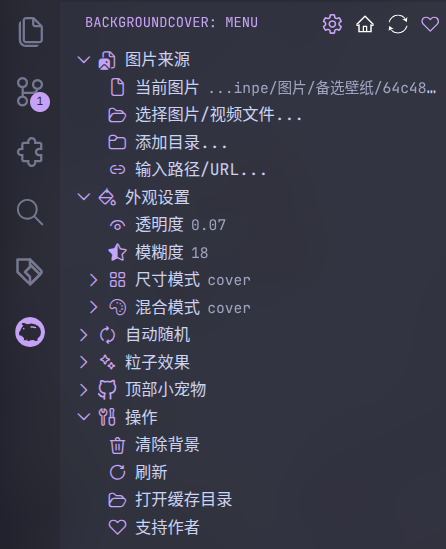

我前年写了篇文章，讲了如何通过“Vibrancy Continued”插件来让VScode有毛玻璃效果：

    
将你的 VScode 背景变成毛玻璃

    
https://blog.pinpe.top/3009

但是这篇文章写得太早了，插件有几个大问题，导致并不是最佳实践，目前已不推荐使用：

- 窗口无法调整大小和设定最大化。
- 透明度、饱和度和模糊度无法设置，因为饱和度过高而看的很怪。

此文章会给出更好的方法。

---

## 通过backgroundCover插件实现“伪模糊”

下载安装“backgroundCover”插件：

    
background-cover

    
让你喜欢的图片或视频铺满 VS Code，支持粒子动画、热更新、视频背景、自动轮播等丰富特性

然后侧边栏便出现了新的条目，你可以在这里选择图片、调整透明度和模糊度：

:::note
每个图片适合不同的透明度和模糊度，自己慢慢调整才会更好看。
:::

你注意到了，这并不能算真正的毛玻璃效果，只能算叠加一层带模糊效果的图片，但这是性能开销最小的、不用系统级插件的最逼真的效果了。

---

## 使用系统级插件

这个可以做到真毛玻璃，但是性能开销比较大，而且实现起来比较复杂，每个系统也不一样，参见Linux KDE桌面的方法：

    
让 KDE 的任意窗口都有半透明模糊效果

    
通过窗口规则和 Better Blur DX，来使任意窗口都有半透明模糊效果。

