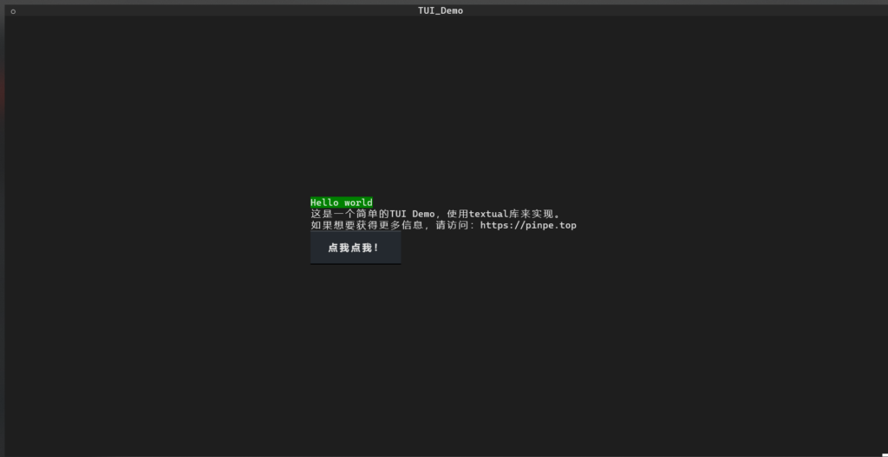

Textual是一个不错的Python库，可以构建出在运行在命令行的图形界面，与rich是姐妹关系。（就是非常烧脑）

### 安装

在终端输入以下命令：

pip install textual

下载的时间有点长，请耐心等待。

### 写一个Demo吧！

#### 文件结构

需要创建一个文件夹和两个文件，以下是文件结构：

TUI Demo

* ->main.py

* ->css.css

注：这个css非彼css。

#### 编写main.py

首先，必须要导入库。

from textual.app import App
from textual.widgets import Label, Header,Button

在后面创建一个APP，你可以理解为浏览器的标签页。

APP的名字叫TUI_Demo吧。

from textual.app import App
from textual.widgets import Label, Header,Button

class TUI_Demo(App):
    def compose(self):
        ...

if __name__ == "__main__":
    app = TUI_Demo()
    app.run()

最后，写一点文字：

from textual.app import App
from textual.widgets import Label, Header,Button

class TUI_Demo(App):
    def compose(self):
        yield Label("Hello world",id="hello")
        yield Label("这是一个简单的TUI Demo，使用textual库来实现。")
        yield Label("如果想要获得更多信息，请访问：http://blog.pinpe.top")

if __name__ == "__main__":
    app = TUI_Demo()
    app.run()

其中，yield是创建一个控件，yield Label就是创建一个文字控件。

现在可以运行了，但是效果非常单调啊，甚至没有可以互动的地方。

说起互动，添加一个按钮吧，yield Button就可以创建一个按钮控件：

from textual.app import App
from textual.widgets import Label, Header,Button

class TUI_Demo(App):

    def compose(self):

        yield Label("Hello world",id="hello")
        yield Label("这是一个简单的TUI Demo，使用textual库来实现。")
        yield Label("如果想要获得更多信息，请访问：http://blog.pinpe.top")
        yield Button("点我点我！")

if __name__ == "__main__":
    app = TUI_Demo()
    app.run()

使用yield Header()还可以创建一个标题控件，就像桌面上的每个窗口都有一个标题。

from textual.app import App
from textual.widgets import Label, Header,Button

class TUI_Demo(App):

    def compose(self):
        yield Header()
        yield Label("Hello world",id="hello")
        yield Label("这是一个简单的TUI Demo，使用textual库来实现。")
        yield Label("如果想要获得更多信息，请访问：http://blog.pinpe.top")
        yield Button("点我点我！")

if __name__ == "__main__":
    app = TUI_Demo()
    app.run()

好，界面控件已经差不多了，但是看起来还是单调啊？别急，我们还没有设置css。

#### 编写css.css

css可以起到美化网页的作用，但是在Textual也可以这样做。

Screen{
    align: center middle;
}
#hello{
    background: green;
}

css编写好了后，main.py还要链接css才能生效：

from textual.app import App
from textual.widgets import Label, Header,Button

class TUI_Demo(App):
    CSS_PATH = "css.css"
    def compose(self):
        yield Header()
        yield Label("Hello world",id="hello")
        yield Label("这是一个简单的TUI Demo，使用textual库来实现。")
        yield Label("如果想要获得更多信息，请访问：http://blog.pinpe.top")
        yield Button("点我点我！")

if __name__ == "__main__":
    app = TUI_Demo()
    app.run()

### 大功告成

这个Demo就做好了！是不是很“简单”？

效果如下：

