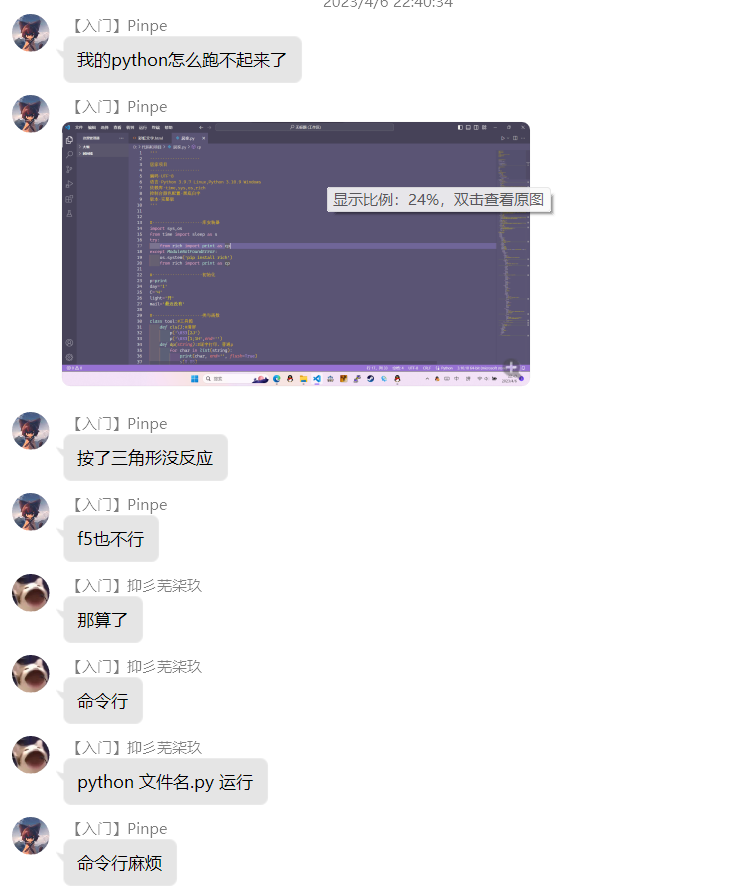

今天想测试一下Python环境，结果按三角形居然没有反应。Python肯定是没有问题的，问题应该出在Python插件。

    我去网上搜了，都说安装一个旧版本的Python插件，但是没有任何效果。

    于是只能求助其他人，总算有个靠谱的方法。

    解决方法就是，直接使用控制台运行，输入

python &#91;文件路径]

就可以了，输入一次后按↑键就可以还原上一次输入的命令。另外这个方法不需要使用Python插件，可以卸载掉。

**2023年4月24日修订：**

有一个错误，Python插件最好不要卸载，否则会没有代码补全功能。