今天去**茅山度假区**玩了！

可以带手机，所以就有很多照片。

准备出发

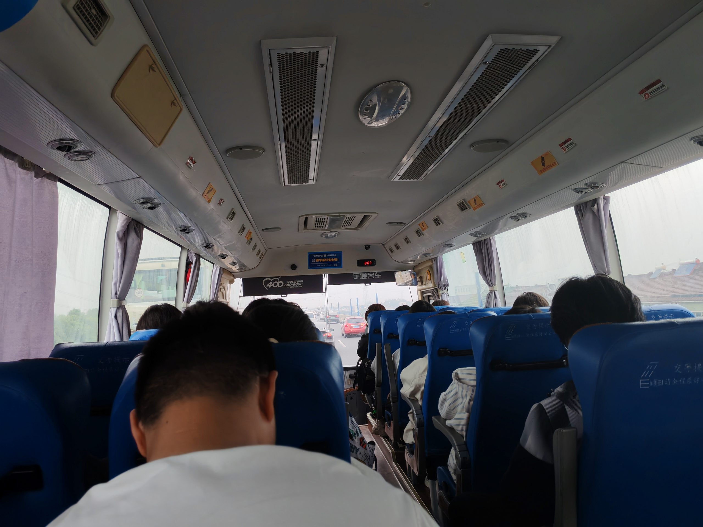要做3小时的车才能到

大门

### 山林景观

今天天气不好，下雨，所以山上雾蒙蒙的。而且要和朋友走很多山路才可以到大草坪。

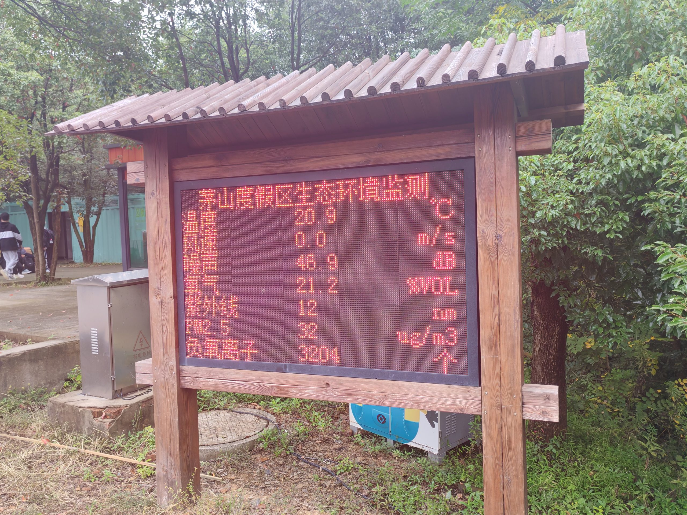

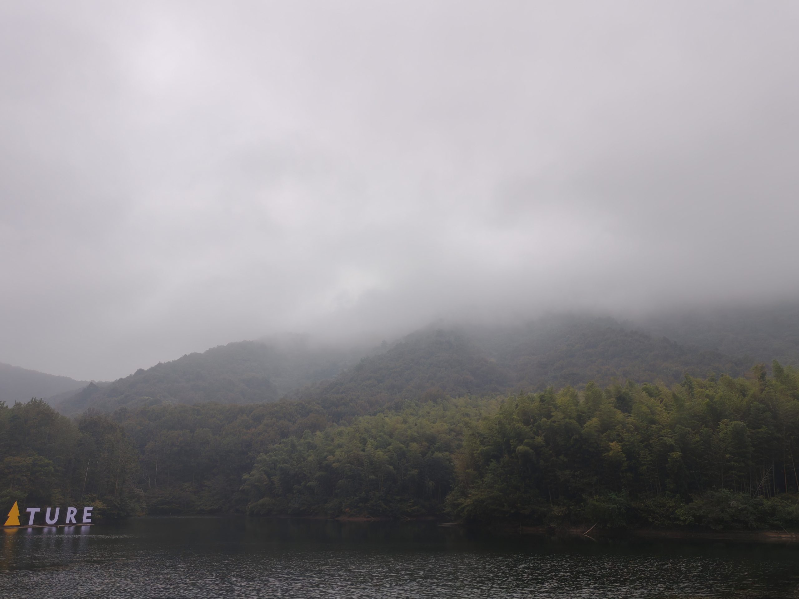山顶上会不会有神仙？

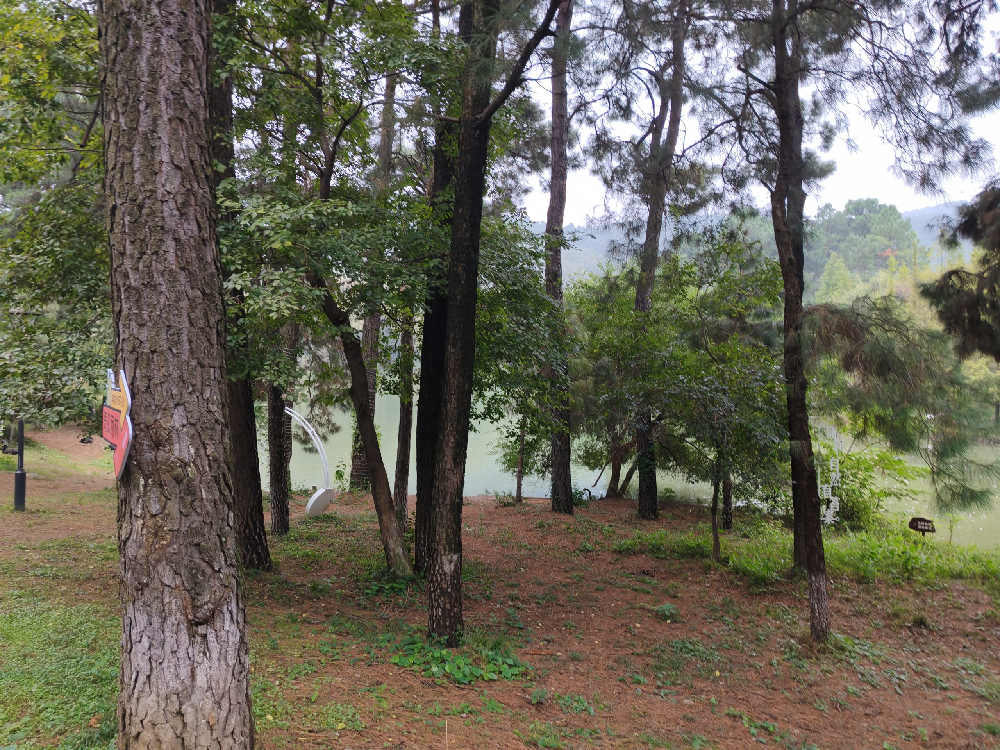

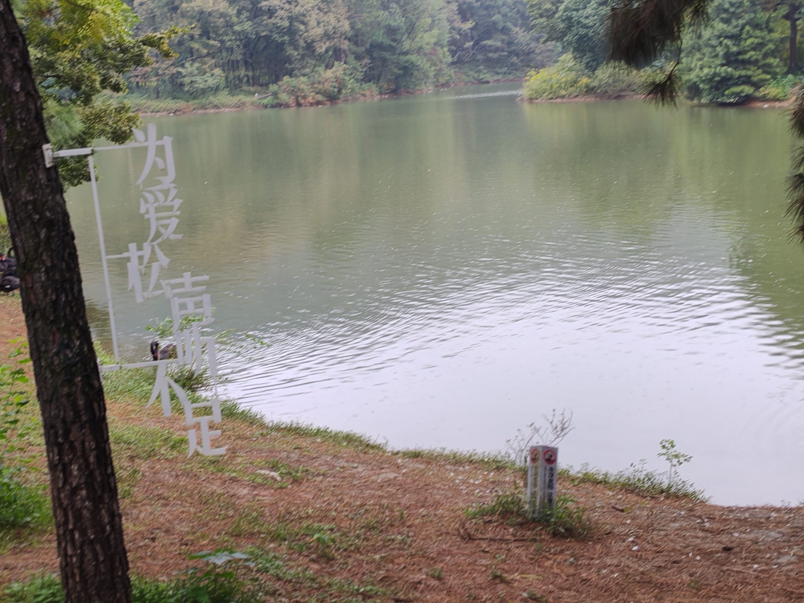

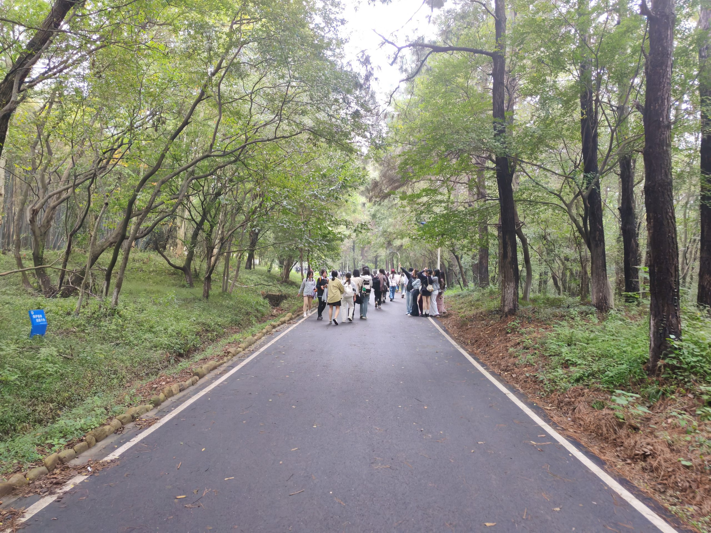

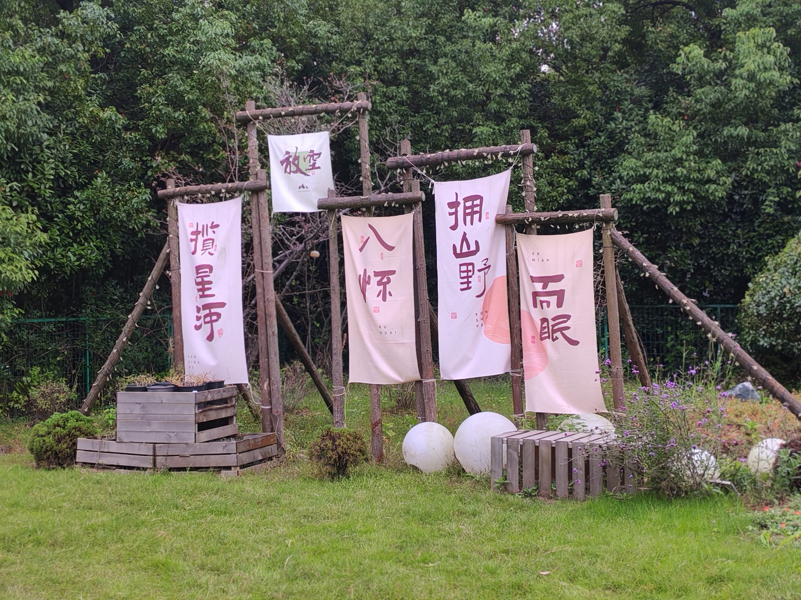路边上的一个非常好装置

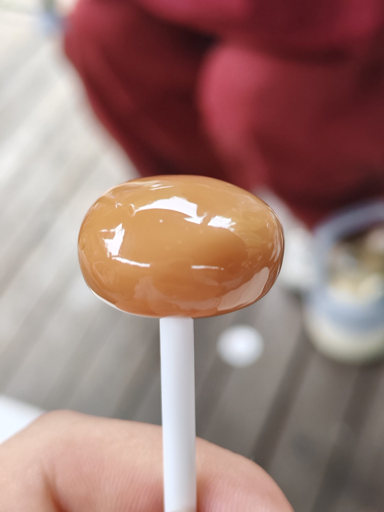朋友的糖最甜蜜！

### 午饭

到了大草坪时，我和朋友都很饿了，于是便吃了顿午饭：

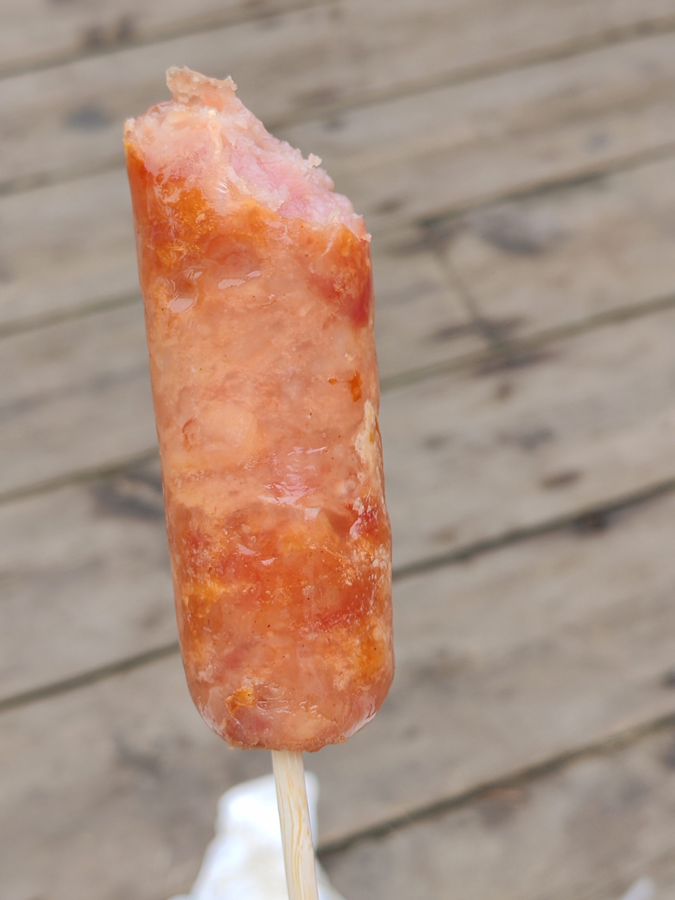5块钱，就普通的烤肠

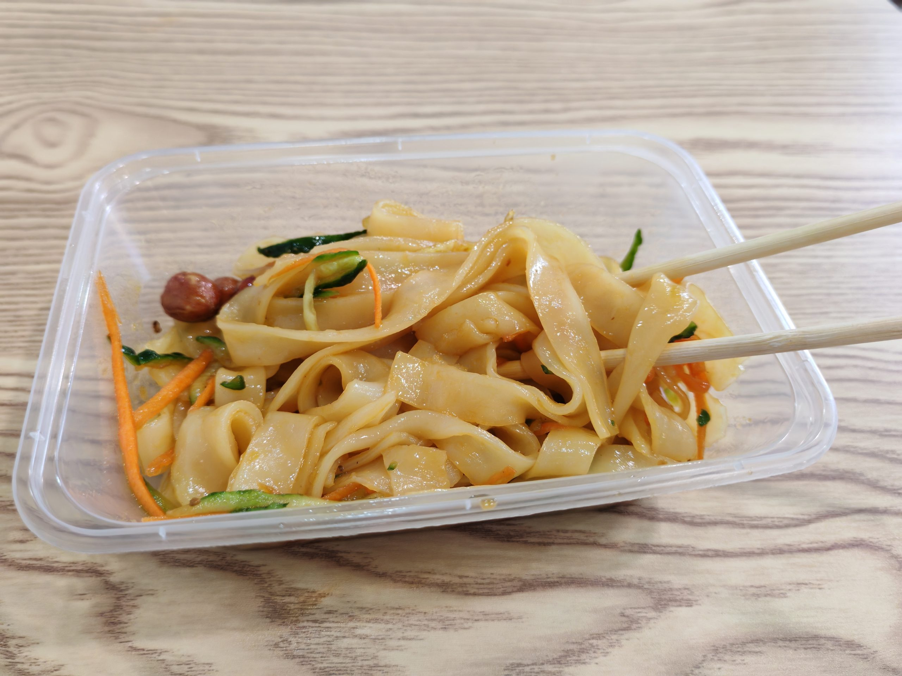20块钱，就普通的凉皮，但醋没有特别多，我很喜欢

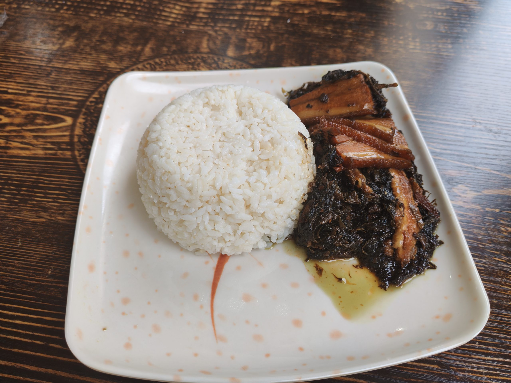38块钱，但味道、性价比、卫生、新鲜、配菜全部都不是很好

除此之外，还有给朋友买的鸡排20块钱，饮料10块钱。

总计花了93块钱，爆哭！

