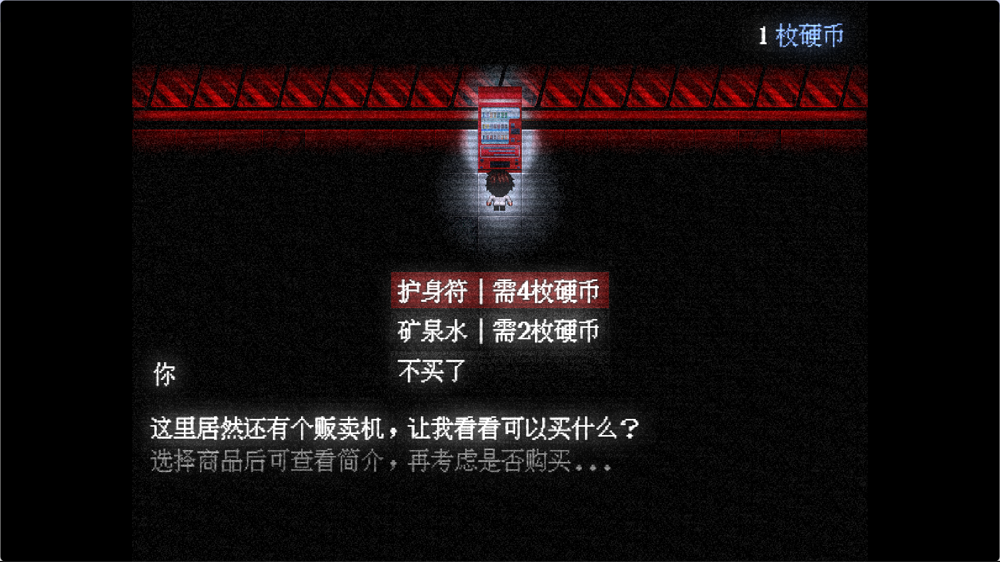

### 开头题外话

虽然此游戏的宣发效果没有特别理想（只有3000左右的播放量），但也收到很多玩家的真心话：

谢谢你们的支持！接下来进入正题。

### 光效：RPG游戏也能有“RTX”？

在RPG Maker MZ中，我们可以设置画面的整体色调来达到夜晚的效果：

虽然这种方法简单粗暴，但看起来会简陋些，而且能见度太高了，可能不适合恐怖的场景。

因此我们需要**Community_Lighting_MZ**插件，来重写引擎的光照效果：

[Community_Lighting_MZ](https://blog.pinpe.top/wp-content/uploads/2025/02/Community_Lighting_MZ.js)[下载](https://blog.pinpe.top/wp-content/uploads/2025/02/Community_Lighting_MZ.js)

载入插件后，并没有发生任何变化，因为此插件要求必须给至少一个事件设置光源，哪怕不需要光源，也要设置一个亮度为0的，就像这样：

&lt;CL: Light 0 #ffffff>

其中，CL: Light是一个固定搭配，要求给这个事件设置光源，0是光源的亮度，#ffffff是光源的颜色。

重新进入游戏，果然奏效了：

如果你要加红色的微弱光源，可以把亮度改大一点，颜色为#ff0000即可：

在《好好巡逻》的设计中，大量使用了白、黑、红三种颜色，我觉得可以带来诡异的效果：

### 滤镜：提升画面质感的不二之选

但是仅仅有光效是不够的，滤镜也很重要，CRT噪点、光晕效果就需要滤镜实现，对应的插件是**FilterControllerMZ**：

[FilterControllerMZ](https://blog.pinpe.top/wp-content/uploads/2025/02/FilterControllerMZ.js)[下载](https://blog.pinpe.top/wp-content/uploads/2025/02/FilterControllerMZ.js)

创建一个自动执行一次的事件，执行createFilter插件指令，会有以下设置：

* filterId：滤镜的id，多滤镜时不可重复。

* filterType：滤镜的类型，你想要什么滤镜效果？

* filterTarget：滤镜的应用范围，哪些地方要用滤镜，哪些地方不用。

* 其它的参数不用管。

例如我要得到充满全屏幕的CRT效果，可以这么设置：

效果如下：

### 结尾的题外话

这样就可以很好的提升画面效果，至少用的好的话至少不会一眼黄油，但游戏不只有画面，以玩家为中心做的游戏，才是真正好玩的游戏。

也祝你的游戏早日大卖👏！