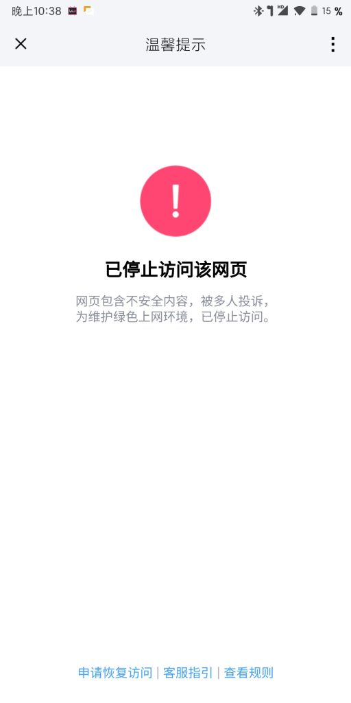

不知道什么时候开始，直接在 QQ 打开我的网站时，会看到这个页面，严重影响了访客的体验：

我郑重声明，我的网站不是所谓的“恶意网站”，我发布的每个内容都合法合规，并且拥护党和国家，评论区也得到了严格管制，所以出现这种情况是某些人恶意举报的结果。

不过目前还不能申诉，由于博主还未满 18 岁，因此无法给网站备案，而申诉需要备案。

解决方式也很简单，只需要复制网址到任何一个浏览器就行了（**不是点击链接后在浏览器打开**）。

其它平台不受此影响。