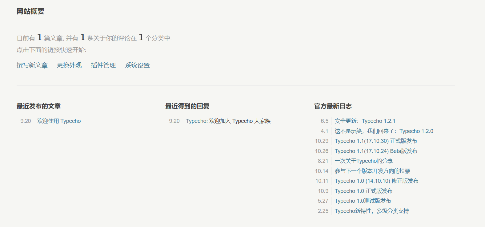

因为WordPress有诸多不足，特别是**庞大缓慢**、**中文社区贫乏**、**历史遗留问题**等原因，我很早就想要换到别的博客内核，最近终于有时间操作了。

### 虚拟主机：只能换到Typecho

我选择了Typecho，不止因为**轻量级**、**社区丰富**等好处，更是因为我的虚拟主机只支持PHP程序，没得选了。

还好，Typecho安装和上手都简单，还有WordPress迁移的插件，因此适应的成本也很低。

### 踩坑之一：不要使用迁移插件

迁移插件好像不会对WordPress造成任何影响，本身也没什么Bug，但有一些设计上的问题：

#### 文章不会自动添加--more--

在Typecho，--more--是分割摘要和正文的分隔符，大部分主题都通用，如果此文章是在Typecho下写的，我会这么用：

最近在尝试迁移到Typecho，但为什么失败了？

--more--

因为WordPress有诸多不足，特别是**庞大缓慢**、**中文社区贫乏**、**历史遗留问题**等原因，我很早就想要换到别的博客内核，最近终于有时间操作了。

......

但是迁移插件不会给文章自动添加--more--，因此大部分主题都会在首页输出每个文章的全文，而且由于文章数量比较大，手动添加又是一个费力的工程。

#### 媒体不会被迁移

迁移插件不会迁移媒体库里的内容，文章和页面里仍然使用WordPress的链接。

如果迁移完就把WordPress下掉，后果不敢想象。

### 踩坑之二：主题配置机制和主题生态

这不是特别严重的问题，但就是让人觉得不舒服，把一个主题停用后此主题的配置数据会被清的渣都不剩，只能重新配置。

而且，不知道是我要求太高了还是本身就如此，虽然主题很多，但找了一圈只找到了几个比较不错的：[Matcha](https://github.com/BigCoke233/matcha?tab=readme-ov-file)、[G主题](https://github.com/youranreus/G)、[Daydream](https://github.com/skywt2003/Daydream)。而且感觉喵喵的主题也很棒，可惜我没钱，用的也不是服务器。QwQ

### 回到WordPress的原因：刷新后才能显示页面内容

上面这些问题不是特别诛心，而接下来的Bug直接让我回到WordPress。

首先，**刚开始进入自定义页面是不会显示任何内容的，你必须要刷新一下才行**，90%的概率复现，网络上没有什么有效的解决方案。

本来以为是主题的问题，但所有使用Pajx的主题都有类似的Bug，因此我认为就是Typecho对Pajx的支持做的不够好。

虽然WordPress虽然有一些问题，但我自己没发现任何一个Bug，而且也很稳定。我想想还是算了吧，继续用WordPress。