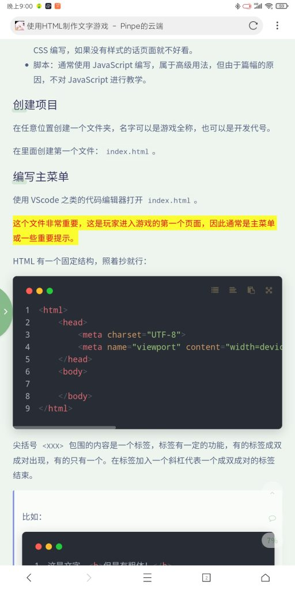
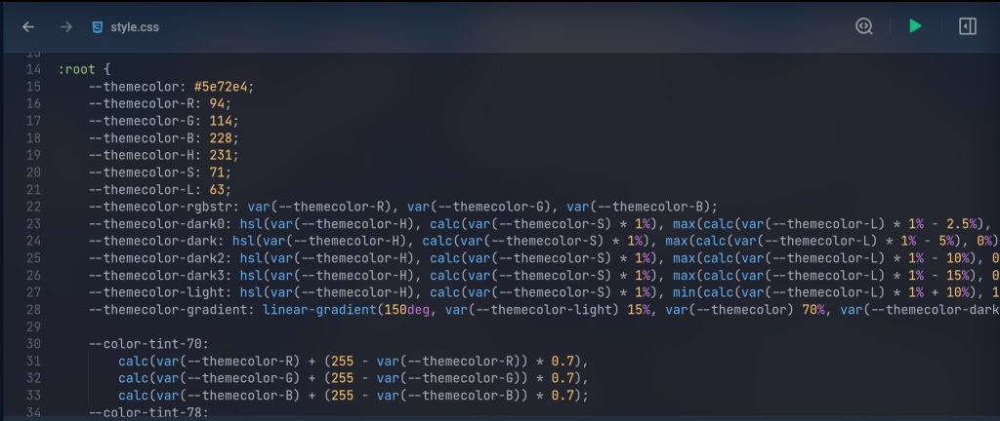

### 荧光笔

在任何一个页面，选择文字都会有黄底红字高亮，你可能会觉得这很丑，但这种颜色可以让人快速注意到选择的地方，适合作为文字高亮发给别人。

这个设计有一个名称——荧光笔。

### 网站结构

整个网站由主页 pinpe.top 和博客系统 blog.pinpe.top 构成，两者在技术层面来讲，是完全独立的。

主页是纯静态的，修改和更新必须要人工完成，自己模仿主题样式。

博客系统是 Wordpress 搭建的，使用 Argon 主题，可以直接在后台管理数据。

由于主页需要人工更新，所以无法及时更新新发布的内容，但可以打开“所有内容”第一时间查看最新内容。

### 背景图片和主题颜色的关系

主题颜色取自背景图片，通常是在图片占比最大的颜色。

在主题颜色的基础上，还会通过计算衍生出其它 6 种颜色，计算公式是主题自带的，非常复杂：

所以我没有在主页把计算公式 CV 下来，直接写色号。

### Argon You 与原生 Argon 主题的关系

Argon You 主题基于 Argon 主题，但目前已经是一个独立的主题。

我一直热衷于魔改现成的主题，不承认主题是独立的，但随着魔改程度越来越高，于 3 月 12 日决定独立并改名。

原生主题是开源的，但魔改主题由于更新过于频繁、定制性极高、产出代码烂等原因，**目前没有准备开源**，但不代表未来也不会开源。

### 评论验证码的 Bug

有时评论系统的计算题会在用户输入正确的情况下仍然报错，我仍然不知道问题出在哪。

**如果遇到这种情况，请复制要发送评论内容，并刷新页面。**

### 全角和半角之间的空格

整个网站大部分地方在全角字体和半角字体之间有一个空格，这个空格称之为“盘古之白”，使用主题自带 Pangu.js 实现的。

漢學家稱這個空白字元為「盤古之白」，因為它劈開了全形字和半形字之間的混沌。另有研究顯示，打字的時候不喜歡在中文和英文之間加空格的人，感情路都走得很辛苦，有七成的比例會在 34 歲的時候跟自己不愛的人結婚，而其餘三成的人最後只能把遺產留給自己的貓。畢竟愛情跟書寫都需要適時地留白。

——节选自 Pangu.js 的 README 

可惜，这个空格并没有完全覆盖，还有不少地方没有空格，强迫症要开始暴毙了。

### 萌国ICP备案

萌国不是真实存在的国家，这个“备案”不具备任何法律效益，只是一个非营利组织的娱乐性活动。

### 鼠标点击特效

在任何一个页面，点击鼠标都会出现五彩缤纷的小球，但这些小球的力度会随着下按时长的增大而增大。