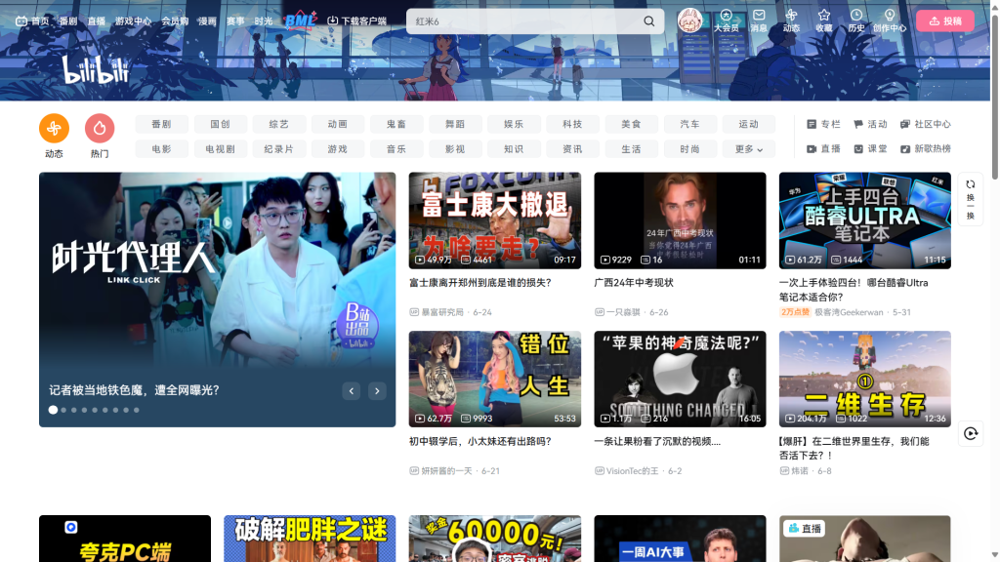
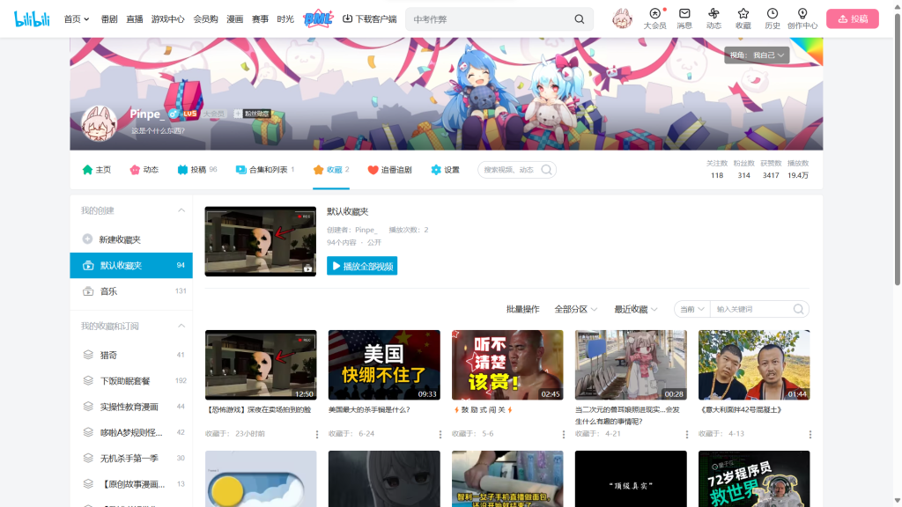
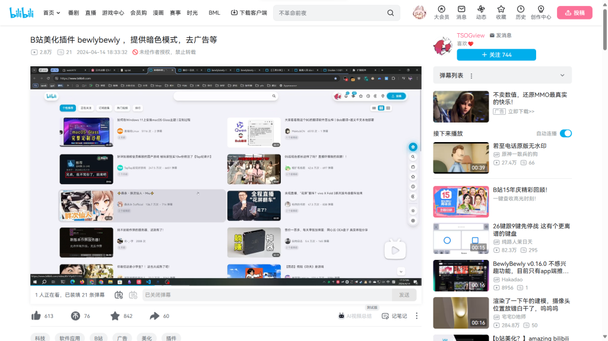
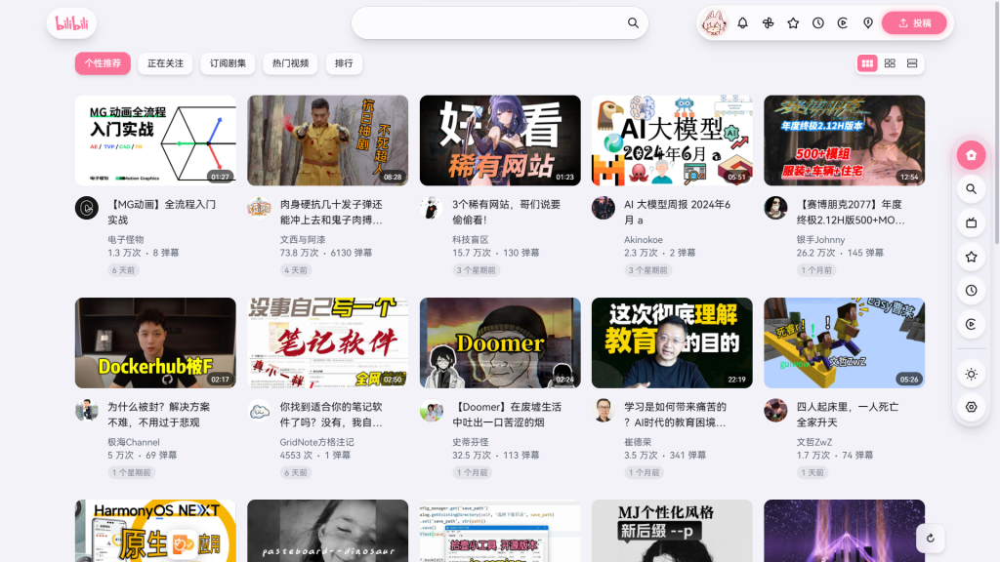
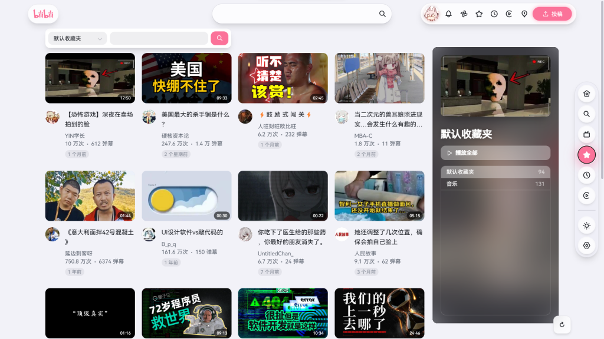
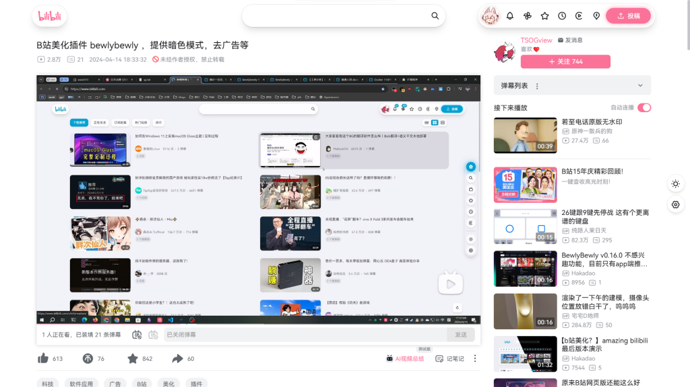

先看原版B站界面，做个对照：

虽然也能看，但是广告和花里胡哨的东西有点多，并且设计也不美观不统一。

再看看开了BewlyBewly插件后的B站：

简洁干净无广告，而且重制部分的设计也美观统一，自定义程度也高。

所以这个插件的作用不必多讲了，你可以在各大浏览器市场获取。

但真正的看点并不在这，在设置->关于->我只想换一份好一点的工作...页面，有这样一封信，直接把插件拉高了几个层次：

首先十分抱歉在这里打扰您，我是一名前端开发者，坐标广州，我想换一份好一点的工作 BewlyBewly 其实是我在找工作的时候做的一个项目，那时试过有快半年是完全没有工作的状态，面试时一直刁难要么就是被礼貌拒绝

我知道以我的能力是完全可以从0开始做一个以我认为巨大的工程出来，但是面试的时候多数注重的地方往往只是在你对技术有如何的深入

技术确实非常重要，但是我认为一个人的能力不仅仅是技术从 BewlyBewly 中，我从界面、配色、用户体验、一个产品用户真正想要的功能最后到实现我都是自己一个人完成的，包括弹窗按钮那些组件

在没有 pr 之前我就已经完成了很大一部分的功能以及界面，自己摸索和解决的不少问题与实现优化的功能，我也知道如何在b站插件几乎是饱和的情况下如何做出别具一格的作品。但是也要感谢后面的 PR 以及 issue 的反馈，让我能够更好的完善这个项目！！！

之后我确实也靠 BewlyBewly 进到了小公司工作一直到现在，现在的公司说是招前端进去主要还是看后端，我后端也是会一点但是没有前端

目前公司内容也很杂，之前也为了某些变态的任务加上公司原本前端十分感人的代码在开发新功能的同时不得不自己也重构代码，但是公司给我的感觉就是因为我能力太差导致那个进度特慢，包括同事也是，同事一点前端都不会我重构了多少屎山代码说了也不明白，某些前端问题我自己也难以预测和修复最后还是做到慢就是做得慢。

那次我还因此加班来确保任务尽快完成，做完之后后续还有分给我的任务时也时不是提一嘴阴阳我做得慢我能力不行

这件事情也只是其中的一件，但是公司不注重前端甚至完全忽视前端对垃圾代码的感受我确实有点接受不了，其他前端同事给我一种感觉是能跑就好我简直无语

我知道这么说我可能太自大，我其实主要想简单说明一下目前情况，我承认我技术上确实没太厉害，公司里前端很大还是靠自己摸索的，有些处理我也不知道符合不符合规范

但是我能力是可以的，我是可以完全从0到1写出 BewlyBewly 出来，甚至之前和身边人说他们也觉得我有病，笑我写的代码（当然后面重构后我也觉得自己之前写的有病） 我目前只是想找一间公司是重视和比较规范前端的，因为我不想自己收拾别人的烂摊子身边人也不知道只是觉得我进度慢就是慢，再为了这种事情加班

坐标广州，我不是希望进去一定要做出什么成就出来，在做开源过程中也对项目负责人和开发者不同的想法观念略有感受。我只想进去了解一下正确的前端规范和能与其他志同道合的人一起工作。如果有合适的前端工作机会请联系我，谢谢！

我思考了良久，最后这样回了他：

**你好！**

首先很抱歉，我并不能给你提供工作，只是与你有些共鸣罢了。

我是在你开发的插件——BewlyBewly认识你的，我非常喜欢这个插件，她非常美，是在商业横行时代的一股清流，目前已经是我的生活必需品了。这个插件不止体现了你的技术，更体现了你对设计的独到见解。**我喜欢的设计师是原研哉和罗永浩，希望你能成为第三个。**

我认为，前端是设计的替身，而设计是非常重要的，设计涉及到我们生活的方方面面，代表着人类最核心的宝藏之一——审美，甚至可以说，**设计代表着我们对美好生活的向往**。不过，后端其实也蛮重要的，如果前端是房子的外表，后端就是房子的内饰。公司需要后端也能理解，现在经济下行，需要更全能的打工人，而且前端不能代替后端。至于同事也是能理解的，目前审美教育几乎没有，很多人就没有良好的审美，当然对美不屑一顾。

我是Pinpe，目前已经初中毕业，我同样只懂一点前端，后端一窍不通，我开设了属于自己的网站：[https://pinpe.top](https://pinpe.top/)，我的网站是使用 WordPress 搭建的，虽然在建站初期使用了开源的模板，但我现在正在魔改这个模板，甚至融入自己的小巧思。（而且我的网站有一个特色，随着时间的推移，主题色和一些内容都会变化，且没有重复，所以每次打开网站都会有不同的感受。）（附件是网站的电脑截图，生怕出现效果上的出入。）

交个朋友吧，如果你有网站，可以互加友链。如果没有的话也建议开设一个，可以更好地表达自己，更多联系方式在我的网站里。

Pinpe

2024.6.27

我想说的都在信里，文章无需添油加醋。