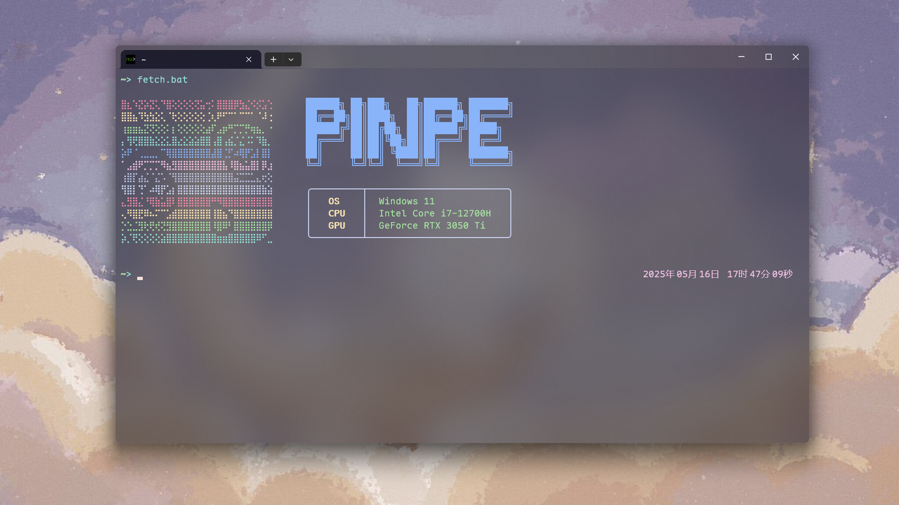

问题原文[博客作者呀，我想采访你这 9 个问题！ - Another Dayu](https://anotherdayu.com/2024/5962/)

### 简单介绍下自己或者你的博客？

我叫Pinpe，17周岁，08年生，是大专生。

我的博客是在2023年4月份建立的，目前已有两年，当时只是觉得很炫酷，但现在博客已经融入到我的生活中了，与朋友圈、QQ空间一个生态位。

### 什么契机让你开始写博客？

我接触到的第一个博客是：[https://blog.qaiu.top/](https://blog.qaiu.top/)，以前用手机编程的时候会在这里下载软件，虽然现在看来对我而言平平无奇了，但让我知道了世界上有“博客”这个概念。

真正到写博客的契机，是因为很久之前开始学前端，做了个人主页，但并没有博客功能，于是不知道是不是头脑一热，就使用WordPress搭建博客了。（当时也只知道个WordPress，现在后悔死了）

### 你是如何完成创作的？

WordPress自带的区块编辑器+Argon主题自带的说说编辑器，都是图形化富文本编辑器，甚至不需要写Markdown。

### 运营博客的过程中是否有失去过动力？如果有，是为什么恢复的？如果没有，请问您又是如何保持创作的激情？

没有，我不写朋友圈、QQ空间之类的东西，无论小到生活碎片还是大到技术文章，都指望着博客来搞定。

而且这里是很安全的，相当于把字刻在石头上的时光胶囊，就算被墙，也不可能因此删除文章，这里的安全性是无法替代的。（理论上）

### 如何搭建博客，以及运营博客每年需要投入的资金？

打开雨云之类的IDC买个服务器和域名，互相解析一下，然后装个宝塔面板，再装个WordPress或Typecho或Halo，配置一下，完成。

资金的话...

项目价格缴费间隔云服务器33￥月域名39￥年

### 推荐 1 篇你博客中的文章，并推荐一个你喜欢读的博客，聊聊原因

推荐文章（不包含文学作品）：[做一个繁华之梦——上海一日游](https://blog.pinpe.top/4619/)，是一篇写的很真实的游记，而且也挺新的。

喜欢的博客就多了，像什么风记星辰、HeoBlog、纸鹿摸鱼处，都挺不错的，各有特点，数不胜数。

### 推荐 1 个近期喜欢的事物？

装逼的、花里胡哨终端软件，甚至因此安装了WSL，因为好多终端软件不支持Windows。

起源是我自己写了一个fetch而已：

### 想做还没有做的事，或想尝试还没有尝试的主题？

自己想做的事情超多！这里怎么可能写的过来？

但是想换的主题也有很多，比如：[Oyiso](https://oyiso.cn/)、[qlAD](https://www.qladgk.com/)、[Fuwari](https://magma.ink/)、[Shiroi](https://tnxgmoe.com/)等，都非常不错，但除了第一个付费主题，都不是WordPress上的，所以谁在说WordPress生态好的？

### 写到这里，闭上你的眼睛，深呼吸几分钟，或是出去溜达一圈，然后回来写任何你想写的东西

博客是一个人展示自己的窗口，其内容足以代表一个人的一部分人格，而且因为去中心化的特点，也不容易被外力控制。

因此搭建博客是很有意义的，这比社交平台得劲是吧？可惜的是目前博客圈早已落寞，如果回到以前辉煌的时期，或许互联网与现在是不一样的。