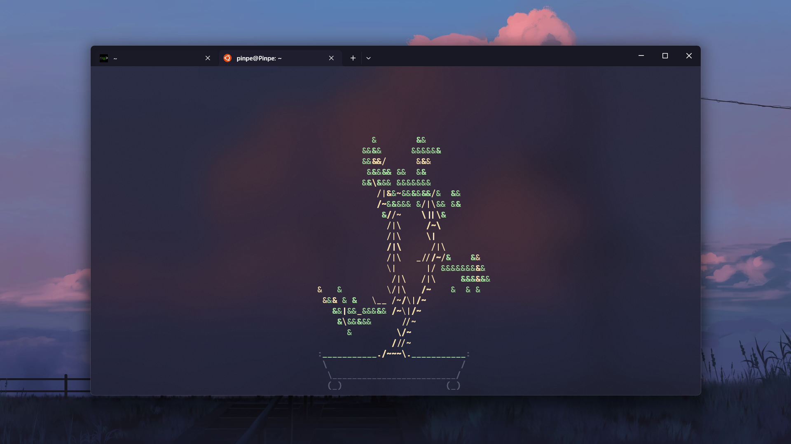
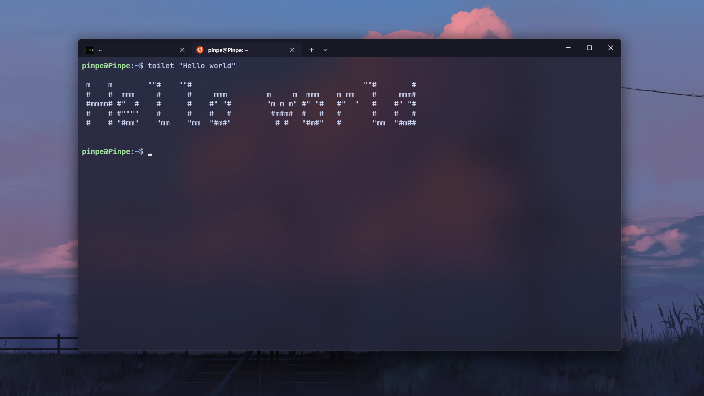

此文章题材较为敏感，因此部分关键词使用拼音缩写代替，且只代表个人观点！此博客面向内地用户，请在评论区谨言慎行！

本人爱国爱党，爱中华民族，并且拥护党的领导，此文章只是提及外网的真实情况，旨在引导正确使用网络。

### 从Github开始谈起

Github，一个全球垄断性的仓库托管平台，每个技术人员应该都很熟悉。

但当我们用中文搜索一些东西时，最后总会跟上一大堆奇怪的东西，比如这样的：

这些仓库通过穷举关键词来获得流量，如果你好奇点进去，就会被里面的内容吓到：哎呀，骇死我了。

这就是Github作为技术交流平台却被墙的原因，但更重要的是，这也是外网中文区的缩影。

### 外网已成为敌人的老巢

说实话，这篇文章有可能让我进局子，因为我确实在今年暑假得到了一个稳定还便宜的tz，于是YouTube、Pixiv、NicoNico等平台成为了我时不时逛的地方。

我甚至开通了YouTube频道：“@Pinpe-ytb”，虽然目前是空的，但以后可能会上传外语视频。（当然内容是正常的）

但是黑暗总是存在的，YouTube的主页推的全都是zz视频，大部分都是中文自媒体，有些则是外国媒体。Pixiv和NicoNico不会主动推送，但搜索关键词还是能看到的。

至于评论区，虽然没有控评之名，但有控评之实，你无法从评论区获取任何信息，因为都跟着频道的观点走。

反面例子

具体观点输出的话，我不想总结了，可以看看人民网的这篇文章，写的还不错：[http://paper.people.com.cn/xwzx/html/2021-10/01/content_26014670.htm](http://paper.people.com.cn/xwzx/html/2021-10/01/content_26014670.htm)。

### 你甚至能看到hj

zn，一百年前对中国的辱语，竟然可以在2024年的今天在外网堂而皇之地说这个词语（还是用中文说的），这是对整个中国（和中国人）的极大侮辱。

这不是hj还是什么？这就是真正的hj啊。

反面例子

### 正确的打开方式是什么？

#### 如果需要国内没有的资源（例如技术教程）

直接用外文搜，并且千万不要管那些乱七八糟的。

#### 如果想看看外国人的世界

外文区还是比较正常的**（除了韩国）**，可以用外文关键词搜索，但还是需要有一定的思考能力。

当然，“China”这种词也可以，外国人对中国还是相对友好的。

